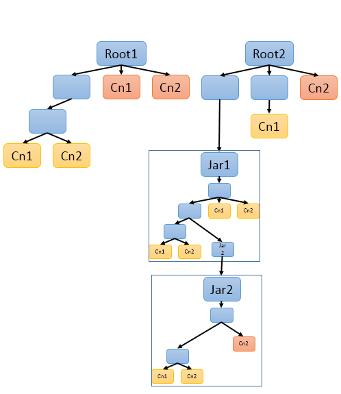

// Licensed to the Apache Software Foundation (ASF) under one
// or more contributor license agreements. See the NOTICE file
// distributed with this work for additional information
// regarding copyright ownership. The ASF licenses this file
// to you under the Apache License, Version 2.0 (the
// "License"); you may not use this file except in compliance
// with the License. You may obtain a copy of the License at
//
// http://www.apache.org/licenses/LICENSE-2.0
//
// Unless required by applicable law or agreed to in writing,
// software distributed under the License is distributed on an
// "AS IS" BASIS, WITHOUT WARRANTIES OR CONDITIONS OF ANY
// KIND, either express or implied. See the License for the
// specific language governing permissions and limitations
// under the License.

[[_uv3.migration]]
= Migrating to UIMA Version 3

[[_uv3.migration.big_picture]]
== Migrating: the big picture

Although UIMA V3 is designed to be backwards compatible with UIMA V2, there are some migration steps needed.
These fall into two broad use cases: 

* if you have an existing UIMA pipeline / application you wish to upgrade to use V3
* if you are "consuming" the Maven artifacts for the core SDK, as part of another project

[[_uv3.migration.migrating_pipeline]]
== How to migrate an existing UIMA pipeline to V3
// <titleabbrev>How to migrate</titleabbrev>

UIMA V3 is designed to be binary compatible with existing UIMA V2 pipelines, so compiled and/or JAR-ed up classes  representing a V2 pipeline should run with UIMA v3, with three changes: 

* Java 8 is required. (If you're already using Java 8, nothing need be done.)
* Any defined JCas cover classes must be migrated or regenerated, and used instead. (If you do not define any JCas classes or don't use JCas in your pipeline, then nothing need be done.) A quick way to do this is to create a Jar with the migrated JCas classes, and put it into the classpath ahead of the other JCas class definitions.
* The runtime classpath needs to include the slf4j-api Jar, and an appropriate slf4j bridging Jar, for details, see next. 

Some adjustments may need to be made to logging setup, typically by including additional Jars  (provided in the UIMA Binary distribution) in your  application's classpath.
If you are using the standard UIMA Launch scripts, this is already done.
For custom application setups, insure that the classpath includes the (now) required jar  "slf4j-api-xxxx.jar" (replace xxxx with the version).   If you were using the standard UIMA based logging, to get the similar behavior, include the slf4j-jdk14-xxxx.jar; this  enables the standard Java Utility Logging facility. 

Some Maven projects use the JCasGen maven plugin; these projects' JCasGen maven plugin, if switched to UIMA V3, automatically generate the V3 versions.
For proper operation, please run maven clean install; the clean operation ought to remove the previously generated JCas class, including the UIMA V2 `xxx_Type` classes.
These are no longer used, and won't compile in V3. 

You can use any of the methods of invoking JCasGen to generate the new V3 versions.
If using the Eclipse plugins (i.e., pushing the ``JCasGen``) button in the  configuration editor, etc.), the V3 version of the plugin must be the one installed into Eclipse. 

If you have the source or class files, you can also migrate those using the migration tool described in this section.
This approach is useful when you've customized the JCas class, and wish to preserve those customizations, while converting the v2 style to the v3 style. 

[[_uv3.migration.jcas]]
== Migrating JCas classes

If you have customized JCasGen classes, these can be migrated by running the migration tool, which is available as a stand-alone command line tool (`runV3migrateJCas.sh` or `...bat`), or  as Eclipse launch configurations.

This tool can migrate either sets of 

* Java source files (xxx.java) or 
* Compiled Java class files (including those contained in JARs or PEARs)

 Usually, if you have the source code it is best to migrate the sources.
Otherwise, you can migrate the compiled classes.
The compiled classes are run through a decompiler, and then the derived sources are migrated. 

When migrating *source* files, you specify one or more "roots" - places in a file directory, or a single java JCas source file (the one not ending in "_Type").  When directories are specified,   the tool scans those  directories recursively (including inside Jars and PEARs), looking for JCas source files.
If just one source file is specified,  it work on just that one source file.
When a source file is processed, it is copied to the output spot  and migrated.
The output is arranged in parallel directories (before and after migration),  for easy side-by-side comparing in a tool such as Eclipse file compare.

After checking the migration results, including comparing the files, you replace the original source with the migrated versions.
Also, the original V2 source would contain a source file for each JCas class ending in "_Type"; these are not used in version 3 and should be deleted.

You may also migrate *class* files; this can be used when the source files are not available.
This option has a decompilation step, to produce the source to be migrated and requires a classpath (passed as the `migrationClasspath` parameter); this classpath is used to resolve symbols during the decompilation, and should be the classpath used when running those classes.
For class files, the migration tool  attempts to compile the results and, for Jars and PEARs, to update those migrated classes  in a copy of the original packaging (meaning, within Jars or PEARs): 

* The *classesRoots* are used to locate .class files, perhaps within Jars and PEARs.
* These are decompiled, using special versions of the migrateClasspath.
* The resultant sources are migrated.
* The migrated sources are compiled.
* If the original classes came from Jars or PEARs, copies of these are made with the  migrated classes replaced.

When scanning directories from source or class roots, if a Jar or a PEAR is encountered, it is recursively scanned.

When migrating from compiled classes: 

* The class is decompiled, and the resulting source is migrated.
* The next 2 steps are skipped if no Java compiler is available. A compiler is available if the migrate utility is being run using a JDK (as opposed to a JRE version of Java).
* The migrated classes are compiled. During this processes, the classpath used is the same as the decompile classpath, except that the uima-core Jar for version 3 (from the classpath used to run the migration tool) is prepended so that the migrated version can be compiled. 
* Finally, if the original "packaging" of the class files is a Jar or PEAR, it  is copied and updated with the migrated classes (provided there was no compile error). 

The results of the migration include the migrated files, a set of logs, and for classesRoots: the  compiled classes, and repackaging of them into copies of original Jars and/or PEARs.
The migration operation is summarized in the console output, detailing anything that might need inspection to verify the migration was done correctly. 

[quote]
If all is OK, the migration will say that it "finished with no unusual conditions", at the end. 

To complete the migration, fix any reported issues that need fixing, and then  update your UIMA application to use these classes/Jars/PEARs  in place of the version 2 ones. 

The actual migration step is a source-to-source transformation, done using a parse of the source files.
The parts in the source which are version 2 specific are replaced with the equivalent version 3 code.
Only those parts which need updating are modified; other code and comments which are part of the source file are left unchanged.
This is intended to preserve any user customization that may have been done. 

[NOTE]
====
After running the tool, it is important to examining the console output and logs.
You can confirm that the migration completed without any unusual conditions, or, if something  unusual was encountered, you can take corrective action. 
====

[[_uv3.migration.tool_guide.running]]
=== Running the migration tool

The tool can be run as a stand-alone command, using the launcher scripts `runV3migrateJCas`;  there are two versions of this -- one for windows (ending it `.bat`)  and one for linux / mac (ending in `.sh`). If you run this without any arguments, it will show a brief help for the arguments. 

There are also a pair of Eclipse launch configurations  (one for migrating source file(s), the other for compiled classes and JARs and PEARs),  which are available if you have the uimaj-examples project (included in the binary distribution of UIMA) in your Eclipse workspace. 

[[_uv3.migration.tool_guide.running.eclipse]]
==== Using Eclipse to run the migration tool

There are two Eclipse launch configurations; one works with source code, the other with compiled classes or Jars or PEARs.
The launch configurations are named: 

* UIMA Run V3 migrate JCas from sources roots
* UIMA Run V3 migrate JCas from classes roots

When running from class directory roots, the classes must not have compile errors, and may contain Jars and PEARs.
Both launchers write their output to a temporary directory, whose name is printed in the Eclipse console log. 

To use the Eclipse launcher to migrate from source code, 

* First select the eclipse project containing the source code to transform;  this project's "build path" will also supply the  classpath used during migration.
+
Alternatively, you may select just one source file to migrate.
* run the migrate-from-sources launcher. 

This will scan the directory tree of the project, looking for source files which are JCas files, and  migrate them, or alternatively, just work on the single selected source file.
No existing files are modified; everything is written to the output directory. 

To use the launcher for compiled code, 

* First select the eclipse project that provides the classpath for the compiled code. This is required for proper "decompiling" of the classes and recompiling the transformed results. 
* The launcher will additionally prompt you for another directory  which the migration tool will use as the top of a tree to scan for compiled Java JCas classes to be migrated. 

[[_uv3.migration.tool_guide.running.cmd_line]]
==== Running from the command line

[[_uv3.migration.tool_guide.running.inputs]]
===== Command line: Specifying input sources

Input is specified using these arguments: 

*"-sourcesRoots"*::
a list of one or more directories, separated by the a path separator character (";" for Windows, ":" for others), or a single source file 
+
Migrates each candidate source file found in any of the file tree roots, skipping over non-JCas classes.

*"-classesRoots"*::
a list of one or more directories containing class files or Jars or PEARs, separated by the a path separator character (";" for Windows, ":" for others). 
+
Decompiles, then migrates each candidate class file found in any of the file tree roots (skipping over non-JCas classes). You can specify either of these, but not both. 

[[_uv3.migration.tool_guide.classpath]]
===== Command line: Specifying a classpath for the migration

When migrating from compiled classes, a classpath is required to locate and decompile the JCas classes to be migrated.
This classpath should include the JCas classes  to be decompiled.
The compiled classes must not have compile errors. 

When migrating from sourcesRoots, this argument is required only if the JCas classes have references to other non-migrated classes (other than core UIMA classes).  For example, if your JCas class had a reference to a user defined Utility class, that would need to be in the classpath.
For plain, non-customized JCas classes, this argument is unnecessary. 

To specify this parameter, use the argument ``-migrateClasspath``.
The Eclipse launcher "UIMA run V3 migrate JCas from classes roots" sets this argument using the selected Eclipse project's classpath.
When migrating within a PEAR, the migration tool automatically adds the  classpath specified by the PEAR (if any) to the classpath. 

[[_uv3.migration.tool_guide.duplicates]]
==== Handling duplicate definitions

Sometimes, a classpath or directory tree may contain multiple instances of the same JCas class.
These might be identical, or they might be different versions. 

The migration utility handles this by migrating each instance. The migrated forms are  stored in the output directory prefixed by the root-id (see above), as the parent directory.
The different versions can then be conveniently compared using tooling such as Eclipse's file compare. 

[[_uv3.migration.tool_guide.reports]]
=== Understanding the reports

The output directory contains a logs directory with additional information.
A summary is also written to System.out. 

Each file translated has both a v2 source and a v3 source.
When the input is ".class" files,  the v2 source is the result of the decompilation step, prior to any migration. 

The process of scanning directories to find JCas class to migrate may come across multiple instances of the same class.
There are two subcases: 

* The instances are the same.
* The instances are different (two non-identical definitions for the same class). Sometimes these arise when migrating from compiled classes, where the compilation was done by different versions of the Java compiler, and the resulting decompilations are logically equal but have some fields or methods in a different order.

This diagram illustrates some of the potentials for identical and non-identical duplicate definitions for the same classname, that the tool may encounter.
The blue boxes represent ordinary file directories or Jars, and the other boxes with labels Cn1 and Cn2 represent the definitions for a classes named Cn1  and Cn2; the different colors represent non-identical definitions, as an example.
Note that a definition for a class might appear sometimes not within a Jar (or a PEAR, not shown here), as well as with that. 

 The migration tool allows for all of these variants.
It will  migrate all versions, and will (when migrating from compiled Jars and PEARs) compile and reassemble these.

The output directories prefix the package/classname holding the source code with a prefix of  "a0", "a1", etc.
The "a" stands for alternative, and the 0 is for the first alternative, and the 1, 2, ... are for other non-equal alternatives.

When the migration is run from compiled classes, then, if possible, the resulting migrated classes are recompiled and if from Jars or PEARs, reassembled into copies of those artifacts.
The compilation for the same classname, with the same sourcecode, could be different for different containers because each compilation is done with that container's classpath (e.g.
Jar or Pear) and with respect to the compilation units of that container. 

Because of this, the compiled results for a given source instance, are done separately, and kept in output directories, indexed additionally by the container number, as "c0", "c1", ... . A list of all container numbers and the migrated       classes within those containers, is printed out to enable correlating these by hand when necessary. 

The overall directory output directory tree looks like: 
[source]
----
Directory structure, starting at -outputDirectory
   converted/
     v2/
       a0/pkg/name.../Classname.java   
                           /Classname2.java etc.
       a1/pkg/name.../Classname.java  if there are multiple
                                              different versions 
       ...
     v3/
       a0/pkg/name.../Classname.java
                     /Classname2.java etc.
       a1/pkg/name.../Classname.java  if there are multiple
                                              different versions
       ...
       
     v3-classes/   for Jars and PEARs, the compiled class
       // xyz is the path in the container to the
       //       start of the pkg/name.../Classname.class
       // the "a0", "a1", ... is extra but serves to 
       //      identify which alternative of the source
       23/a0/xyz/pkg/name.../Classname.class
       33/a0/xyz/pkg/name.../Classname.class
       42/a0/xyz/pkg/name.../Classname.class
         ...    

     pears/
       // xyz_updated_pear_copy is the path
       //    relative to the container, of the PEAR
       33/xyz_updated_pear_copy.pear  
         ...
     
     jars/
       // xyz_updated_jar_copy is the path
       //    relative to the container, of the Jar
       42/xyz_updated_jar_copy.jar
         ...
       
   not-converted/
   
   logs/
     processed.txt
     failed.txt
     skippedBuiltins.txt
     nonJCasFiles.txt
     workaroundDir.txt
     deletedCheckModified.txt
     manualInspection.txt
     pearFileUpdates.txt
     jarFileUpdates.txt
     
     ...
----

The converted subtree holds all the sources and migrated versions that were successfully migrated.
The not-converted subtree hold the sources that failed in some way the migration.
The logs contain many kinds of entries for different issues encountered: 

*processed.txt*::
List of successfully processed classes 

*failed.txt*::
List of classes that failed to migrate 

*skippedBuiltins.txt*::
List of classes representing built-ins that were skipped.
These need manual inspection to see how to merge with new v3 built-ins. 

*NonJCasFiles.txt*::
List of files that were thought to be JCas classes but  upon further analysis appear to not be.
These need  manual inspection to confirm. 

*deletedCheckModified.txt*::
List of class where a version 2 if statement doing the "featOkTst" was apparently modified.
In the migrated code, this statement was deleted, perhaps incorrectly.
These need manual inspection to confirm. 

*manualInspection.txt*::
List of files where the migration found a get or set method, where the version 2 code was accessing a casFeatCode with the  feature name not matching.
These need manual inspection. 

*jarsFileUpdates.txt*::
List of Jar files and classes which were replace in them. 

*pearsFileUpdates.txt*::
List of Pear files and classes which were replace in them. 

[[_uv3.migration.tool_guide.cookbook]]
=== Examples

Run the command line tool: 
[source]
----
cd $UIMA_HOME
      
bin/runV3migrateJCas.sh

  -migrateClasspath /home/me/myproj/xyz.jar:$UIMA_HOME/lib/uima-core.jar
    
  -classesRoots /home/me/myproj/xyz.jar:/home/me/myproj/target/classes
  
  -outputDirectory /temp/migratejcas
----

Run the Eclipse launcher:

First, make sure you've installed the V3 UIMA plugins into Eclipse!

[source]
----
Startup an Eclipse workspace containing the project 
with JCas source files to be migrated.
      
Select the Java project with the JCas sources to be migrated.

Eclipse -> menu -> Run -> Run configurations
  Use the search box to find 
  "UIMA run V3 migrate JCas from sources" launcher.
----

Please read the console output summarization to see where the output went, and about any  conditions found during migration which need manual inspection and fixup.

[[_uv3.migration.consuming]]
== Consuming V3 Maven artifacts

Projects may have tests which write to the UIMA log.
Because V3 switched to SLF4J as the default logger, unless SLF4J can find an adapter to some back-end logger, it will issue a message and substitute a "NO-OP"  back-end logger.
If your test cases depend on having the V2 default logger (which is the one built into Java),  you need to add a "test" dependency that specifies the SLF4J-to-JDK14 adapter to your POM.
Here's the xml for that:

[source]
----
<dependency>
  <groupId>org.slf4j</groupId>
  <artifactId>slf4j-jdk14</artifactId>
  <version>1.7.24</version>  <!-- or some version you need -->
  <scope>test</scope>
</dependency>
----