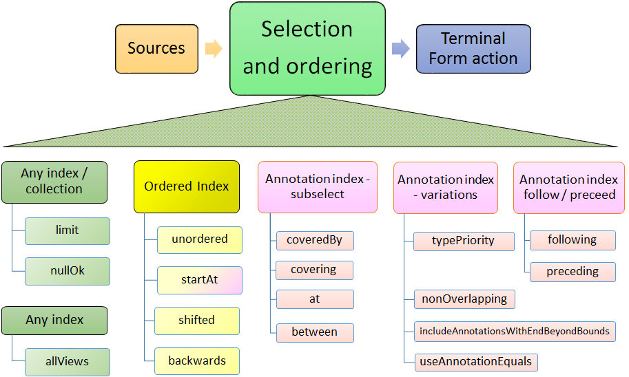

// Licensed to the Apache Software Foundation (ASF) under one
// or more contributor license agreements. See the NOTICE file
// distributed with this work for additional information
// regarding copyright ownership. The ASF licenses this file
// to you under the Apache License, Version 2.0 (the
// "License"); you may not use this file except in compliance
// with the License. You may obtain a copy of the License at
//
// http://www.apache.org/licenses/LICENSE-2.0
//
// Unless required by applicable law or agreed to in writing,
// software distributed under the License is distributed on an
// "AS IS" BASIS, WITHOUT WARRANTIES OR CONDITIONS OF ANY
// KIND, either express or implied. See the License for the
// specific language governing permissions and limitations
// under the License.

[[_uv3.select]]
= SelectFS CAS data access

The _select_ framework provides a concise way to work with Feature Structure data stored in the CAS.
It is integrated with the Java 8 _stream_ framework, and provides additional capabilities supported by the underlying  UIMA framework, including the ability to move both forwards and backwards while iterating, moving to specific positions, and doing various kinds of specialized Annotation  selection such as working with Annotations spanned by another annotation (think of a Paragraph annotation, and the Sentences or Tokens within that). 

There are 3 main parts to this framework:

* The source 
* what to select, ordering 
* what to do 

.Select - the big picture
image::images/version_3_users_guide/select/select_big_pic.png["Select composed of sources, what to select, and what to do"]

These are described in code using a builder pattern to specify the many options and parameters.
Some of the very common parameters are also available as positional arguments in some contexts.
Most of the variations are defaulted so that in the common use cases, they may be omitted. 

[[_uv3.select.builder_pattern]]
== Select's use of the builder pattern

The various options and specifications are specified using the builder pattern.
Each specification has a name, which is a Java method name, sometimes having further parameters.
These methods return an instance of SelectFSs; this instance is updated by each builder method. 

A common approach is to chain these methods together.
When this is done, each subsequent method updates the SelectFSs instance.
This means that the last method in case there are  multiple method calls specifying the same specification is the one that is used. 

For example, 
[source]
----
a_cas.select().typePriority(true).typePriority(false).typePriority(true)
----
would configure the select to be using typePriority (described later).

Some parameters are specified as positional parameters, for example, a UIMA Type, or a starting position or shift-offset.

[[_uv3.select.sources]]
== Sources of Feature Structures

Feature Structures are kept in the CAS, and may be accessed using UIMA Indexes.
Note that not all Feature Structures in the CAS are in the UIMA indexes; only those that the  user had "added to the indexes" are.
Feature Structures not in the indexes are not included when using the CAS as the source for the select framework.

Feature Structures may, additionally, be kept in `FSArrays`, `FSLists`, and many additional collection-style objects that implement `SelectViaCopyToArray` interface.
This interface is implemented by the new semi-built-in types `FSArrayList`, `FSHashSet` and `FSLinkedHashSet`; user-defined JCas classes for user types may also choose to implement this.
All of these sources may be used with `select`.

.select method with type
image::images/version_3_users_guide/select/select_source_type.png["Sources have select method, which has optional type argument"]

For CAS sources, if Views are being used, there is a separate set of indexes per CAS view.
When there are multiple views, only one view's set of indexed Feature Structures is accessed - the view implied by the CAS being used.
Note that there is a way to specify aggregating over all views; see `allViews` described later.

For CAS sources, users may specify all Feature Structures in a view, or restrict this in two ways: 

* specifying an index: Users may define their own indexes, in additional to the built in ones, and  then specify which index to use. 
* specifying a type: Only Feature Structures of this type (or its subtypes) are included. 

It is possible to specify both of these, using the form `myIndex.select(myType)`;  in that case the type must be the type or a subtype of the index's top most type. 

If no index is specified, the default is 

* to use all Feature Structures in a CAS View, or
* to use all Feature Structures in the view's AnnotationIndex, if the selection and ordering specifications require an AnnotationIndex.

Note that the non-CAS collection sources (e.g.
the FSArray and FSList sources are considered ordered, but non-sorted,  and therefore cannot be used for an operations which require a sorted order.

There are 4 kinds of sources of Feature Structures supported:

* a CAS view: all the FSs that were added to the indexes for this view. 
* an Index over a CAS view. Note that the AnnotationIndex is often implied by other `select` specifications, so it is often not necessary to supply this. 
* Feature Structures from a (semi) built-in UIMA Collection instance, such as instances of the types `FSArray, FSArrayList, FSHashSet,` etc. 
* Feature Structures from a user-defined UIMA Collection instance.

UIMA Collection sources have somewhat limited configurability, because they are considered non-sorted,  and therefore cannot be used for an operations which require a sorted order, such as the various bounding selections (e.g. ``coveredBy``)  or positioning operations (e.g. `startAt`).

Each of these sources has a new API method, `select(...)`, which initiates the select specification.
The select method can take an optional parameter, specifying the UIMA type to return.
If supplied, the type must must be the type or subtype of the index  (if one is specified or implied); it serves to further restrict the types selected beyond whatever the  index (if specified) has as its top-most type.

[[_uv3.select.sources.type]]
=== Use of Type in selection of sources

The optional type argument for `select(...)` specifies a UIMA type.
This restricts the Feature Structures to just those of the specified type or any of its subtypes.
If omitted, if an index is used as a source,  its type specification is used; otherwise all types are included.

Type specifications may be specified in multiple ways.
The best practice, if you have a JCas cover class defined for the type, is to use the form ``MyJCasClass.class``.
This has the advantage of setting the  expected generic type of the select to that Java type. 

The type may also be specified by using the actual UIMA type instance (useful if not using the  JCas), using a fully qualified type name as a string, or using the JCas class static `type` field.

[[_uv3.select.sources.generics]]
=== Sources and generic typing

The select method results in a generically typed object, which is used to have subsequent operations make use of the generic type, which may reduce the need for casting.

The generic type can come from arguments or from where a value is being assigned,  if that target has a generic type.
This latter source is only partially available in Java, as it does not propagate past the first object in a chain of calls; this becomes a problem when using `select` with generically typed index variables. 

There is also a static version of the `select` method which takes a  generically typed index as an argument.

The best practice is to pass the JCas class representing the type you want, to the select statement.
This enables the generic typing mechanism to be set to that type.
In the example below, we use `Token` as the type, and `fsIterator()` just as an example of some terminal form action. 

[source]
----
// Best practice, when possible
// the generic type for Token is passed as an argument to select
FSIterator<Token> token_it = cas.select(Token.class).fsIterator();
----

A compile-time generic type can be specified after the select, if the class argument form of `select`  is not used.
In these two examples, the generic type is being specified at compile time, explicitly: 

[source]
----
// ... myCas.select(myType).<Token>fsIterator() ...  
// ... myIndexOversomeType.select().<Token>further-operators-of-select-etc
----

Java 8's type inference doesn't take the generic type past the first object in a build chain, so you can use these techniques to overcome that.
In these examples, tkn_idx is a generically typed variable:

[source]
----
FSIndex<Token> tkn_idx = ... ; // generically typed variable
----

We show a straight-forward syntax that doesn't work, followed by 3 alternatives that do work.

[source]
----
// this next fails because the Token generic type from the 
// index variable being assigned doesn't get passed to the select().

FSIterator<Token> token_iterator = tkn_idx.select().fsIterator();
----

You can overcome this in three ways:

[source]
----
// pass in the type as an argument to select using the JCas cover type.  

FSIterator<Token> token_iterator = 
    tkn_idx.select(Token.class).fsIterator();

// Or use the static form of select (avoids repeating the type info)

FSIterator<Token> token_iterator = 
    SelectFSs.select(tkn_idx).fsIterator();

// Or you can also explicitly set the generic type 
// that select() should use, like this:

FSIterator<Token> token_iterator =
    tkn_idx.<Token>select().fsIterator();
----

Note: the static `select` method may be statically imported into code that uses it, to avoid repeatedly  qualifying this with its class, `SelectFSs`.

Any specification of an index may be further restricted to just a subType (including that subtype's subtypes, if any) of that index's type.
For example, an AnnotationIndex may be specialized to just ``Token``s (and their subtypes):
[source]
----
FSIterator<Token> token_iterator = 
    annotation_index.select(Token.class).fsIterator();
----

[[_uv3.select.selection_and_ordering]]
== Selection and Ordering

There are four sets of sub-selection and ordering specifications, grouped  by what they apply to: 

* all sources 
* Indexes or FSArrays or FSLists 
* Ordered Indexes 
* The Annotation Index 

With some exceptions, configuration items to the left also apply to items on the right. 

When the same configuration item is specified multiple times, the last one specified is the one that is used.

.Selection and Ordering

[[_uv3.select.boolean_properties]]
=== Boolean properties

Many configuration items specify a boolean property.
These are named so the default (if you don't specify them) is generally what is desired, and the specification of the method with null parameter switches the property to the  other (non-default) value.

For example, normally, when working with bounded limits within Annotation Indexes, type priorities are ignored when computing the bound positions.
Specifying typePriority() says to use type priorities.

Additionally, the boolean configuration methods have an optional form where they take a boolean value; true sets the property.
So, for example typePriority(true) is equivalent to typePriority(), and typePriority(false) is equivalent to omitting this configuration.

[[_uv3.select.any_source]]
=== Configuration for any source

*limit*::
a limit to the number of Feature Structures that will be produced or iterated over. 

*nullOK*::
changes the behavior for the terminal_form actions ``get(...) and single(...)``, which would otherwise throw an exception if a null result happened. 

[[_uv3.select.any_index]]
=== Configuration for any index

*allViews*::
Normally, only Feature Structures belonging to the particular CAS view are included in the selection.
If you want, instead, to include Feature Structures from all views, you can specify `allViews()`. 
+
When this is specified, it acts  as an aggregation of the underlying selections, one per view in the CAS.
The ordering among the views is arbitrary; the ordering within each view is the same as if this setting wasn't in force.
Because of this implementation, the items in the selection may not be unique --  Feature Structures in the underlying selections that are in multiple views will appear multiple times. 

[[_uv3.select.ordered_index]]
=== Configuration for sort-ordered indexes

When an index is sort-ordered, there are additional capabilities that can be configured, in particular positioning to particular Feature Structures, and running various iterations backwards. 

*orderNotNeeded*::
relaxes any iteration by allowing it to proceed in an unordered manner.
Specifying this may improve performance in some cases.
When this is specified,  the current implementation skips the work of keeping multiple iterators for a type and all of its subtypes in the proper synchronization. 

*startAt*::
position the starting point of any iteration. `startAt(...)` can be used for general sorted indexes, and also has special formats only usable for Annotation Indexes. 
+
[source]
----
// Forms for any sorted index
startAt(fs);          // fs specifies a feature structure 
                      // indicating the starting position
             
startAt(fs, shifted); // same as above, but after positioning, 
                      // shift to the right or left by the shift 
                      // amount which can be positive or negative

// Forms for AnnotationIndex sources

startAt(begin);       // sets no TypePriorities, and starts at the
                      //   leftmost annotation whose begin is >= begin   
startAt(begin, end);  // start at the position indicated by begin/end

startAt(begin, end, shifted) // same as above, 
                             // but with a subsequent shift.
                             // which can be positive or negative
----

NOTE: The use of `startAt` in conjunction with `following` or `prededing` or any of the bounded sub-selection operators is *not* supported.

*backwards*::
specifies that the result is returned the opposite order than normal. It does not
matter at which point in the selection this method is invoked. So e.g. 
`...backwards().limit(5)` returns the same result as `...limit(5).backwards()`. Also, invoking 
this method twice does not "un-reverse" the results.

[[_uv3.select.annot.follow_precede]]
=== Following or Preceding

For an Annotation Index, you can specify all Feature Structures following or preceding a position.
The position can be specified either as an Annotation or by specifying an annotation begin index.
Both of these can have an additional shift offset amount as a 2nd parameter.
Note that the positioning arguments differ from the `startAt` specification,  which uses both begin and end values. 

*following*::
Position the iterator according to the argument,  and then move the iterator forwards until the Annotation at that position has its begin value >= to the positioning annotation's end value. 
+
If the position is specified as an int, move the iterator forwards until the Annotation at that position has its begin value >= the specified int. 

*preceding*::
Position the iterator according to the argument,  and then move it backwards until the Annotation's (at that position) `end` value is <= to  the positioning Annotation's `begin` value. 
+
If the position is specified as an int, treat this as the begin value.
+
Once positioned, the actual iteration starts at the beginning and ends at the last position.

The `preceding` iteration skips over annotations whose `end` values are >  the positioning annotation's begin value, or the positioning int's value.

[NOTE]
====
When using following/preceding in combination with `limit`, `backwards`, `shifted` and `non-overlappin`, the order in which these operations are internally applied is as follows.

. unambiguous - first, ambiguous annotations are skipped. The shift amount does not affect which which of the ambiguous annotations are skipped.
. shifted - after removing the ambiguous annotations, items in the result set can be skipped in the  direction of the selection. A negative shift is implicitly capped to 0. E.g. consider you have `[10, 20] [20, 30]` and `select().preceding([30, 40])`, the result would be `[10, 20] [20, 30]` (in this order). Because the shift skips away from the reference point, the result of `select().preceding([30, 40]).shifted(1)` is  `[10, 20]` and not `[20, 30]`. 
. limit - the limit is applied after shifting. Thus, the amount of shifting has no effect on the limit.
. backwards - finally, the result set may be reversed.
====

[[_uv3.select.annot.subselect]]
=== Bounded sub-selection within an Annotation Index

When selecting Annotations, frequently you may want to select only those which have a relation to a bounding Annotation.
A commonly done selection is to select all Annotations  (of a particular type including its subtypes) within the span of another bounding Annotation,  for example, all `Tokens` within a `Sentence`.

There are four varieties of sub-selection within an annotation index.
They all are based on a  bounding Annotation (except the `between` which is based on two bounding Annotations). 

The bounding Annotations are specified using either a Annotation (or a subtype), or by specifying the begin and end offsets that would be for the bounding Annotation.

Leaving aside `between` as a special case, the bounding Annotation's `begin` and `end` (and sometimes, its `type`) is used to specify where an iteration would start, where it would end,  and possibly, which Annotations within those bounds would be filtered out.
There are many variations possible; these are described in the next section.

The returned Annotations exclude the one(s) which are `equal` to the bounding FS.
There are several variations of how this `equal` test is done, discussed in the next section.

*coveredBy*::
iterates over Annotations within the bound

*covering*::
iterates over Annotations that span the bound.

*at*::
iterates over Annotations that have the same span (i.e., begin and end) as the bound.

*between*::
uses two Annotations, and returns Annotations that are in between the two bounds, specified by Annotations. If the bounds are backwards, then they are automatically used in reverse order.
The meaning of between is that an included Annotation's begin has to be >= the earlier bound's `end`,  and the Annotation's end has to be <= the later bound's `begin`. 

[NOTE]
====
When using following/preceding in combination with `limit`, `backwards`, `shifted` and `non-overlappin`, the order in which these operations are internally applied is as follows.
 
. unambiguous - first, ambiguous annotations are skipped. The shift amount does not affect which which of the ambiguous annotations are skipped.
. backwards - if requested, reversal is applied before shift and limit.
. shifted - after removing the ambiguous annotations, items in the result set can be skipped.
the end of the. A negative shift is implicitly capped to 0.
. limit - the limit is applied after shifting. Thus, the amount of shifting has no effect on the limit.
====

[[_uv3.select.annot.variations]]
=== Variations in Bounded sub-selection within an Annotation Index

There are five variations you can specify.
Two affect how the starting bound position is set;  the other three affect skipping of some Annotations while iterating.
The defaults (summarized following) are designed to fit the popular use cases.

*typePriority*::
The default is to ignore type priorities when setting the starting position, and just use the begin / end position to locate the left-most equal spot.
If you want to respect type priorities, specify this variant. 

*nonOverlapping*::
Normally, all Annotations satisfying the bounds are returned.
If this is set,  annotations whose `begin` position is not >= the previous annotation's (going forwards) `end` position are skipped.
This is also called _unambiguous_ iteration.
If the iterator is run backwards, it is first run forwards to locate all the items that would be in the forward iteration following the rules; and then those are traversed backwards.
This variant is ignored for `covering` selection. 

*includeAnnotationsWithEndBeyondBounds*::
The Subiterator _strict_ configuration is equivalent to the opposite of this.
This only applied to the `coveredBy` selection;  if specified, then any Annotations whose `end` position is > the end position of the bounding Annotation are included; normally they are skipped. 

*skipSameBeginEndType*::
While doing bounded iteration, if the Annotation being returned is identical (has the same _id()) with the bounding Annotation, it is always skipped. 
+
Other annotations, which might  have the same begin, end, and type values, are not skipped, but instead, included, by default.
+
When this configuration is specified, any Annotation which has the same begin, end, and type is also skipped. 

[NOTE]
====
If you do not want any of the indexed annotations to be skipped, you can achieve  this by 

* insuring you haven't set `skipWhenSameBeginEndType()`
* making a bounding annotation with the begin / end / type you want for the bound
* Don't add this bounding annotation to the index

Because the bounding annotation will not be equal (have the same Feature Structure ID) as any  annotations in the index (because you haven't indexed it), it will never match any annotations found in the index while iterating. 
====

[[_uv3.select.annot.subselect.defaults]]
=== Defaults for bounded selects

The ordinary core UIMA Subiterator implementation defaults to using type order as part of the bounds determination.
uimaFIT, in contrast, doesn't use type order, and sets bounds according to  the begin and end positions.

This `select` implementation mostly follows the uimaFIT approach by default, but provides the above configuration settings to flexibly alter this to the user's preferences.
For reference, here are the default settings, with some comparisons to the defaults for ``Subiterators``:

*typePriority*::
default: false; type priorities are not used when moving to left-most among equal items.
Subiterators created using the AnnotationIndex, in contrast, use type priorities. 

*nonOverlapping*::
default: false; no Annotations are skipped because they overlap.
This corresponds to the "ambiguous" mode in Subiterators. 

*includeAnnotationsWithEndBeyondBounds*::
default: (only applies to `coveredBy` selections;  The default is to skip Annotations whose end position lies outside of the bounds;  this corresponds to Subiterator's "strict" option. 

*skipSameBeginEndType*::
default: only the single Annotation with the same _id() is skipped when using  a bounded iteration.
Use this setting to expand the set of skipped Annotations to include all those equal to the  bound's begin, end and type. 

[[_uv3.select.terminal_form_actions]]
== Terminal Form actions

After the sources and selection and ordering options have been specified, one  terminal form action may be specified.
This can be an getting an iterator, array or list, or a single value with various extra checks, or a Java stream.
Specifying any stream operation (except limit) converts the object to a stream; from that point on, any stream operation may be used.

.Select Terminal Form Actions
image::images/version_3_users_guide/select/select_terminal_form_actions.png[Terminal form actions for select]

[[_uv3.select.terminal_form_actions.iterators]]
=== Iterators

*(Iterable)*::
The `SelectFSs` object directly implements `Iterable`, so it may be  used in the extended Java `for` loop.

*fsIterator*::
returns a configured fsIterator or subIterator.
This iterator implements `ListIterator` as well (which, in turn, implements Java `Iterator`). Modifications to the list using `add` or `set` are not supported. 

*iterator*::
This is just the plain Java iterator, for convenience. 

*spliterator*::
This returns a spliterator, which can be marginally more efficient to use than a normal iterator.
It is configured to be sequential (not parallel), and has other characteristics set according to  the sources and selection/ordering configuration. 

[[_uv3.select.terminal_form_actions.arrays_lists]]
=== Arrays and Lists

*asArray*::
This takes 1 argument, the class of the returned array type, which must be the type or subtype of the select. 

*asList*::
Returns a Java list, configured from the sources and selection and ordering specifications. 

[[_uv3.select.terminal_form_actions.single_items]]
=== Single Items

These methods return just a single item, according to the previously specified select configuration.
Variations may throw exceptions on empty or more than one item situations.

These have no-argument forms as well as argument forms identical to `startAt` (see above). When arguments are specified, they adjust the item returned by positioning within the index  according to the arguments.

[NOTE]
====
Positioning arguments with a Annotation or begin and end require an Annotation Index.
Positioning using a Feature Structure, by contrast, only require that the index being use be sorted. 
====

*get*::
If no argument is specified, then returns the first item.
If there is no item, then an exception is thrown unless `nullOK` is set. 
+
If any positioning arguments are specified, then this returns the item at that position unless there is no item at that position, in which case it throws an exception unless `nullOK` is set. 

*single*::
returns the item at the position, but throws exceptions  if there are more than one item in the selection, or if there are no items in the selection. 

*singleOrNull*::
returns the item at the position, but throws an exception  if there are more than one item in the selection. 

*isEmpty*::
returns true if the selection is empty. 

[[_uv3.select.terminal_form_actions.streams]]
=== Streams

*any stream method*::
Select supports all the stream methods.
The first occurrance of a stream method converts the select into a stream, using `spliterator`, and from then on, it behaves just like a stream object. 
+
For example, here's a somewhat contrived example: you could do the following to collect the set of types appearing within some bounding annotation, when considered in nonOverlapping style: 
+

[source]
----
// items of MyType or subtypes 
Set<Type> foundTypes = myIndex.select(MyType.class)
   .coveredBy(myBoundingAnnotation)
   .nonOverlapping()
   .map(fs -> fs.getType())
   .collect(Collectors.toCollection(TreeSet::new));
----

Or, to collect by category a set of frequency values: 

[source]
----
Map<Category, Integer> freqByCategory = myIndex.select(MyType.class)
     .collect(Collectors
     .groupingBy(MyType::getCategory,
                 Collectors.summingInt(MyType::getFreq)));
----
