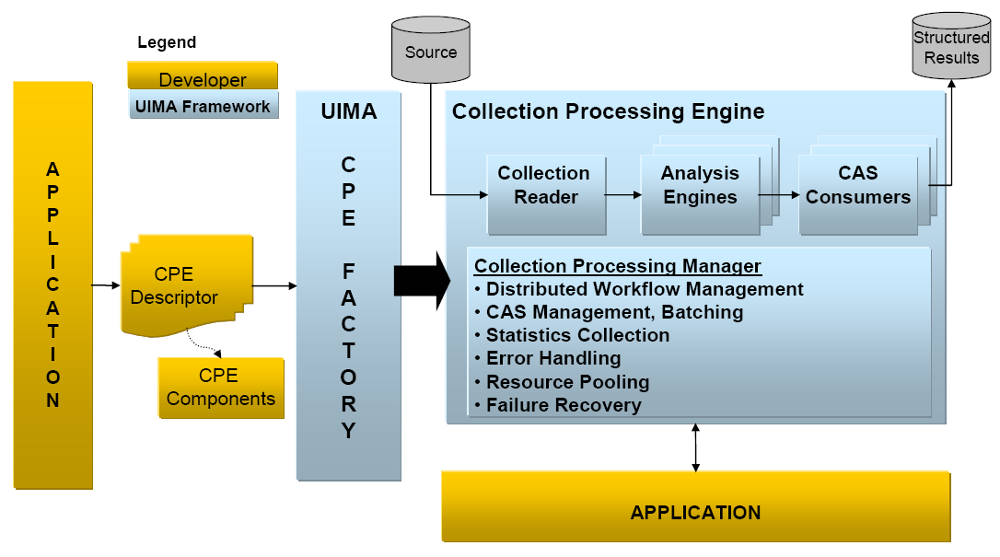

// Licensed to the Apache Software Foundation (ASF) under one
// or more contributor license agreements. See the NOTICE file
// distributed with this work for additional information
// regarding copyright ownership. The ASF licenses this file
// to you under the Apache License, Version 2.0 (the
// "License"); you may not use this file except in compliance
// with the License. You may obtain a copy of the License at
//
// http://www.apache.org/licenses/LICENSE-2.0
//
// Unless required by applicable law or agreed to in writing,
// software distributed under the License is distributed on an
// "AS IS" BASIS, WITHOUT WARRANTIES OR CONDITIONS OF ANY
// KIND, either express or implied. See the License for the
// specific language governing permissions and limitations
// under the License.

[[ugr.ovv.conceptual]]
= UIMA Conceptual Overview

UIMA is an open, industrial-strength, scaleable and extensible platform for creating, integrating and deploying unstructured information management solutions from powerful text or multi-modal analysis and search components. 

The Apache UIMA project is an implementation of the Java UIMA framework available under the Apache License, providing a common foundation for industry and academia to collaborate and accelerate the world-wide development of technologies critical for discovering vital knowledge present in the fastest growing sources of information today.

This chapter presents an introduction to many essential UIMA concepts.
It is meant to provide a broad overview to give the reader a quick sense of UIMA's basic architectural philosophy and the UIMA SDK's capabilities. 

This chapter provides a general orientation to UIMA and makes liberal reference to the other chapters in the UIMA SDK documentation set, where the reader may find detailed treatments of key concepts and development practices.
It may be useful to refer to <<ugr.glossary>>, to become familiar with the terminology in this overview.

[[ugr.ovv.conceptual.uima_introduction]]
== UIMA Introduction

.UIMA helps you build the bridge between the unstructured and structuredworlds
image::images/overview-and-setup/conceptual_overview_files/image002.png[Picture of a bridge between unstructured information artifacts and structured metadata about those artifacts]

Unstructured information represents the largest, most current and fastest growing source of information available to businesses and governments.
The web is just the tip of the iceberg.
Consider the mounds of information hosted in the enterprise and around the world and across different media including text, voice and video.
The high-value content in these vast collections of unstructured information is, unfortunately, buried in lots of noise.
Searching for what you need or doing sophisticated data mining over unstructured information sources presents new challenges. 

An unstructured information management (UIM) application may be generally characterized as a software system that analyzes large volumes of unstructured information (text, audio, video, images, etc.) to discover, organize and deliver relevant knowledge to the client or application end-user.
An example is an application that processes millions of medical abstracts to discover critical drug interactions.
Another example is an application that processes tens of millions of documents to discover key evidence indicating probable competitive threats. 

First and foremost, the unstructured data must be analyzed to interpret, detect and locate concepts of interest, for example, named entities like persons, organizations, locations, facilities, products etc., that are not explicitly tagged or annotated in the original artifact.
More challenging analytics may detect things like opinions, complaints, threats or facts.
And then there are relations, for example, located in, finances, supports, purchases, repairs etc.
The list of concepts  important for applications to discover in unstructured content is large, varied and  often domain specific.
Many different component analytics may solve different parts of the overall analysis task.
These component analytics must interoperate and must be easily combined to facilitate  the development of UIM applications.

The result of analysis are used to populate structured forms so that conventional  data processing and search technologies  like search engines, database engines or OLAP (On-Line Analytical Processing, or Data Mining) engines  can efficiently deliver the newly discovered content in response to the client requests  or queries.

In analyzing unstructured content, UIM applications make use of a variety of analysis technologies including:

* Statistical and rule-based Natural Language Processing (NLP)
* Information Retrieval (IR)
* Machine learning
* Ontologies
* Automated reasoning and
* Knowledge Sources (e.g., CYC, WordNet, FrameNet, etc.)

Specific analysis capabilities using these technologies are developed  independently using different techniques, interfaces and platforms. 

The bridge from the unstructured world to the structured world is built through the composition and deployment of these analysis capabilities.
This integration is often a costly challenge. 

The Unstructured Information Management Architecture (UIMA) is an architecture and software framework that helps you build that bridge.
It supports creating, discovering, composing and deploying a broad range of analysis capabilities and linking them to structured information services.

UIMA allows development teams to match the right skills with the right parts of a solution and helps enable rapid integration across technologies and platforms using a variety of different deployment options.
These ranging from tightly-coupled deployments for high-performance, single-machine, embedded solutions to parallel and fully distributed deployments for highly flexible and scaleable solutions.

[[ugr.ovv.conceptual.architecture_framework_sdk]]
== The Architecture, the Framework and the SDK

UIMA is a software architecture which specifies component interfaces, data representations, design patterns and development roles for creating, describing, discovering, composing and deploying multi-modal analysis capabilities.

The *UIMA framework* provides a run-time environment in which developers can plug in their UIMA component implementations and with which they can build and deploy UIM applications.
The framework is not specific to any IDE or platform.
Apache hosts a Java and (soon) a C++ implementation of the UIMA Framework.

The *UIMA Software Development Kit (SDK)* includes the UIMA framework, plus tools and utilities for using UIMA.
Some of the tooling supports an Eclipse-based ( http://www.eclipse.org/) development environment. 

[[ugr.ovv.conceptual.analysis_basics]]
== Analysis Basics

[NOTE]
====
Analysis Engine, Document, Annotator, Annotator Developer, Type, Type System, Feature, Annotation, CAS, Sofa, JCas, UIMA Context.
====

[[ugr.ovv.conceptual.aes_annotators_and_analysis_results]]
=== Analysis Engines, Annotators & Results

[[ugr.ovv.conceptual.metadata_in_cas]]
.Objects represented in the Common Analysis Structure (CAS)
image::images/overview-and-setup/conceptual_overview_files/image004.png["Picture of some text, with a hierarchy of discovered metadata about words in the text, including some image of a person as metadata about that name."]

UIMA is an architecture in which basic building blocks called Analysis Engines (AEs) are composed to analyze a document and infer and record descriptive attributes about the document as a whole, and/or about regions therein.
This descriptive information, produced by AEs is referred to generally as **analysis results**.
Analysis results typically represent meta-data about the document content.
One way to think about AEs is as software agents that automatically discover and record meta-data about original content.

UIMA supports the analysis of different modalities including text, audio and video.
The majority of examples we provide are for text.
We use the term **document, **therefore, to generally refer to any unit of content that an AE may process, whether it is a text document or a segment of audio, for example.
See the xref:tug.adoc#ugr.tug.mvs[Multiple CAS Views of an Artifact] for more information on multimodal processing in UIMA.

Analysis results include different statements about the content of a document.
For example, the following is an assertion about the topic of a document:

[source]
----
(1) The Topic of document D102 is "CEOs and Golf".
----

Analysis results may include statements describing regions more granular than the entire document.
We use the term *span* to refer to a sequence of characters in a text document.
Consider that a document with the identifier D102 contains a span, "`Fred Centers`" starting at character position 101.
An AE that can detect persons in text may represent the following statement as an analysis result:

[source]
----
(2) The span from position 101 to 112 in document D102 denotes a Person
----

In both statements 1 and 2 above there is a special pre-defined term or what we call in UIMA a **Type**.
They are _Topic_ and _Person_ respectively.
UIMA types characterize the kinds of results that an AE may create -- more on types later.

Other analysis results may relate two statements.
For example, an AE might record in its results that two spans are both referring to the same person:

[source]
----
(3) The Person denoted by span 101 to 112 and 
  the Person denoted by span 141 to 143 in document D102 
  refer to the same Entity.
----

The above statements are some examples of the kinds of results that AEs may record to describe the content of the documents they analyze.
These are not meant to indicate the form or syntax with which these results are captured in UIMA -- more on that later in this overview.

The UIMA framework treats Analysis engines as pluggable, composible, discoverable, managed objects.
At the heart of AEs are the analysis algorithms that do all the work to analyze documents and record analysis results. 

UIMA provides a basic component type intended to house the core analysis algorithms running inside AEs.
Instances of this component are called **Annotators**.
The analysis algorithm developer's primary concern therefore is the development of annotators.
The UIMA framework provides the necessary methods for taking annotators and creating analysis engines.

In UIMA the person who codes analysis algorithms takes on the role of the **Annotator Developer**.
The xref:tug.adoc#ugr.tug.aae[Annotator and Analysis Engine Developer’s Guide] will take the reader through the details involved in creating UIMA annotators and analysis engines.

At the most primitive level an AE wraps an annotator adding the necessary APIs and infrastructure for the composition and deployment of annotators within the UIMA framework.
The simplest AE contains exactly one annotator at its core.
Complex AEs may contain a collection of other AEs each potentially containing within them other AEs. 

[[ugr.ovv.conceptual.representing_results_in_cas]]
=== Representing Analysis Results in the CAS

How annotators represent and share their results is an important part of the UIMA architecture.
UIMA defines a *Common Analysis Structure (CAS)* precisely for these purposes.

The CAS is an object-based data structure that allows the representation of objects, properties and values.
Object types may be related to each other in a single-inheritance hierarchy.
The CAS logically (if not physically) contains the document being analyzed.
Analysis developers share and record their analysis results in terms of an object model within the CAS. footnote:[We have plans to extend the representational capabilities of the CAS and align its semantics with the semantics of the OMG's Essential Meta-Object Facility (EMOF) and with the semantics of the Eclipse Modeling Framework's ( ) Ecore semantics and XMI-based representation.]

The UIMA framework includes an implementation and interfaces to the CAS.
For a more detailed description of the CAS and its interfaces see xref:ref.adoc#ugr.ref.cas[CAS Reference].

A CAS that logically contains statement 2 (repeated here for your convenience)

[source]
----
(2) The span from position 101 to 112 in document D102 denotes a Person
----

would include objects of the Person type.
For each person found in the body of a document, the AE would create a Person object in the CAS and link it to the span of text where the person was mentioned in the document.

While the CAS is a general purpose data structure, UIMA defines a few basic types and affords the developer the ability to extend these to define an arbitrarily rich **Type System**.
You can think of a type system as an object schema for the CAS.

A type system defines the various types of objects that may be discovered in  documents by AE's that subscribe to that type system.

As suggested above, Person may be defined as a type.
Types have properties or **features**.
So for example, _Age_ and _Occupation_ may be defined as features of the Person type.

Other types might be _Organization, Company, Bank, Facility, Money, Size, Price, Phone Number, Phone Call, Relation, Network Packet, Product, Noun, Phrase, Verb, Color, Parse Node, Feature Weight Array_ etc.

There are no limits to the different types that may be defined in a type system.
A type system is domain and application specific.

Types in a UIMA type system may be organized into a taxonomy.
For example, _Company_ may be defined as a subtype of __Organization__. _NounPhrase_ may be a subtype of a __ParseNode__.

[[ugr.ovv.conceptual.annotation_type]]
==== The Annotation Type

A general and common type used in artifact analysis and from which additional types are often derived is the *annotation* type. 

The annotation type is used to annotate or label regions of an artifact.
Common artifacts are text documents, but they can be other things, such as audio streams.
The annotation type for text includes two features, namely `begin` and `end`.
Values of these features represent integer offsets in the artifact and delimit a span.
Any particular annotation object identifies the span it annotates with the `begin` and `end` features.

The key idea here is that the annotation type is used to identify and label or __annotate__ a specific region of an artifact.

Consider that the Person type is defined as a subtype of annotation.
An annotator, for example, can create a Person annotation to record the discovery of a mention of a person between position 141 and 143 in document D102.
The annotator can create another person annotation to record the detection of a mention of a person in the span between positions 101 and 112. 

[[ugr.ovv.conceptual.not_just_annotations]]
==== Not Just Annotations

While the annotation type is a useful type for annotating regions of a document, annotations are not the only kind of types in a CAS.
A CAS is a general representation scheme and may store arbitrary data structures to represent the analysis of documents.

As an example, consider statement 3 above (repeated here for your convenience).

[source]
----
(3) The Person denoted by span 101 to 112 and 
  the Person denoted by span 141 to 143 in document D102 
  refer to the same Entity.
----

This statement mentions two person annotations in the CAS; the first, call it P1 delimiting the span from 101 to 112 and the other, call it P2, delimiting the span from 141 to 143.
Statement 3 asserts explicitly that these two spans refer to the same entity.
This means that while there are two expressions in the text represented by the annotations P1 and P2, each refers to one and the same person. 

The Entity type may be introduced into a type system to capture this kind of information.
The Entity type is not an annotation.
It is intended to represent an object in the domain which may be referred to by different expressions (or mentions) occurring multiple times within a document (or across documents within a collection of documents). The Entity type has a feature named __occurrences. __This feature is used to point to all the annotations believed to label mentions of the same entity.

Consider that the spans annotated by P1 and P2 were "`Fred Center`" and "`He`" respectively.
The annotator might create a new Entity object called ``FredCenter``.
To represent the relationship in statement 3 above, the annotator may link FredCenter to both P1 and P2 by making them values of its _occurrences_ feature.

<<ugr.ovv.conceptual.metadata_in_cas>> also illustrates that an entity may be linked to annotations referring to regions of image documents as well.
To do this the annotation type would have to be extended with the appropriate features to point to regions of an image.

[[ugr.ovv.conceptual.multiple_views_within_a_cas]]
==== Multiple Views within a CAS

UIMA supports the simultaneous analysis of multiple views of a document.
This support comes in handy for processing multiple forms of the artifact, for example, the audio and the closed captioned views of a single speech stream, or the tagged and detagged  views of an HTML document.

AEs analyze one or more views of a document.
Each view contains a specific **subject of analysis(Sofa)**, plus a set of indexes holding metadata indexed by that view.
The CAS, overall, holds one or more CAS Views, plus the descriptive objects that represent the analysis results for each. 

Another common example of using CAS Views is for different translations of a document.
Each translation may be represented with a different CAS View.
Each translation may be described by a different set of analysis results.
For more details on CAS Views and Sofas, see xref:tug.adoc#ugr.tug.mvs[Multiple CAS Views of an Artifact] and xref:tug.adoc#ugr.tug.aas[Annotations, Artifacts, and Sofas].

[[ugr.ovv.conceptual.interacting_with_cas_and_external_resources]]
=== Using CASes and External Resources

The two main interfaces that a UIMA component developer interacts with are the CAS and the UIMA Context.

UIMA provides an efficient implementation of the CAS with multiple programming interfaces.
Through these interfaces, the annotator developer interacts with the document and reads and writes analysis results.
The CAS interfaces provide a suite of access methods that allow the developer to obtain indexed iterators to the different objects in the CAS.
See xref:ref.adoc#ugr.ref.cas[CAS Reference].
While many objects may exist in a CAS, the annotator developer can obtain a specialized iterator to all Person objects associated with a particular view, for example.

For Java annotator developers, UIMA provides the JCas.
This interface provides the Java developer with a natural interface to CAS objects.
Each type declared in the type system appears as a Java Class; the UIMA framework renders the Person type as a Person class in Java.
As the analysis algorithm detects mentions of persons in the documents, it can create Person objects in the CAS.
For more details on how to interact with the CAS using this interface, refer to the xref:ref.adoc#ugr.ref.jcas[JCas Reference].

The component developer, in addition to interacting with the CAS, can access external resources through the framework's resource manager interface called the **UIMA Context**.
This interface, among other things, can ensure that different annotators working together in an aggregate flow may share the same instance of an external file or remote resource accessed via its URL, for example.
For details on using the UIMA Context see xref:tug.adoc#ugr.tug.aae[Annotator and Analysis Engine Developer's Guide].

[[ugr.ovv.conceptual.component_descriptors]]
=== Component Descriptors

UIMA defines interfaces for a small set of core components that users of the framework provide implmentations for.
Annotators and Analysis Engines are two of the basic building blocks specified by the architecture.
Developers implement them to build and compose analysis capabilities and ultimately applications.

There are others components in addition to these, which we will learn about later, but for every component specified in UIMA there are two parts required for its implementation:

. the declarative part and
. the code part.

The declarative part contains metadata describing the component, its identity, structure and behavior and is called the **Component Descriptor**.
Component descriptors are represented in XML.
The code part implements the algorithm.
The code part may be a program in Java.

As a developer using the UIMA SDK, to implement a UIMA component it is always the case that you will provide two things: the code part and the Component Descriptor.
Note that when you are composing an engine, the code may be already provided in reusable subcomponents.
In these cases you may not be developing new code but rather composing an aggregate engine by pointing to other components where the code has been included.

Component descriptors are represented in XML and aid in component discovery, reuse, composition and development tooling.
The UIMA SDK provides tools for easily creating and maintaining the component descriptors that relieve the developer from editing XML directly.
This tool is described briefly in xref:tug.adoc#ugr.tug.aae[Annotator and Analysis Engine Developer's Guide], and more thoroughly in xref:tools.adoc#ugr.tools.cde[Component Descriptor Editor User’s Guide].

Component descriptors contain standard metadata including the component's name, author, version, and a reference to the class that implements the component.

In addition to these standard fields, a component descriptor identifies the type system the component uses and the types it requires in an input CAS and the types it plans to produce in an output CAS.

For example, an AE that detects person types may require as input a CAS that includes a tokenization and deep parse of the document.
The descriptor refers to a type system to make the component's input requirements and output types explicit.
In effect, the descriptor includes a declarative description of the component's behavior and can be used to aid in component discovery and composition based on desired results.
UIMA analysis engines provide an interface for accessing the component metadata represented in their descriptors.
For more details on the structure of UIMA component descriptors refer to xref:ref.adoc#ugr.ref.xml.component_descriptor[Component Descriptor Reference].

[[ugr.ovv.conceptual.aggregate_analysis_engines]]
== Aggregate Analysis Engines

[NOTE]
====
Aggregate Analysis Engine, Delegate Analysis Engine, Tightly and Loosely Coupled, Flow Specification, Analysis Engine Assembler
====

[[ugr.ovv.conceptual.sample_aggregate]]
.Sample Aggregate Analysis Engine
image::images/overview-and-setup/conceptual_overview_files/image006.png["Picture of multiple parts (a language identifier, tokenizer, part of speech annotator, shallow parser, and named entity detector) strung together into a flow, and all of them wrapped as a single aggregate object, which produces as annotations the union of all the results of the individual annotator components ( tokens, parts of speech, names, organizations, places, persons, etc.)"]

A simple or primitive UIMA Analysis Engine (AE) contains a single annotator.
AEs, however, may be defined to contain other AEs organized in a workflow.
These more complex analysis engines are called *Aggregate Analysis Engines.*

Annotators tend to perform fairly granular functions, for example language detection, tokenization or part of speech detection.
These functions typically address just part of an overall analysis task.
A workflow  of component engines may be orchestrated to perform more complex tasks.

An AE that performs named entity detection, for example, may include a pipeline of annotators starting with language detection feeding tokenization, then part-of-speech detection, then deep grammatical parsing and then finally named-entity detection.
Each step in the pipeline is required by the subsequent analysis.
For example, the final named-entity annotator can only do its analysis if the previous deep grammatical parse was recorded in the CAS.

Aggregate AEs are built to encapsulate potentially complex internal structure and insulate it from users of the AE.
In our example, the aggregate analysis engine developer acquires the internal components, defines the necessary flow between them and publishes the resulting AE.
Consider the simple example illustrated in <<ugr.ovv.conceptual.sample_aggregate>> where "`MyNamed-EntityDetector`" is composed of a linear flow of more primitive analysis engines.

Users of this AE need not know how it is constructed internally but only need its name and its published input requirements and output types.
These must be declared in the aggregate AE's descriptor.
Aggregate AE's descriptors declare the components they contain and a **flow specification**.
The flow specification defines the order in which the internal component AEs should be run.
The internal AEs specified in an aggregate are also called the *delegate analysis engines*. 
The term "delegate" is used because aggregate AE's are thought to "delegate" functions to their internal AEs.

The developer can implement a "Flow Controller" and include it as part  of an aggregate AE by referring to it in the aggregate AE's descriptor.
The flow controller is responsible for computing the "flow", that is,  for determining the order in which of delegate AE's that will process the CAS.
The Flow Contoller has access to the CAS and any external resources it may require  for determining the flow.
It can do this dynamically at run-time, it can  make multi-step decisions and it can consider any sort of flow specification  included in the aggregate AE's descriptor.
See xref:tug.adoc#ugr.tug.fc[Flow Controller Developer's Guide]  for details on the UIMA Flow Controller interface. 

We refer to the development role associated with building an aggregate from delegate AEs as the *Analysis Engine Assembler* .

The UIMA framework, given an aggregate analysis engine descriptor, will run all delegate AEs, ensuring that each one gets access to the CAS in the sequence produced by the flow controller.
The UIMA framework is equipped to handle different deployments where the delegate engines, for example, are *tightly-coupled* (running in the same process) or *loosely-coupled* (running in separate processes or even on different machines). The framework supports a number of remote protocols for loose coupling deployments of aggregate analysis engines.

The UIMA framework facilitates the deployment of AEs as remote services by using an adapter layer that automatically creates the necessary infrastructure in response to a declaration in the component's descriptor.
For more details on creating aggregate analysis engines refer to xref:ref.adoc#ugr.ref.xml.component_descriptor[Component Descriptor Reference].
The component descriptor editor tool assists in the specification of aggregate AEs from a repository of available engines.
For more details on this tool refer to xref:tools.adoc#ugr.tools.cde[Component Descriptor Editor User’s Guide].

The UIMA framework implementation has two built-in flow implementations: one that support a linear flow between components, and one with conditional branching based on the language of the document.
It also supports user-provided flow controllers, as described in xref:tug.adoc#ugr.tug.fc[Flow Controller Developer's Guide].
Furthermore, the application developer is free to create multiple AEs and provide their own logic to combine the AEs in arbitrarily complex flows.
For more details on this the reader may refer to xref:tug.adoc#ugr.tug.application.using_aes[Using Analysis Engines].

[[ugr.ovv.conceptual.applicaiton_building_and_collection_processing]]
== Application Building and Collection Processing

[NOTE]
====
Process Method, Collection Processing Architecture, Collection Reader, CAS Consumer, CAS Initializer, Collection Processing Engine, Collection Processing Manager.
====

[[ugr.ovv.conceptual.using_framework_from_an_application]]
=== Using the framework from an Application

[[ugr.ovv.conceptual.application_factory_ae]]
.Using UIMA Framework to create and interact with an Analysis Engine
image::images/overview-and-setup/conceptual_overview_files/image008.png["Picture of application interacting with UIMA's factory to produce an analysis engine, which acts as a container for annotators, and interfaces with the application via the process and getMetaData methods
among others."]

As mentioned above, the basic AE interface may be thought of as simply CAS in/CAS out.

The application is responsible for interacting with the UIMA framework to instantiate an AE, create or acquire an input CAS, initialize the input CAS with a document and then pass it to the AE through the **process method**.
This interaction with the framework is illustrated in <<ugr.ovv.conceptual.application_factory_ae>>. 

The UIMA AE Factory takes the declarative information from the Component Descriptor and the class files implementing the annotator, and instantiates the AE instance, setting up the CAS and the UIMA Context.

The AE, possibly calling many delegate AEs internally, performs the overall analysis and its process method returns the CAS containing new analysis results. 

The application then decides what to do with the returned CAS.
There are many possibilities.
For instance the application could: display the results, store the CAS to disk for post processing, extract and index analysis results as part of a search or database application etc.

The UIMA framework provides methods to support the application developer in creating and managing CASes and instantiating, running and managing AEs.
Details may be found in xref:tug.adoc#ugr.tug.application[Application Developer’s Guide].

[[ugr.ovv.conceptual.graduating_to_collection_processing]]
=== Graduating to Collection Processing

.High-Level UIMA Component Architecture from Source to Sink
image::images/overview-and-setup/conceptual_overview_files/image010.png[]

Many UIM applications analyze entire collections of documents.
They connect to different document sources and do different things with the results.
But in the typical case, the application must generally follow these logical steps: 

. Connect to a physical source
. Acquire a document from the source
. Initialize a CAS with the document to be analyzed
. Send the CAS to a selected analysis engine
. Process the resulting CAS
. Go back to 2 until the collection is processed
. Do any final processing required after all the documents in the collection have been analyzed

UIMA supports UIM application development for this general type of processing through its **Collection Processing Architecture**.

As part of the collection processing architecture UIMA introduces two primary components in addition to the annotator and analysis engine.
These are the *Collection Reader* and the **CAS Consumer**.
The complete flow from source, through document analysis, and to CAS Consumers supported by UIMA is illustrated in <<ugr.ovv.conceptual.fig.cpe>>.

The Collection Reader's job is to connect to and iterate through a source collection, acquiring documents and initializing CASes for analysis. 

CAS Consumers, as the name suggests, function at the end of the flow.
Their job is to do the final CAS processing.
A CAS Consumer may be implemented, for example, to index CAS contents in a search engine, extract elements of interest and populate a relational database or serialize and store analysis results to disk for subsequent and further analysis. 

A UIMA *Collection Processing Engine* (CPE) is an aggregate component that specifies a "`source to sink`" flow from a Collection Reader though a set of analysis engines and then to a set of CAS Consumers. 

CPEs are specified by XML files called CPE Descriptors.
These are declarative specifications that point to their contained components (Collection Readers, analysis engines and CAS Consumers) and indicate a flow among them.
The flow specification allows for filtering capabilities to, for example, skip over AEs based on CAS contents.
Details about the format of CPE Descriptors may be found in xref:ref.adoc#ugr.ref.xml.cpe_descriptor[Collection Processing Engine Descriptor Reference].

[[ugr.ovv.conceptual.fig.cpe]]
.Collection Processing Manager in UIMA Framework

The UIMA framework includes a *Collection Processing Manager* (CPM). The CPM is capable of reading a CPE descriptor, and deploying and running the specified CPE. <<ugr.ovv.conceptual.fig.cpe>> illustrates the role of the CPM in the UIMA Framework.

Key features of the CPM are failure recovery, CAS management and scale-out. 

Collections may be large and take considerable time to analyze.
A configurable behavior of the CPM is to log faults on single document failures while continuing to process the collection.
This behavior is commonly used because analysis components often tend to be the weakest link -- in practice they may choke on strangely formatted content. 

This deployment option requires that the CPM run in a separate process or a machine distinct from the CPE components.
A CPE may be configured to run with a variety of deployment options that control the features provided by the CPM.
For details see xref:ref.adoc#ugr.ref.xml.cpe_descriptor[Collection Processing Engine Descriptor Reference].

The UIMA SDK also provides a tool called the CPE Configurator.
This tool provides the developer with a user interface that simplifies the process of connecting up all the components in a CPE and running the result.
For details on using the CPE Configurator see xref:tools.adoc#ugr.tools.cpe[Collection Processing Engine Configurator User’s Guide].
This tool currently does not provide access to the full set of CPE deployment options supported by the CPM; however, you can configure other parts of the CPE descriptor by editing it directly.
For details on how to create and run CPEs refer to xref:tug.adoc#ugr.tools.cpe[Collection Processing Engine Developer's Guide].

[[ugr.ovv.conceptual.exploiting_analysis_results]]
== Exploiting Analysis Results

[NOTE]
====
Semantic Search, XML Fragment Queries.
====

[[ugr.ovv.conceptual.semantic_search]]
=== Semantic Search

In a simple UIMA Collection Processing Engine (CPE), a Collection Reader reads documents from the file system and initializes CASs with their content.
These are then fed to an AE that annotates tokens and sentences, the CASs, now enriched with token and sentence information, are passed to a CAS Consumer that populates a search engine index. 

The search engine query processor can then use the token index to provide basic key-word search.
For example, given a query "`center`" the search engine would return all the documents that contained the word "`center`".

*Semantic Search* is a search paradigm that can exploit the additional metadata generated by analytics like a UIMA CPE.

Consider that we plugged a named-entity recognizer into the CPE described above.
Assume this analysis engine is capable of detecting in documents and annotating in the CAS mentions of persons and organizations.

Complementing the name-entity recognizer we add a CAS Consumer that extracts in addition to token and sentence annotations, the person and organizations added to the CASs by the name-entity detector.
It then feeds these into the semantic search engine's index.

A semantic search engine can exploit this addition information from the CAS to support more powerful queries.
For example, imagine a user is looking for documents that mention an organization with "`center`" it is name but is not sure of the full or precise name of the organization.
A key-word search on "`center`" would likely produce way too many documents because "`center`" is a common and ambiguous term.
A semantic search engine might support a query language called **XML Fragments**.
This query language is designed to exploit the CAS annotations entered in its index.
The XML Fragment query, for example, 

[source]
----
<organization> center </organization>
----

will produce first only documents that contain "`center`" where it appears as part of a mention annotated as an organization by the name-entity recognizer.
This will likely be a much shorter list of documents more precisely matching the user's interest.

Consider taking this one step further.
We add a relationship recognizer that annotates mentions of the CEO-of relationship.
We configure the CAS Consumer so that it sends these new relationship annotations to the semantic search index as well.
With these additional analysis results in the index we can submit queries like 

[source]
----
<ceo_of>
    <person> center </person>
    <organization> center </organization>
<ceo_of>
----

This query will precisely target documents that contain a mention of an organization with "`center`" as part of its name where that organization is mentioned as part of a `CEO-of` relationship annotated by the relationship recognizer.

For more details about using UIMA and Semantic Search see the section on integrating text analysis and search in xref:tug.adoc#ugr.tug.application[Application Developer’s Guide].

[[ugr.ovv.conceptual.databases]]
=== Databases

Search engine indices are not the only place to deposit analysis results for use by applications.
Another classic example is populating databases.
While many approaches are possible with varying degrees of flexibly and performance all are highly dependent on application specifics.
We included a simple sample CAS Consumer that provides the basics for getting your analysis result into a relational database.
It extracts annotations from a CAS and writes them to a relational database, using the open source Apache Derby database.

[[ugr.ovv.conceptual.multimodal_processing]]
== Multimodal Processing in UIMA

In previous sections we've seen how the CAS is initialized with an initial artifact that will be subsequently analyzed by Analysis engines and CAS Consumers.
The first Analysis engine may make some assertions about the artifact, for example, in the form of annotations.
Subsequent Analysis engines will make further assertions about both the artifact and previous analysis results, and finally one or more CAS Consumers will extract information from these CASs for structured information storage.

[[ugr.ovv.conceptual.fig.multiple_sofas]]
.Multiple Sofas in support of multi-modal analysis of an audio Stream. Someengines work on the audio "`view`", some on the text "`view`" and some on both.
image::images/overview-and-setup/conceptual_overview_files/image014.png["Picture showing audio on the left broken into segments by a segmentation component, then sent to multiple analysis pipelines in parallel, some processing the raw audio, others processing the recognized speech as text."]

Consider a processing pipeline, illustrated in <<ugr.ovv.conceptual.fig.multiple_sofas>>, that starts with an audio recording of a conversation, transcribes the audio into text, and then extracts information from the text transcript.
Analysis Engines at the start of the pipeline are analyzing an audio subject of analysis, and later analysis engines are analyzing a text subject of analysis.
The CAS Consumer will likely want to build a search index from concepts found in the text to the original audio segment covered by the concept.

What becomes clear from this relatively simple scenario is that the CAS must be capable of simultaneously holding multiple subjects of analysis.
Some analysis engine will analyze only one subject of analysis, some will analyze one and create another, and some will need to access multiple subjects of analysis at the same time. 

The support in UIMA for multiple subjects of analysis is called *Sofa* support; 
Sofa is an acronym which is derived from __S__ubject _of_ __A__nalysis, which is a physical  representation of an artifact (e.g., the detagged text of a web-page, the HTML  text of the same web-page, the audio segment of a video, the close-caption text  of the same audio segment).
A Sofa may be associated with CAS Views.
A particular CAS will have one or more views, each view corresponding to a particular subject of analysis, together with a set of the defined indexes that index the metadata (that is, Feature Structures) created in that view.

Analysis results can be indexed in, or "`belong`" to, a specific view.
UIMA components may be written in "`Multi-View`" mode - able to create and access multiple Sofas at the same time, or in "`Single-View`" mode, simply receiving a particular view of the CAS corresponding to a particular single Sofa.
For single-view mode components, it is up to the person assembling the component to supply the needed information to insure a particular view is passed to the component at run time.
This is done using XML descriptors for Sofa mapping (see xref:tug.adoc#ugr.tug.mvs.sofa_name_mapping[Sofa Name Mapping]).

Multi-View capability brings benefits to text-only processing as well.
An input document can be transformed from one format to another.
Examples of this include transforming text from HTML to plain text or from one natural language to another. 

[[ugr.ovv.conceptual.next_steps]]
== Next Steps

This chapter presented a high-level overview of UIMA concepts.
Along the way, it pointed to other documents in the UIMA SDK documentation set where the reader can find details on how to apply the related concepts in building applications with the UIMA SDK.

At this point the reader may return to the xref:oas.adoc#ugr.project_overview_doc_use[documentation guide] to learn how they might proceed in getting started using UIMA.

For a more detailed overview of the UIMA architecture, framework and development roles we refer the reader to the following paper:

* D. Ferrucci and A. Lally, __"Building an example application using the Unstructured Information Management Architecture",__ __IBM Systems Journal__ **43**, No. 3, 455-475 (2004). 

This paper can be found on line at http://www.research.ibm.com/journal/sj43-3.html