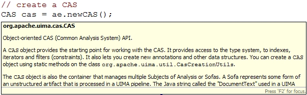

// Licensed to the Apache Software Foundation (ASF) under one
// or more contributor license agreements. See the NOTICE file
// distributed with this work for additional information
// regarding copyright ownership. The ASF licenses this file
// to you under the Apache License, Version 2.0 (the
// "License"); you may not use this file except in compliance
// with the License. You may obtain a copy of the License at
//
// http://www.apache.org/licenses/LICENSE-2.0
//
// Unless required by applicable law or agreed to in writing,
// software distributed under the License is distributed on an
// "AS IS" BASIS, WITHOUT WARRANTIES OR CONDITIONS OF ANY
// KIND, either express or implied. See the License for the
// specific language governing permissions and limitations
// under the License.

[[ugr.ovv.eclipse_setup]]
= Setting up the Eclipse IDE to work with UIMA
// <titleabbrev>Eclipse IDE setup for UIMA</titleabbrev>

This chapter describes how to set up the UIMA SDK to work with Eclipse.
Eclipse (&url_eclipse;link:) is a popular open-source Integrated Development Environment for many things, including Java.
The UIMA SDK does not require that you use Eclipse.
However, we recommend that you do use Eclipse because some useful UIMA SDK tools run as plug-ins to the Eclipse platform and because the UIMA SDK examples are provided in a form that's easy to import into your Eclipse environment.

If you are not planning on using the UIMA SDK with Eclipse, you may skip this chapter and read xref:tug.adoc#ugr.tug.aae[Annotator and Analysis Engine Developer's Guide]next.

This chapter provides instructions for 

* installing Eclipse, 
* installing the UIMA SDK's Eclipse plugins into your Eclipse environment, and 
* importing the example UIMA code into an Eclipse project. 

The UIMA Eclipse plugins are designed to be used with Eclipse version 4.10 (2018-12) or later. 

[NOTE]
====
You will need to run Eclipse using a Java at the 1.8 or later level, in order to use the UIMA Eclipse plugins.
====

[[ugr.ovv.eclipse_setup.installation]]
== Installation

[[ugr.ovv.eclipse_setup.install_eclipse]]
=== Install Eclipse

* Go to &url_eclipse;link: and follow the instructions there to download Eclipse. 
* We recommend using the latest release level. Navigate to the Eclipse Release version you want and download the archive for your platform.
* Unzip the archive to install Eclipse somewhere, e.g., c:\
* Eclipse has a bit of a learning curve. If you plan to make significant use of Eclipse, check out the tutorial under the help menu. It is well worth the effort. There are also books you can get that describe Eclipse and its use.

The first time Eclipse starts up it will take a bit longer as it completes its installation.
A "`welcome`" page will come up.
After you are through reading the welcome information, click on the arrow to exit the welcome page and get to the main Eclipse screens.

[[ugr.ovv.eclipse_setup.install_uima_eclipse_plugins]]
=== Installing the UIMA Eclipse Plugins

The best way to do this is to use the Eclipse Install New Software mechanism, because that will  insure that all needed prerequisites are also installed.
See below for an alternative, manual approach.

[NOTE]
====
If your computer is on an internet connection which uses a proxy server, you can configure Eclipse to know about that.
Put your proxy settings into Eclipse using the Eclipse preferences by accessing the menus: Window →Preferences... →Install/Update, and Enable HTTP proxy connection under the Proxy Settings with the information about your proxy. 
====

To use the Eclipse Install New Software mechanism, start Eclipse, and then pick the menu ``Help → Install new software...``.
In the next page, enter the following URL in the "Work with" box and press enter: 

*``https://www.apache.org/dist/uima/eclipse-update-site/``
+
*``https://www.apache.org/dist/uima/eclipse-update-site-v3/``
+

Choose the 2nd if you are working with core UIMA Java SDK at version 3 or later.
.

Now select the plugin tools you wish to install, and click Next, and follow the  remaining panels to install the UIMA plugins. 

[[ugr.ovv.eclipse_setup.install_uima_sdk]]
=== Install the UIMA SDK

If you haven't already done so, please download and install the UIMA SDK from &url_apache_uima_download;link:.
Be sure to set the environmental variable UIMA_HOME pointing to the root of the installed UIMA SDK and run the `adjustExamplePaths.bat` or `adjustExamplePaths.sh` script, as explained in the README.

The environmental parameter UIMA_HOME is used by the command-line scripts in the %UIMA_HOME%/bin directory as well as by eclipse run configurations in the uimaj-examples sample project.

[[ugr.ovv.eclipse_setup.install_uima_eclipse_plugins_manually]]
=== Installing the UIMA Eclipse Plugins, manually

If you installed the UIMA plugins using the update mechanism above, please skip this section.

If you are unable to use the Eclipse Update mechanism to install the UIMA plugins, you  can do this manually.
In the directory %UIMA_HOME%/eclipsePlugins (The environment variable %UIMA_HOME% is where you installed the UIMA SDK), you will see a set of folders.
Copy these to your %ECLIPSE_HOME%/dropins directory (%ECLIPSE_HOME% is where you installed Eclipse).

[[ugr.ovv.eclipse_setup.start_eclipse]]
=== Start Eclipse

If you have Eclipse running, restart it (shut it down, and start it again) using the `-clean` option; you can do this by running the command `eclipse -clean` (see explanation in the next section) in the directory where you installed Eclipse.
You may want to set up a desktop shortcut at this point for Eclipse.

[[ugr.ovv.eclipse_setup.special_startup_parameter_clean]]
==== Special startup parameter for Eclipse: -clean

If you have modified the plugin structure (by copying or files directly in the file system) after you started it for the first time, please include the "`-clean`" parameter in the startup arguments to Eclipse, _one time_ (after any plugin modifications were done). This is needed because Eclipse may not notice the changes you made, otherwise.
This parameter forces Eclipse to reexamine all of its plugins at startup and recompute any cached information about them.

[[ugr.ovv.eclipse_setup.example_code]]
== Setting up Eclipse to view Example Code

Later chapters refer to example code.
Here's how to create a special project in Eclipse to hold the examples.

* In Eclipse, if the Java perspective is not already open, switch to it by going to Window →Open Perspective →Java.
* Set up a class path variable named UIMA_HOME, whose value is the directory where you installed the UIMA SDK. This is done as follows: 
+
** Go to Window →Preferences →Java →Build Path →Classpath Variables.
** Click "`New`"
** Enter UIMA_HOME (all capitals, exactly as written) in the "`Name`" field.
** Enter your installation directory (e.g. ``C:/Program Files/apache-uima``) in the "`Path`" field
** Click "`OK`" in the "`New Variable Entry`" dialog
** Click "`OK`" in the "`Preferences`" dialog
** If it asks you if you want to do a full build, click "`Yes`"
* Select the File →Import menu option
* Select "`General/Existing Project into Workspace`" and click the "`Next`" button.
* Click "`Browse`" and browse to the %UIMA_HOME%/examples directory
* Click "`Finish.`" This will create a new project called "`uimaj-examples`" in your Eclipse workspace. There should be no compilation errors. 

To verify that you have set up the project correctly, check that there are no error messages in the "`Problems`" view.

[[ugr.ovv.eclipse_setup.adding_source]]
== Adding the UIMA source code to the jar files

[NOTE]
====
If you are running a current version of Eclipse, and have the m2e (Maven extensions for Eclipse)  plugin installed, Eclipse should be able to automatically download the source for the jars, so you may not need to do anything special (it does take a few seconds, and you need an internet connection).
====

Otherwise, if you would like to be able to jump to the UIMA source code in Eclipse or to step through it with the debugger, you can add the UIMA source code directly to the jar files.
This is done via a shell script that comes with the source distribution.
To add the source code to the jars, you need to: 

* Download and unpack the UIMA source distribution. 
* Download and install the UIMA binary distribution (the UIMA_HOME environment variable needs to be set to point to where you installed the UIMA binary distribution). 
* "cd" to the root directory of the source distribution
* Execute the `src\main\readme_src\addSourceToJars` script in the root directory of the  source distribution. 

This adds the source code to the jar files, and it will then be automatically available from Eclipse.
There is no further Eclipse setup required. 

[[ugr.ovv.eclipse_setup.linking_uima_javadocs]]
== Attaching UIMA Javadocs

The binary distribution also includes the UIMA Javadocs.
They are attached to the UIMA library Jar files in the uima-examples project described above.
You can attach the Javadocs to your own project as well. 

[NOTE]
====
If you attached the source as described in the previous section, you  don't need to attach the Javadocs because the source includes the Javadoc comments.
====

Attaching the Javadocs enables Javadoc help for UIMA APIs.
After they are  attached, if you hover your mouse over a certain UIMA api element, the corresponding Javadoc will appear.
You can then press "`F2`" to make the hover "stick", or "`Shift-F2`" to open the default  web-browser on your system to let you browse the entire Javadoc information  for that element. 

If this pop-up behavior is something you don't want, you can turn it off in the Eclipse preferences, in the menu __Window → Preferences → Java → Editors → hovers__. 

Eclipse also has a Javadoc "view" which you can show, using the __Window → Show View → Javadoc__.

See xref:ref.adoc#ugr.ref.javadocs.libraries[Using named Eclipse User Libraries] for information on how to set up a UIMA "library" with the Javadocs attached, which can be reused for other projects in your Eclipse workspace.

You can attach the Javadocs to each UIMA library jar you think you might be  interested in.
It makes most sense for the uima-core.jar, you'll probably use the core APIs most of all. 

Here's a screenshot of what you should see when you hover your mouse pointer over the class name "`CAS`" in the source code.

.Screenshot of mouse-over for UIMA APIs

[[ugr.ovv.eclipse_setup.running_external_tools_from_eclipse]]
== Running external tools from Eclipse

You can run many tools without using Eclipse at all, by using the shell scripts in the UIMA SDK's bin directory.
In addition, many tools can be run from inside Eclipse; examples are the Document Analyzer, CPE Configurator, CAS Visual Debugger,  and JCasGen.
The uimaj-examples project provides Eclipse launch configurations that make this easy to do.

To run these tools from Eclipse:

* If the Java perspective is not already open, switch to it by going to Window →Open Perspective →Java.
* Go to __Run → Run...__ 
* In the window that appears, select "`UIMA CPE GUI`", "`UIMA CAS Visual Debugger`", "`UIMA JCasGen`", or "`UIMA Document Analyzer`" from the list of run configurations on the left. (If you don't see, these, please select the uimaj-examples project and do a __Menu → File → Refresh__).
* Press the "`Run`" button. The tools should start. Close the tools by clicking the "`X`" in the upper right corner on the GUI. 

For instructions on using the Document Analyzer and CPE Configurator, in the xref:tools.adoc#ugr.tools.doc_analyzer[Docuemnt Analyzer], and xref:tools.adoc#ugr.tools.cpe[Collection Processing Engine Configurator User's Guide].
For instructions on using the CAS Visual Debugger and JCasGen, see xref:tools.adoc#ugr.tools.cvd[CAS Visual Debugger] and xref:tools.adoc#ugr.tools.jcasgen[JCasGen].