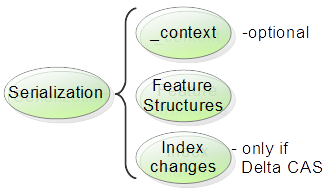

// Licensed to the Apache Software Foundation (ASF) under one
// or more contributor license agreements. See the NOTICE file
// distributed with this work for additional information
// regarding copyright ownership. The ASF licenses this file
// to you under the Apache License, Version 2.0 (the
// "License"); you may not use this file except in compliance
// with the License. You may obtain a copy of the License at
//
// http://www.apache.org/licenses/LICENSE-2.0
//
// Unless required by applicable law or agreed to in writing,
// software distributed under the License is distributed on an
// "AS IS" BASIS, WITHOUT WARRANTIES OR CONDITIONS OF ANY
// KIND, either express or implied. See the License for the
// specific language governing permissions and limitations
// under the License.

[[ugr.ref.json]]
= JSON Serialization of CASs and UIMA Description objects
// <titleabbrev>JSON support</titleabbrev>

[[ugr.ref.json.overview]]
== JSON serialization support overview

Applications are moving to the "cloud", and new applications are being rapidly developed that are hooking things up using various mashup techniques.
New standards and conventions are emerging to support this kind of application development, such as REST services.
JSON is now a popular way for services to communicate;  its popularity is rising (in 2014) while XML is falling.

Starting with version 2.7.0, JSON style serialization (but not (yet) deserialization)  for CASs and UIMA descriptions is supported.
The exact format of the serialization is configurable in several aspects.
The implementation is built on top of the Jackson JSON generation library. 

The next section discusses serialization for CASes, while a later section describes serialization of description objects, such as type system descriptions.

[[_ug.ref.json.cas]]
== JSON CAS Serialization

CASs primarily consist of collections of Feature Structures (FSs). Similar to XMI serialization, JSON serialization skips serializing unreachable FSs, outputting only those FSs that are found in the indexes (these are called __roots__), plus all of   the FSs that are referenced via some chain of references, from the roots. 

To support the kinds of things users do with FSs,  the serialized form may be augmented to include additional information beyond the FSs.

For traditional UIMA implementations, the serialized formats mostly assumed that the receivers had access to a type system description, which specified details of the types of each feature value.
For JSON serialization, some of this information can be including directly in the serialization.

This abbreviated type system information is one kind of additional information that can be included;  here's a summary list of the various kinds of additional information you can add to the serialization:

* having a way to identify which fields in a FS should be treated as references to other FSs, or as representing serialized binary data from UIMA byte arrays.
* something like XML namespaces to allow the use of short type names in the serialization while handling name collisions
* enough of the UIMA type hierarchy to allow the common operation of iterating over a type together  with all of its subtypes
* A way to identify which FSs were "added-to-the-indexes" (separately, per CAS View)  and therefore serve as roots when  iterating over types.
* An identification of the associated type system definition

Simple JSON serialization does not have a convention for supporting these, but many extensions do.
We borrow some of the concepts in the JSON-LD (linked data) standard in providing this  additional information.

[[_ug.ref.json.cas.bigpic]]
=== The Big Picture

CAS JSON serialization consists of several parts: an optional _context, the set of Feature Structures, and (if doing a delta serialization) information about changes to what was indexed.

.The major sections of JSON serialization

The serializer can be configured to omit the _context or parts of the _context for cases where that information isn't needed.
The index changes information is only included if Delta CAS serialization is specified.
Note that Delta CAS support is incomplete; so this information is just for planning purposes.

[[_ug.ref.json.cas.context]]
=== The _context section

The _context section has entries for each used type as well as some special additional entries.
Each entry for a type has multiple sub-entries, identified by a key-name.
Each sub-entry can be selectively omitted if not needed. 

* *\_type_system* - a URI of the type system information
* *\_types* - information about each used type 
+
** *\_id* - the type's fully qualified UIMA type name
** *\_feature_types* - a map from features of this type to  information about the type of the value of the feature
** *\_subtypes* - an array of used subtype short-names

Here's an example:

====
[source]
----
"_context" : {
  "_type_system" : "URI to the type system information",
  "_types : {
    "A_Typical_User_or_built_in_Type" : {
      "_id" : "org.apache.uima.test.A_Typical_User_or_built_in_Type", 
      "_feature_types" : [
           "sofa"         : "_ref", 
           "aFS"          : "_ref", 
           "an_array"     : "_array",
           "a_byte_array" : "_byte_array"],
      "_subtypes" : [ "subtype1", "subtype2", ... ] }, 
    "Sofa" : {
      "_id" : "uima.cas.Sofa", 
      "_feature_types" : {"sofaArray" : "_ref"} }
  }
}
----
====

The *\_type_system* is an optional URI that references a UIMA type system description that defines the types for the CAS being serialized.

In the *\_types* section, the key (e.g.
"Sofa" or "A_Typical_User_or_built_in_Type") is the "short" name  for the type used in the serialization.
It is either just the last segment of the full type name (e.g.
for the type x.y.z.TypeName, it's TypeName), or,  if name would collide with another type name if just the last segment was used (example:  some.package.cname.Foo,  and some.other.package.cname.Foo), then the key is made up of the next-to-last segment, with an optional suffixed incrementing integer in case of collisions on that name, a colon (:) and then the last name.

[quote]
In this example, since the next to last segment of both names is "cname", one namespace name would be "cname", and the other would be "cname1".  The keys in this case would be cname:Foo and cname1:Foo.

The value of the _id is the fully qualified name of the type.

The *\_feature_types* values of _ref, _array, and _byte_array indicate the corresponding values  of the named features need special handling  when deserailized. 

* *\_ref* - used when features are deserialized as numbers, but they are to be interpreted as references to other FSs whose `id` is the number. UIMA lists and arrays of  FSs are marked with _ref; if the value is a JSON array, the elements of the array will be either numbers (to be interpreted as references), or embedded serializations of FSs.
* *\_array* - used when features are serialized as JSON  arrays containing embedded values,  unless the corresponding UIMA object has multiple references, in which case it is serialized as a FS reference which looks like a single number. If a feature is marked with _array, then a non-array, single number should be interpreted as the `id` of the feature structure that is the array or the first element of the list of items. This designation is used for both UIMA arrays and lists.
+
This designation is for arrays and lists of primitive values, except for byte arrays.
In the case of FS arrays and lists, the _ref designation is used instead of this to indicate that the  resulting values in a JSON array that look like numbers should be interpreted as references.
* *\_byte_array* - _byte_array features are serialized numbers (if they are a  reference to a separate object, or as strings (if embedded).  The strings are to be decoded into binary byte arrays using the Base64 encoding (the standard one used by Jackson to serialize binary data).

Note that single element arrays are _not_ unwrapped, as in some other JSON serializations, to enable distinguishing references to arrays from embedded arrays. 

*\_subtypes* are a list of the type's used subtypes.
A type is _used_ if it is the type of a Feature Structure being serialized, or if it is in the supertype chain of some Feature Structure which is serialized.
If a type has no used subtypes, this element is omitted.
The names are represented as the "short" name.
Users typically use this information to construct support for iterators over a type which includes all of its subtypes.

[[_ug.ref.json.cas.context.omit]]
==== Omitting parts of the _context section

It is possible to selectively omit some of the  _context sections (or the entire _context), via configuration.
Here's an example:

====
[source]
----
// make a new instance to hold the serialization configuration           
JsonCasSerializer jcs = new JsonCasSerializer();  
// Omit the expanded type names information
jcs.setJsonContext(JsonContextFormat.omitExpandedTypeNames);
----
====

See the Javadocs for `JsonContextFormat` for how to specify the parts.

[[_ug.ref.json.cas.featurestructures]]
=== Serializing Feature Structures

Feature Structures themselves are represented as JSON objects consisting of field - value pairs, where the  fields correspond to UIMA Features, and the values are the values of the features. 

The various kinds of values for a UIMA feature are represented by their natural JSON counterpart.
UIMA primitive boolean values are represented by JSON true and false literals.
UIMA Strings are  represented as JSON strings.
Numbers are represented by JSON numbers.
Byte Arrays are represented by the Jackson standard binary encoding (base64 encoding), written as JSON strings.
References to other Feature Structures are also represented as JSON integer numbers, the values of which are  interpreted as ids of the referred-to FSs.
These ids are treated in the same manner as the xmi:ids of XMI Serialization.
Arrays and Lists when embedded (see following section) are represented as JSON arrays using the [] notation.

Besides the feature values defined for a Feature Structure, an additional special feature may be serialized:  _type.
The _type is the type name, written using the short format.
This is automatically included when the type cannot  easily be inferred from other contextual information. 

Here's an example, with some comments which, since JSON doesn't support comments, are just here for explanation:

====
[source]
----
{ "_type" : "Annotation", // _type may be omitted
  "feat1" : true,   // boolean value represented as true or false
  "feat2" : 123,    // could be a number or a reference to FS with id 123
  "feat3" : "b3axgh"//could be a string or a base64 encoded byte array
}
----
====

[[_ug.ref.json.cas.featurestructures.embedding]]
==== Embedding normally referenced values

Consider a FS which has a feature that refers to another FS.
This can be serialized in one of two ways:

* the value of the feature can be coded as an `id` (a number), where the number is the `id` of the referred-to FS.
* The value of the feature can be coded as the serialization of the referred-to FS.

This second way of encoding is often done by JSON style serializations, and is called "embedding".  Referred-to  FSs may be embedded if there are no other references to the embedded FS.
Multiple references may arise due to having a FS referenced as a "root" in some CAS View, or being used as a value in a FS feature.

Following the XMI conventions, UIMA arrays and lists which are  identified as singly referenced by either the static or dynamic method (see below) are embedded directly as the value of a feature.
In this case, the JSON serialization writes out the value of the feature as a JSON array.
Otherwise, the value is written out as a FS reference, and a separate serialization occurs of  the list elements or the array.

In addition to arrays and lists, FSs which are identifed as singly referenced from another FS are serialized as the embedded value of the referring feature.
This is also done (when using the dynamic method) for singly referenced rooted instances. 

If a FS is multiply referenced, the serialization in these cases is just the numeric value of the `id` of the FS.

[[_ug.ref.json.cas.featurestructures.dynamicstatic]]
==== Dynamic vs Static multiple-references and embedding

There are two methods of determining if a particular FS or list or array can be embedded. 

* *dynamic* - calculates at serilization time whether or not there are multiple references to a given FS.
* *static* - looks in the type system definition to see if  the feature is marked with <multipleReferencesAllowed>. 
+
** `multipleReferencesAllowed` false → use the embedded style
** `multipleReferencesAllowed` true → use separate objects

Note that since this flag is not available for  references to FSs from View indexes, any FS that is indexed in any view is considered (if using static mode) to be multipleReferencesAllowed. 

Delta serialization only supports the static method; this mode is forced on if delta serialization is specified.

Dynamic embedding is enabled by default for JSON, but may be disabled via configuration.

[[_ug.ref.json.cas.featurestructures.embeddedarrayslists]]
==== Embedded Arrays and Lists

When static embedding is being used, a case can arise where some feature is marked to have only  singly referenced FS values, but that value may actually be multiply referenced.
This is detected during  serialization, and an message is issued if an error handler has been specified to the serializer.
The serialization continues, however.
In the case of an Array, the value of the array is embedded in the serialization and the fact that these were referring to the same object is lost.
In the case of a list, if any element in the list has multiple references (for example,  if the list has back-references, loops, etc.),  the serialization of the list is truncated at the point where the multiple reference occurs.

[quote]
Note that you can correctly serialize arbitrarily linked complex list structures created  using the built-in list types only if you use dynamic embedding, or  specify `multipleReferencesAllowed` = true.

Embedded list or array values are both serialized using the JSON array notation; as a result, these alternative representations are not distinguised in the JSON serialization.

[[_ug.ref.json.cas.featurestructures.null]]
==== Omitting null values

Following the conventions established in XMI serialization, features with `null` values have their key-value pairs omitted from the FS serialization when the type of the feature value is: 

* a Feature Structure Reference
* a String ( whose value is ``null``, not "" (a 0-length String))
* an embedded Array or List (where the entire array and/or list is ``null``)

[NOTE]
====
Inside arrays or lists of FSs, references which are being serialized as references have a `null` reference coded as the number 0; references which are embedded are serialized as ``null``.
====

Configuring the serializer with `setOmit0Values(true)` causes additional primitive features (byte/short/int/long/float/double) to be omitted, when their values are 0 or 0.0

[[_ug.ref.json.cas.featurestructures.organization]]
== Organizing the Feature Structures

The set of all FSs being serialized is divided into two parts.
The first part represents all FSs that are root FSs, in that they were in one or more indexes at the time of serialization.
The second part represents feature structures that are multiply referenced, or are referenced via a chain of references from the root FSs.
The same feature structure can appear in both lists.
The elements in the second part are actual  serialized FSs, whereas, the elements in the first part are either references to the corresponding FSs in the second part, if they exist, or the actual embedded serialized FSs.
Actual embedded serialized FSs only exist once in the two parts.

====
[source]
----
"_views" : {
  "_InitialView" : {
     "theFirstType" : [  { ... fs1 ...}, 123, 456, { ... fsn ...} ]
     "anotherType"  : [  { ... fs1 ...}, ... { ... fsn ...} ]
      ...     // more types which have roots in view "12"
         },
  "AnotherView" : {
     "theFirstType" : [  { ... fsv1 ...}, 123, { ... fsvn ...} ]
     "anotherType"  : [  { ... fsv1 ...}, ... { ... fsvn ...} ]
      ...     // more types which have roots in view "25"
         },
   ...        // more views         
}, 

"_referenced_fss" : {
  "12" : {"_type" : "Sofa",  "sofaNum" : 1,  "sofaID" : "_InitialView" },
  "25" : {"_type" : "Sofa",  "sofaNum" : 2,  "sofaID" : "AnotherView" },
  
  "123" : { ... fs-123 ... },
  "456" : { ... fs-456 ... },
  ...
}
----
====

The first part map is made up of multiple maps, one for each separate CAS View.
The outer map is keyed by the `id` of the corresponding SofaFS (or 0, if there is no corresponding SofaFS). For each view, the value is a map whose key is a used Type, and the values are an array of instances of FSs of that type which were found in some index; these are the "root" FSs.
Only root instances of a particular type are included in this array. 

The second part map has keys which are the `id` value of the FSs, and values which are  a map of key-value pairs corresponding to the feature-values of that FS.
In this case, the _type extra feature is added to record the type.

The _views map, keyed by view and type name, has all the FSs (as an JSON array) for that type that were in one or more indexes in any View.
If a FS in this array is not multiply referenced (using dynamic mode),  then it is embedded here.
Otherwise, only the reference (a simple number representing the `id` of that FS) is serialized for that FS.

[[_ug.ref.json.cas.features]]
== Additional JSON CAS Serialization features

JSON serialization also supports several additional features, including:

* Type and feature filtering: only types and features that exist in a specified type system description  are serialized.
* An ErrorHandler; this will be called in various error situations, including when  serializing in static mode an array or list value for a feature marked `multipleReferencesAllowed = false` is found to have multiple references.
* A switch to control omitting of numeric features that have 0 values (default is to include these). See the `setOmit0Values(true_or_false)` method in JsonCasSerializer.
* a pretty printing flag (default is not to do pretty-printing)

See the Javadocs for JsonCasSerializer for details.

[[ugr.ref.json.delta]]
=== Delta CAS

[NOTE]
====
Delta CAS support is incomplete, and is not supported as of release 2.7.0, but may be supported in later releases.
The information here is just for planning purposes.
====

*\_delta_cas* is present only when a delta CAS serialization is being performed.
This serializes just the  changes in the CAS since a Mark was set; so for cases where a large CAS is deserialized into a service, which then does a relatively small amount of additions and modifications, only those changes are serialized.
The values of the keys are arrays of the ids of FSs that were added to the indexes,  removed from the indexes, or reindexed.

This mode requires the static embeddability mode.
When specified, a `\_delta_cas` key-value  is added to the serialization at the end,  which lists the FSs (by ``id``) that were added, removed, or reindexed, since the mark was set.
Additional extra information, created when the CAS was previously deserialized and the mark set,  must be passed to the serializer, in the form of an instance of ``XmiSerializationSharedData``, or JsonSerializationSharedData (not yet defined as of release 2.7.0).

Here's what the last part of the serialization looks like, when Delta CAS is specified: 

====
[source]
----
"_delta_cas" : {
  "added_members" : [  123, ... ],
  "deleted_members" : [  456, ... ],
  "reindexed_members" : [] }
----
====

[[ugr.ref.json.usage]]
== Using JSON CAS serialization

The support is built on top the Jackson JSON serialization package.
We follow Jackson conventions for configuring.

The serialization APIs are in the JsonCasSerializer class.

Although there are some static short-cut methods for common use cases, the basic operations needed to serialize a CAS as JSON are:

* Make an instance of the `JsonCasSerializer` class. This will serve to collect configuration information.
* Do any additional configuration needed. See the Javadocs for details. The following objects can be configured:
** The `JsonCasSerializer` object: here you can specify the kind of JSON formatting, what to serialize, whether or not delta serialization is wanted, prettyprinting, and more.
** The underlying `JsonFactory` object from Jackson. Normally, you won't need to configure this. If you do, you can create your own instance of this object and configure it and use it in the serialization.
** The underlying `JsonGenerator` from Jackson. Normally, you won't need to configure this. If you do, you can get the instance the serializer will be using and configure that.
* Once all the configuration is done, the serialize(...) call is done in this class,  which will create a one-time-use inner class where the actual serialization is done. The serialize(...) method is thread-safe, in that the same  JsonCasSerializer instance (after it has been configured) can kick off multiple  (identically configured) serializations  on different threads at the same time.
+
The serialize call follows the Jackson conventions, taking one of 3 specifications of where to serialize to: a Writer, an OutputStream, or a File.

Here's an example:

====
[source]
----
JsonCasSerializer jcs = new JsonCasSerializer();
jcs.setPrettyPrint(true); // do some configuration
StringWriter sw = new StringWriter();                          
jcs.serialize(cas, sw); // serialize into sw
----
====

The JsonCasSerializer class also has some static convenience methods for JSON serialization, for the most common configuration cases; please see the Javadocs for details.
These are named jsonSerialize, to  distinguish them from the non-static serialize methods.

Many of the common configuration methods generally return the instance, so they can be chained together.
For example, if `jcs` is an instance of the JsonCasSerializer, you can write `jcs.setPrettyPrint(true).setOmit0values(true);` to configure both of these.

[[ugr.ref.json.descriptionserialization]]
== JSON serialization for UIMA descriptors

UIMA descriptors are things like analysis engine descriptors, type system descriptors, etc.
UIMA has an internal form for these, typically named UIMA __description__s;  these can be serialized out as XML using a `toXML` method.
JSON support adds the ability to serialize these a JSON objects, as well.
It may be of use, for example, to have the full type system description for a UIMA pipeline available in JSON notation. 

The class JsonMetaDataSerializer defines a set of static methods that serialize UIMA description objects using a toJson method that takes as an argument the description object to be serialized, and the standard set of serialiization targets that Jackson supports (File, Writer, or OutputStream).  There is also an optional prettyprint flag (default is no prettyprinting).

The resulting JSON serialization is just a straight-forward serialization of the description object, having the same fields as the XML serialization of it.

Here's what a small TypeSystem description looks like, serialized:

====
[source]
----
{"typeSystemDescription" : 
  {"name" : "casTestCaseTypesystem",  
   "description" : "Type system description for CAS test cases.",  
   "version" : "1.0",  
   "vendor" : "Apache Software Foundation",  
   "types" : [
     {"typeDescription" : 
       {"name" : "Token",  
        "description" : "",  
         "supertypeName" : "uima.tcas.Annotation",  
         "features" : [
           {"featureDescription" : 
             {"name" : "type",  
              "description" : "",  
              "rangeTypeName" : 
              "TokenType" } }, 
           {"featureDescription" : 
             {"name" : "tokenFloatFeat",  
              "description" : "",  
              "rangeTypeName" : "uima.cas.Float" } } ] } }, 
     {"typeDescription" : 
       {"name" : "TokenType",  
        "description" : "",  
        "supertypeName" : "uima.cas.TOP" } } ] } }
----
====

Here's a sample of code to serialize a UIMA description object held in the variable ``tsd``, with  and without pretty printing:

====
[source]
----
StringWriter sw = new StringWriter();                               
JsonMetaDataSerializer.toJSON(tsd, sw); // no prettyprinting

sw = new StringWriter();             
JsonMetaDataSerializer.toJSON(tsd, sw, true); // prettyprinting
----
====