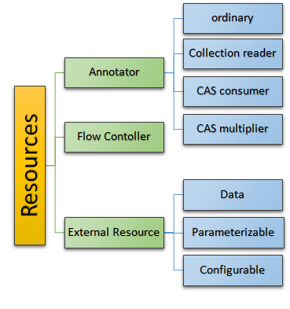

// Licensed to the Apache Software Foundation (ASF) under one
// or more contributor license agreements. See the NOTICE file
// distributed with this work for additional information
// regarding copyright ownership. The ASF licenses this file
// to you under the Apache License, Version 2.0 (the
// "License"); you may not use this file except in compliance
// with the License. You may obtain a copy of the License at
//
// http://www.apache.org/licenses/LICENSE-2.0
//
// Unless required by applicable law or agreed to in writing,
// software distributed under the License is distributed on an
// "AS IS" BASIS, WITHOUT WARRANTIES OR CONDITIONS OF ANY
// KIND, either express or implied. See the License for the
// specific language governing permissions and limitations
// under the License.

[[ugr.ref.resources]]
= UIMA Resources
// <titleabbrev>UIMA Resources</titleabbrev>

[[ugr.ref.resources.overview]]
== What is a UIMA Resource?

UIMA uses the term `Resource` to describe all UIMA components that can be acquired by an application or by other resources.

.Resource Kinds

There are many kinds of resources; here's a list of the main kinds: 

*Annotator*::
a user written component, receives a CAS, does some processing, and returns the possibly updated CAS.
Variants include CollectionReaders, CAS Consumers, CAS Multipliers.

*Flow Controller*::
a user written component controlling the flow of CASes within an aggregate.

*External Resource*::
a user written component.
Variants include: 
+

* Data - includes special lifecycle call to load data
* Parameterized - allows multiple instantiations with simple string parameter variants; example: a dictionary, that has variants in content for different languages
* Configurable - supports configuration from the XML specifier

[[ugr.ref.resources.resource_inner_implementations]]
=== Resource Inner Implementations

Many of the resource kinds include in their specification a (possibly optional) element, which is  the name of a Java class which implements the resource.
We will call this class the "inner implementation".

The UIMA framework creates instances of Resource from resource specifiers, by calling  the framework's `produceResource(specifier, additional_parameters)` method.
This call produces a instance of Resource. 

____
For example, calling produceResource on an AnalysisEngineDescription produces an instance of AnalysisEngine.
This, in turn will have a reference to the user-written inner implementation class.
specified by the ``annotatorImplementationName``. 

External resource descriptors may include an `implementationName` element.
Calling produceResource on a ExternalResourceDescription produces an instance of Resource; the resource obtained by subsequent calls to `getResource(...)`  is dependent on the particular descriptor, and may be an instance of the inner implementation class. 
____

For external resources, each resource specifier kind handles the case where  the inner implementation is omitted.
If it is supplied, the named class must implement the interface specified in the bindings for this resource.
In addition, the particular specifier kind may  further restrict the kinds of classes the user supplies as the implementationName. 

Some examples of this further restriction: 

*customResource*::
the class must also implement the Resource interface

*dataResource*::
the class must also implement the SharedResourceObject interface

[[ugr.ref.resources.sharing_across_pipelines]]
== Sharing Resources, even across pipelines
// <titleabbrev>Sharing Resources</titleabbrev>

UIMA applications run one or more UIMA Pipelines.
Each pipeline has a top-level Analysis Engine, which may be an aggregation of many other Analysis Engine components.
The UIMA framework instantiates Annotator  resources as specified to configure the pipelines.

Sometimes, many identical pipelines are created (for example, in order to exploit multi-core hardware by processing multiple CASes in parallel). In this case, the framework would produce multiple instances of those Annotation resources; these are implemented as multiple instances of the same Java class.

Sets of External Resources plus a CAS Pool and UIMA Extension ClassLoader are set up and kept,  per instance of a ResourceManager;  this instance serves to allow sharing of these items across one or more pipelines. 

* The UIMA Extension ClassLoader (if specified) is used to find the resources to be loaded by the framework
* The `External Resources` are specified by a pipeline's resource configuration.
* The CAS Pool is a pool of CASs all with identical type systems and index definitions, associated  with a pipeline.

When setting up a pipeline, the UIMA Framework's `produceResource`  or one of its specialized variants is called, and a new ResourceManager being created and used for that pipeline.
However, in many cases, it may be advantageous to share the same Resources across multiple pipelines; this is easily doable by passing a common instance of the ResourceManager to the pipeline creation methods (using the additional parameters of the produceResource method).

To handle additional use cases, the ResourceManager has a `copy()` method which creates a copy of the Resource Manager instance.
The new instance is created with a null CAS Manager; if you want to share the the CAS Pool, you have to copy the CAS Manager: ``newRM.setCasManager(originalRM.getCasManager())``.
You also may set the Extension Class Loader in the new instance (PEAR wrappers use this to allow PEARs to have their own classpath).  See the Javadocs for details. 

[[ugr.ref.resources.external_resource_multiple_parameterized_instances]]
== External Resources support for multiple Parameterized Instances

A typical external resource gets a single instantiation, shared with all users of a particular ResourceManager.
Sometimes, multiple instantiations may be useful (of the same resource).  The framework supports this for  ParameterizedDataResources.
There's one kind supplied with UIMA - the fileLanguageResourceSpecifier.
This works by having each call to getResource(name, extra_keys[]) use the extra keys to select a particular instance.
On the first call for a particular instance, the named resource uses the extra keys to  initialize a new instance by calling its `load` method with a data resource derived from the  extra keys by the named resource. 

For example, the fileLanguageResourceSpecifier uses the language code and goes through  a process with lots of defaulting and fall back to find a resource to load, based on the language code. 