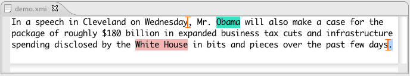
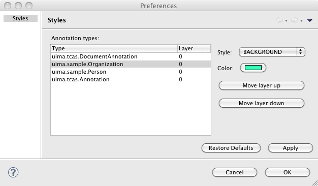

// Licensed to the Apache Software Foundation (ASF) under one
// or more contributor license agreements. See the NOTICE file
// distributed with this work for additional information
// regarding copyright ownership. The ASF licenses this file
// to you under the Apache License, Version 2.0 (the
// "License"); you may not use this file except in compliance
// with the License. You may obtain a copy of the License at
//
// http://www.apache.org/licenses/LICENSE-2.0
//
// Unless required by applicable law or agreed to in writing,
// software distributed under the License is distributed on an
// "AS IS" BASIS, WITHOUT WARRANTIES OR CONDITIONS OF ANY
// KIND, either express or implied. See the License for the
// specific language governing permissions and limitations
// under the License.

[[ugr.tools.ce]]
= Cas Editor User's Guide
// <titleabbrev>Cas Editor User's Guide</titleabbrev>

[[_sandbox.caseditor.introduction]]
== Introduction

The CAS Editor is an Eclipse based annotation tool which supports manual and automatic annotation (via running UIMA annotators) of CASes stored in files.
Currently only text-based CAS are supported.
The CAS Editor can visualize and edit all feature structures.
Feature Structures which are annotations can additionally be viewed and edited directly on text. 

image::images/tools/tools.caseditor/CasEditor.png[]

[[_sandbox.caseditor.launching]]
== Launching the Cas Editor

To open a CAS in the Cas Editor it needs a compatible type system and styling information which specify how to display the types.
The styling information is created automatically by the Cas Editor; but the type system file must be provided by the user. 

A CAS in the xmi or xcas format can simply be opened by clicking on it, like a text file is opened with the Eclipse text editor.

[[_sandbox.caseditor.typesystemspec]]
=== Specifying a type system

The Cas Editor expects a type system file at the root of the project named TypeSystem.xml.
If a type system cannot be found, this message is shown: 

image::images/tools/tools.caseditor/ProvideTypeSystem.png[No type system available for the opened CAS.]

If the type system file does not exist in this location you can point the Cas Editor to a specific type system file.
You can also change the default type system location in the properties page of the Eclipse project.
To do that right click the project, select Properties and go to the UIMA Type System tab, and specify the default location for the type system file. 

After the Cas Editor is opened switch to the Cas Editor Perspective to see all the Cas Editor related views. 

[[_sandbox.caseditor.annotation_editor]]
== Annotation editor

The annotation editor shows the text with annotations and provides different views to show aspects of the CAS. 

[[ugr.tools.cas_editor.annotation_editor.editor]]
=== Editor

After the editor is open it shows the default sofa of the CAS.
(Displaying another sofa is right now not possible.) The editor has an associated, changeable CAS Type.
This type is called the editor "mode". By default the editor only shows annotation of this type.
Actions and views are sensitive to this mode.
The next screen shows the display, where the mode is set to "Person": 

image::images/tools/tools.caseditor/EditorOneType.png[]
				 To change the mode for the editor, use the "Mode" menu in the editor context menu.
To open the context menu right click somewhere on the text. 

image::images/tools/tools.caseditor/ModeMenu.png[]
				        	 The current mode is displayed in the status line at the bottom and in the Style View. 

It's possible to work with more than one annotation type at a time; the mode just selects the default annotation type which can be marked with the fewest keystrokes.
To show annotations of other types, use the "Show" menu in the context menu. 

image::images/tools/tools.caseditor/ShowAnnotationsMenu.png[]
				 Alternatively, you may select the annotation types to be shown in the Style View. 

image::images/tools/tools.caseditor/StyleView2.png[]
 The editor will show the additional selected types. 

				 The annotation renderer and rendering layer can be changed in the Properties dialog.
After the change all editors which share the same type system will be updated. 

The editor automatically selects annotations of the editor mode type that are near the cursor.
This selection is then synchronized or displayed in other views. 

To create an annotation manually using the editor, mark a piece of text and then press the enter key.
This creates an annotation of the  type of the editor mode, having bounds corresponding to the selection.
You can also use the "Quick Annotate" action from the context menu. 

It is also possible to choose the annotation type; press shift + enter (smart insert) or click on "Annotate" in the context menu for this.
A dialog will ask for the annotation type to create; either select the desired type or use the associated key shortcut.
In the screen shot below, pressing the "p" key will create a Person annotation for "Obama". 

image::images/tools/tools.caseditor/ShiftEnter.png[]

To delete an annotation, select it and press the delete key.
Only annotations of the editor mode can be deleted with this method.
To delete non-editor mode annotations use the Outline View. 

For annotation projects you can change the font size in the editor.
The default font size is 13.
To change this open the Eclipse preference dialog,  go to "UIMA Annotation Editor". 

[[_sandbox.caseditor.annotation_editor.styling]]
=== Configure annotation styling

The Cas Editor can visualize the annotations in multiple highlighting colors and with different annotation drawing styles.
The annotation styling is defined per type system.
When its changed, the appearance changes in all opened editors sharing a type system. 

The styling is initialized with a unique color for every annotation type and every annotation is drawn with Squiggles annotation style.
You may adjust the annotation styles and coloring depending on the project needs. 

image::images/tools/tools.caseditor/StyleView.png[]

The Cas Editor offers a property page to edit the styling.
To open this property page click on the "Properties" button in the Styles view. 

The property page can be seen below.
By clicking on one of the annotation types, the color, drawing style and drawing layer can be edited on the right side. 

The annotations can be visualized with one the following  annotation stlyes: 

.Style Table
[cols="1,1,1", frame="all", options="header"]
|===
| Style
| Sample
| Description

|BACKGROUND
|

image::images/tools/tools.caseditor/Style-Background.png[]

|

The background is drawn in the annotation color.

|TEXT_COLOR
|

|

The text is drawn in the annotation color.

|TOKEN
|

image::images/tools/tools.caseditor/Style-Token.png[]

|

The token type assumes that token annotation are always separated by a whitespace.
Only if they are not separated by a whitespace a vertical line is drawn to display the two token annotations.
The image on the left actually contains three annotations, one for "Mr", "." and "Obama". 

|SQUIGGLES
|

image::images/tools/tools.caseditor/Style-Squiggles.png[]

|

Squiggles are drawen under the annotation in the annotation color.

|BOX
|

image::images/tools/tools.caseditor/Style-Box.png[]

|

A box in the annotation color is drawn around the annotation.

|UNDERLINE
|

image::images/tools/tools.caseditor/Style-Underline.png[]

|

A line in the annotation color is drawen below the annotation.

|BRACKET
|

|

An opening bracket is drawn around the first character of the annotation and a closing bracket is drawn around the last character of the annotation.
|===

The Cas Editor can draw the annotations in different layers.
If the spans of two annotations overlap the annotation which is in a higher layer is drawn over annotations in a lower  layer.
Depending on the drawing style it is possible to see both annotations.
The drawing order is defined by the layer number, layer 0 is drawn first, then layer 1 and so on.
If annotations in the same layer overlap its not defined which annotation type is drawn first. 

[[ugr.tools.cas_editor.annotation_editor.cas_views]]
=== CAS view support

The Annotation Editor can only display text Sofa CAS views.
Displaying CAS views with Sofas of different types is not possible and will show an editor page to switch back to another CAS view.
The Edit and Feature Structure Browser views are still available and might be used to edit Feature Structures which belong to the CAS view. 

To switch to another CAS view, right click in the editor to open the context menu and choose "CAS Views" and the view the editor should switch to. 

[[ugr.tools.cas_editor.annotation_editor.outline]]
=== Outline view

The outline view gives an overview of the annoations which are shown in the editor.
The annotation are grouped by type.
There are actions to increase or decrease the bounds of the selected annotation.
There is also an action to merge selected annotations.
The outline has second view mode where only annotations of the current editor mode are shown. 

image::images/tools/tools.caseditor/Outline.png[]
			 
The style can be switched in the view menu, to a style where it only shows the annotations which  belong to the current editor mode. 

[[ugr.tools.cas_editor.annotation_editor.properties_view]]
=== Edit Views

The Edit Views show details about the currently selected annotations or feature structures.
It is possible to change primitive values in this view.
Referenced feature structures can be created and deleted, including arrays.
To link a feature structure with other feature structures, it can be pinned to the edit view.
This means that it does not change if the selection changes. 

image::images/tools/tools.caseditor/EditView.png[]

[[ugr.tools.cas_editor.annotation_editor.fs_view]]
=== FeatureStructure View

The FeatureStructure View lists all feature structures of a specified type.
The type is selected in the type combobox. 

It's possible to create and delete feature structures of every type. 

image::images/tools/tools.caseditor/FSView.png[]

[[ugr.tools.cas_editor.custom_view]]
== Implementing a custom Cas Editor View

Custom Cas Editor views can be added,  to rapidly create, access and/or change Feature Structures in the CAS.
While the Annotation Editor and its views offer support for general viewing and editing, accessing and editing things in the CAS can be streamlined using a custom Cas Editor.
A custom Cas Editor view can be programmed to use a particular type system and optimized to quickly change or show something. 

Annotation projects often need to track the annotation status of a CAS where a user needs to mark which parts have been annotated or corrected.
To do this with the Cas Editor a user would need to use the Feature Structure Browser view to select the Feature Structure and then edit it inside the Edit view.
A custom Cas Editor view could directly select and show the Feature Structure and offer  a tailored user interface to change the annotation status.
Some features such as the name of the annotator could even be automatically filled in. 

The creation of Feature Structures which are linked to existing annotations or Feature Structures is usually difficult with the standard views.
A custom view which can make assumptions about the type system is usually needed to do this efficiently. 

[[ugr.tools.cas_editor.custom_view.sample]]
=== Annotation Status View Sample

The Cas Editor provides the CasEditorView class as a base class for views which need to access the CAS which is opened in the current editor.
It shows a "view not available" message when the current editor does not show a CAS, no editor is opened at all or the current CAS view is incompatible with the view. 

The following snippet shows how it is usually implemented: 

[source]
----
public class AnnotationStatusView extends CasEditorView {
	
  public AnnotationStatusView() {
    super("The Annotation Status View is currently not available.");
  }

  @Override
  protected IPageBookViewPage doCreatePage(ICasEditor editor) {
    ICasDocument document = editor.getDocument();

    if (document != null) {
      return new AnnotationStatusViewPage(editor);
    }

    return null;
  }
}
----

The `doCreatePage` method is called to create the actual view page.
If the document is null the editor failed to load a document and is showing an error message.
In the case the document is not null but the CAS view is incompatible the method should return null to indicate that it has nothing to show.
In this case the "not available" message is displayed. 

The next step is to implement the AnnotationStatusViewPage.
That is the page which gets the CAS as input and need to provide the user with a ui to change the Annotation Status Feature Structure. 

[source]
----
public class AnnotationStatusViewPage extends Page {
  
  private ICasEditor editor;
  
  AnnotationStatusViewPage(ICasEditor editor) {
    this.editor = editor;
  }
  
  ...
  
  public void createControl(Composite parent) {
  
    // create ui elements here
    
    ...
    
    ICasDocument document = editor.getDocument();
    CAS cas = document.getCAS();
    
    // Retrieve Annotation Status FS from CAS
    // and initalize the ui elements with it
    
    FeatureStructre statusFS;
    
    ...
    
    // Add event listeners to the ui element
    // to save an update to the CAS
    // and to advertise a change
    
    ...
    
    // Send update event
    document.update(statusFS);
    
  }
}
----

The above code sketches out how a typical view page is implemented.
The CAS can be directly used to access any Feature Structures or annotations stored in it.
When something is modified added/removed/changed that must be advertised via the ICasDocument object.
It has multiple notification methods which send an event so that other views can be updated.
The view itself can also register a listener to receive CAS change events. 