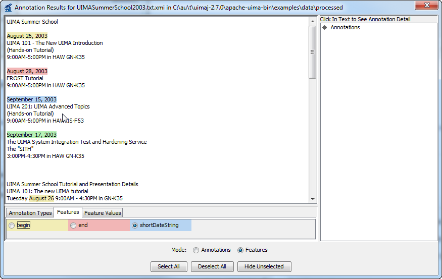
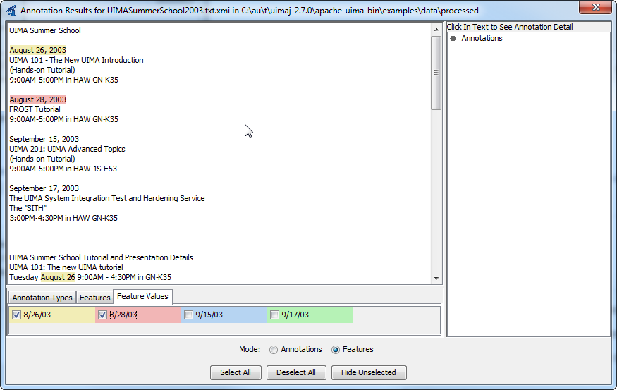

// Licensed to the Apache Software Foundation (ASF) under one
// or more contributor license agreements. See the NOTICE file
// distributed with this work for additional information
// regarding copyright ownership. The ASF licenses this file
// to you under the Apache License, Version 2.0 (the
// "License"); you may not use this file except in compliance
// with the License. You may obtain a copy of the License at
//
// http://www.apache.org/licenses/LICENSE-2.0
//
// Unless required by applicable law or agreed to in writing,
// software distributed under the License is distributed on an
// "AS IS" BASIS, WITHOUT WARRANTIES OR CONDITIONS OF ANY
// KIND, either express or implied. See the License for the
// specific language governing permissions and limitations
// under the License.

[[ugr.tools.doc_analyzer]]
= Document Analyzer User's Guide

The _Document Analyzer_ is a tool provided by the UIMA SDK for testing annotators and AEs.
It reads text files from your disk, processes them using an AE, and allows you to view the results.
The Document Analyzer is designed to work with text files and cannot be used with Analysis Engines that process other types of data.

For an introduction to developing annotators and Analysis Engines, read xref:tug.adoc#ugr.tug.aae[Annotator and Analysis Engine Developer's Guide]$$.$$
This chapter is a user's guide for using the Document Analyzer tool, and does not describe the process of developing annotators and Analysis Engines.

[[ugr.tools.doc_analyzer.starting]]
== Starting the Document Analyzer

To run the Document Analyzer, execute the `documentAnalyzer` script that is in the `bin` directory of your UIMA SDK installation, or, if you are using the example Eclipse project, execute the "`UIMA Document Analyzer`" run configuration supplied with that project.

Note that if you're planning to run an Analysis Engine other than one of the examples included in the UIMA SDK, you'll first need to update your CLASSPATH environment variable to include the classes needed by that Analysis Engine.

When you first run the Document Analyzer, you should see a screen that looks like this: 

image::images/tools/tools.doc_analyzer/DocAnalyzerScr1.png[Document Analyzer GUI]

[[ugr.tools.doc_analyzer.running_an_ae]]
== Running an AE

To run a AE, you must first configure the six fields on the main screen of the Document Analyzer.

*Input Directory:*   Browse to or type the path of a directory containing text files that you want to analyze.
Some sample documents are provided in the UIMA SDK under the `examples/data` directory.

*Input File Format:* Set this to "text".  It can, alternatively,  be set to one of the two serialized forms for CASes, if you have previously generated and saved these.
For the CAS formats only, you can also specify "Lenient deserialization"; if checked, then extra types and features in the CAS being deserialized and loaded (that are not defined by the Annotator-to-be-run's type system) will not cause a deserialization error, but will instead be ignored.

*Character Encoding:*   The character encoding of the input files.
The default, UTF-8, also works fine for ASCII text files.
If you have a different encoding, select it here.
For more information on character sets and their names, see the Javadocs for ``java.nio.charset.Charset``.

*Output Directory:* Browse to or type the path of a directory where you want output to be written.
(As we'll see later, you won't normally need to look directly at these files, but the Document Analyzer needs to know where to write them.) The files written to this directory will be an XML representation of the analyzed documents.
If this directory doesn't exist, it will be created.
If the directory exists, any files in it will be deleted (but the tool will ask you to confirm this before doing so). If you leave this field blank, your AE will be run but no output will be generated.

*Location of AE XML Descriptor:*   Browse to or type the path of the descriptor for the AE that you want to run.
There are some example descriptors provided in the UIMA SDK under the `examples/descriptors/analysis_engine` and `examples/descriptors/tutorial` directories.

*XML Tag containing Text:*   This is an optional feature.
If you enter a value here, it specifies the name of an XML tag, expected to be found within the input documents, that contains the text to be analyzed.
For example, the value `TEXT` would cause the AE to only analyze the portion of the document enclosed within <TEXT>...</TEXT> tags.
Also, any XML tags occuring within that text will be removed prior to analysis.

*Language:* Specify the language in which the documents are written.
Some Analysis Engines, but not all, require that this be set correctly in order to do their analysis.
You can select a value from the drop-down list or type your own.
The value entered here must be an ISO language identifier, the list of which can be found here: http://www.ics.uci.edu/pub/ietf/http/related/iso639.txt. 

Once you've filled in the appropriate values, press the "`Run`" button.

If an error occurs, a dialog will appear with the error message.
(A stack trace will also be printed to the console, which may help you if the error was generated by your own annotator code.)  Otherwise, an "`Analysis Results`" window will appear.

[[ugr.tools.doc_analyzer.viewing_results]]
== Viewing the Analysis Results

After a successful analysis, the "`Analysis
Results`" window will appear. 

image::images/tools/tools.doc_analyzer/image004.jpg[Analysis Results Window]

The "`Results Display Format`" options at the bottom of this window show the different ways you can view your analysis – the Java Viewer, Java Viewer (JV) with User Colors, HTML, and XML.
The default, Java Viewer, is recommended.

Once you have selected your desired Results Display Format, you can double-click on one of the files in the list to view the analysis done on that file.

For the Java viewer, two different view modes are supported, each represented by one of two  radio buttons titled "Annnotations", and "Features":

In the "Annotations" view, each annotation which is declared to be an output of the pipeline  (in the top most Annotator Descriptor) is given a checkbox and a color, in the bottom panel.
You can control which annotations are shown by using the checkboxes in the bottom panel, the Select All button,  or the Deselet All button.
The results display looks like this (for the AE descriptor ``examples/descriptors/tutorial/ex4/MeetingDetectorTAE.xml``): 

image::images/tools/tools.doc_analyzer/image006v2.png[Analysis Results Window showing results from tutorial example 4 in Annotations view mode]

You can click the mouse on one of the highlighted annotations to see a list of all its features in the frame on the right.

In the "Features" view, you can specify a combination of a single type, a single feature of that type, and some feature values for that feature.
The annotations whose feature values match will be highlighted.
Step by step, you first select a specific type of annotations by using  a radio button in the first tab of the legend. 

image::images/tools/tools.doc_analyzer/image007-1v2.png[Analysis Results Window showing results from tutorial example 4 in Features view mode by selecting the DateAnnotation type.]

Selecting this automatically transitions to the second tab, where you then select a specific feature  of the annotation type. 

Selecting this again automatically transitions you to the thrid tab, where you select some specific feature  values in the third tab of the legend. 

In each of the above two view modes, you can click the mouse on one of the highlighted  annotations to see a list of all its features in the frame on the right.

If you are viewing a CAS that contains multiple subjects of analysis, then a selector will appear at the bottom right of the Annotation Viewer window.
This will allow you to choose the Sofa that you wish to view.
Note that only text Sofas containing a non-null document are available for viewing.

[[ugr.tools.doc_analyzer.configuring]]
== Configuring the Annotation Viewer

The "`JV User Colors`" and the HTML viewer allow you to specify exactly which colors are used to display each of your annotation types.
For the Java Viewer, you can also specify which types should be initially selected, and you can hide types entirely.

To configure the viewer, click the "`Edit Style
Map`" button on the "`Analysis Results`" dialog.
You should see a dialog that looks like this: 

image::images/tools/tools.doc_analyzer/image008.jpg[Configuring the Analysis Results Viewer]

To change the color assigned to a type, simply click on the colored cell in the "`Background`" column for the type you wish to edit.
This will display a dialog that allows you to choose the color.
For the HTML viewer only, you can also change the foreground color.

If you would like the type to be initially checked (selected) in the legend when the viewer is first launched, check the box in the "`Checked`" column.
If you would like the type to never be shown in the viewer, click the box in the "`Hidden`" column.
These settings only affect the Java Viewer, not the HTML view.

When you are done editing, click the "`Save`" button.
This will save your choices to a file in the same directory as your AE descriptor.
From now on, when you view analysis results produced by this AE using the "`JV User Colors`" or "`HTML`" options, the viewer will be configured as you have specified.

[[ugr.tools.doc_analyzer.interactive_mode]]
== Interactive Mode

Interactive Mode allows you to analyze text that you type or cut-and-paste into the tool, rather than requiring that the documents be stored as files.

In the main Document Analyzer window, you can invoke Interactive Mode by clicking the "`Interactive`" button instead of the "`Run`" button.
This will display a dialog that looks like this: 

image::images/tools/tools.doc_analyzer/image010.jpg[Invoking Interactive Mode]

You can type or cut-and-paste your text into this window, then choose your Results Display Format and click the "`Analyze`" button.
Your AE will be run on the text that you supplied and the results will be displayed as usual.

[[ugr.tools.doc_analyzer.view_mode]]
== View Mode

If you have previously run a AE and saved its analysis results, you can use the Document Analyzer's View mode to view those results, without re-running your analysis.
To do this, on the main Document Analyzer window simply select the location of your analyzed documents in the "`Output Directory`" dialog and click the "`View`" button.
You can then view your analysis results as described in Section <<ugr.tools.doc_analyzer.viewing_results>>.