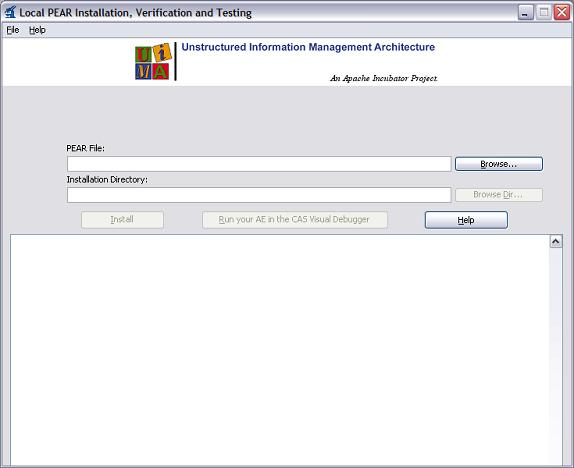

// Licensed to the Apache Software Foundation (ASF) under one
// or more contributor license agreements. See the NOTICE file
// distributed with this work for additional information
// regarding copyright ownership. The ASF licenses this file
// to you under the Apache License, Version 2.0 (the
// "License"); you may not use this file except in compliance
// with the License. You may obtain a copy of the License at
//
// http://www.apache.org/licenses/LICENSE-2.0
//
// Unless required by applicable law or agreed to in writing,
// software distributed under the License is distributed on an
// "AS IS" BASIS, WITHOUT WARRANTIES OR CONDITIONS OF ANY
// KIND, either express or implied. See the License for the
// specific language governing permissions and limitations
// under the License.

[[ugr.tools.pear.installer]]
= PEAR Installer User's Guide

PEAR (Processing Engine ARchive) is a new standard for packaging UIMA compliant components.
This standard defines several service elements that should be included in the archive package to enable automated installation of the encapsulated UIMA component.
The major PEAR service element is an XML Installation Descriptor that specifies installation platform, component attributes, custom installation procedures and environment variables. 

The installation of a UIMA compliant component includes 2 steps: (1) installation of the component code and resources in a local file system, and (2) verification of the serviceability of the installed component.
Installation of the component code and resources involves extracting component files from the archive (PEAR) package in a designated directory and localizing file references in component descriptors and other configuration files.
Verification of the component serviceability is accomplished with the help of standard UIMA mechanisms for instantiating analysis engines. 

There are two versions of the PEAR Installer.
One is an interactive, GUI-based application which puts up a panel asking for the parameters of the installation; the  other is a command line interface version where you pass the parameters needed on the command line itself.
To launch the GUI version of the PEAR Installer, use the script in the UIMA bin directory: `runPearInstaller.bat` or `runPearInstaller.sh.` The command line is launched using `runPearInstallerCli.cmd` or `runPearInstallerCli.sh.`

The PEAR Installer installs UIMA compliant components (analysis engines) from PEAR packages in a local file system.
To install a desired UIMA component the user needs to select the appropriate PEAR file in a local file system and specify the installation directory (optional). If no installation directory is specified, the PEAR file is installed to the current working directory.
By default the PEAR packages are not installed directly to the specified installation directory.
For each PEAR a subdirectory with the name of the PEAR's ID is created where the PEAR package is  installed to.
If the PEAR installation directory already exists, the old content is automatically  deleted before the new content is installed.
During the component installation the user can read messages printed by the installation program in the message area of the application window.
If the installation fails, appropriate error message is printed to help identifying and fixing the problem.

After the desired UIMA component is successfully installed, the PEAR Installer allows testing this component in the CAS Visual Debugger (CVD) application, which is provided with the UIMA package.
The xref:tools.adoc#ugr.tools.cvd[CVD application] will load your UIMA component using its XML descriptor file.
If the component is loaded successfully, you'll be able to run it either with sample documents provided in the `<UIMA_HOME>/examples/data` directory, or with any other sample documents.
Running your component in the CVD application helps to make sure the component will run in other UIMA applications.
If the CVD application fails to load or run your component, or throws an exception, you can find more information about the problem in the uima.log file in the current working directory.
The log file can be viewed with the CVD.

PEAR Installer creates a file named `setenv.txt` in the `<component_root>/metadata` directory.
This file contains environment variables required to run your component in any UIMA application.
It also creates a xref:ref.adoc#ugr.ref.pear.specifier[PEAR descriptor] file named `<componentID>_pear.xml` in the `<component_root>` directory that can be used to directly run the installed pear file in your application. 

The `metadata/setenv.txt` is not read by the UIMA framework anywhere.
It's there for use by non-UIMA application code if that code wants to set environment variables.
The `metadata/setenv.txt` is just a "convenience" file duplicating what is in the XML. 

The `setenv.txt` file has two special variables: the `CLASSPATH` and the `PATH`.
The `CLASSPATH` is computed from any supplied `CLASSPATH` environment variable,  plus the jars that are configured in the PEAR structure, including subcomponents.
The `PATH` is similarly computed, using any supplied `PATH` environment variable plus  it includes the `bin` subdirectory of the PEAR structure, if it exists. 

The command line version of the PEAR installer has one required argument: the path to the PEAR file being installed.
A second argument can specify the installation directory (default is the current working directory). An optional argument, one of `-c` or `-check` or `-verify`, causes verification to be done after installation, as described above.