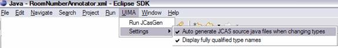
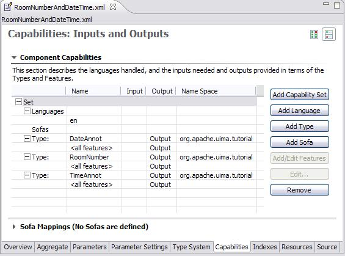

// Licensed to the Apache Software Foundation (ASF) under one
// or more contributor license agreements. See the NOTICE file
// distributed with this work for additional information
// regarding copyright ownership. The ASF licenses this file
// to you under the Apache License, Version 2.0 (the
// "License"); you may not use this file except in compliance
// with the License. You may obtain a copy of the License at
//
// http://www.apache.org/licenses/LICENSE-2.0
//
// Unless required by applicable law or agreed to in writing,
// software distributed under the License is distributed on an
// "AS IS" BASIS, WITHOUT WARRANTIES OR CONDITIONS OF ANY
// KIND, either express or implied. See the License for the
// specific language governing permissions and limitations
// under the License.

[[ugr.tug.aae]]
= Annotator and Analysis Engine Developer's Guide
// <titleabbrev>Annotator &amp; AE Developer's Guide</titleabbrev>

This chapter describes how to develop UIMA __type systems__, _Annotators_ and _Analysis Engines_ using the UIMA SDK.
It is helpful to read the UIMA Conceptual Overview chapter for a review on these concepts.

An _Analysis Engine (AE)_ is a program that analyzes artifacts (e.g.
documents) and infers information from them.

Analysis Engines are constructed from building blocks called __Annotators__.
An annotator is a component that contains analysis logic.
Annotators analyze an artifact (for example, a text document) and create additional data (metadata) about that artifact.
It is a goal of UIMA that annotators need not be concerned with anything other than their analysis logic – for example the details of their deployment or their interaction with other annotators.

An Analysis Engine (AE) may contain a single annotator (this is referred to as a __Primitive AE)__, or it may be a composition of others and therefore contain multiple annotators (this is referred to as an __Aggregate
    AE__). Primitive and aggregate AEs implement the same interface and can be used interchangeably by applications.

Annotators produce their analysis results in the form of typed __Feature Structures__, which are simply data structures that have a type and a set of (attribute, value) pairs.
An _annotation_ is a particular type of Feature Structure that is attached to a region of the artifact being analyzed (a span of text in a document, for example).

For example, an annotator may produce an Annotation over the span of text ``President Bush``, where the type of the Annotation is `Person` and the attribute `fullName` has the value ``George W. Bush``, and its position in the artifact is character position 12 through character position 26.

It is also possible for annotators to record information associated with the entire document rather than a particular span (these are considered Feature Structures but not Annotations).

All feature structures, including annotations, are represented in the UIMA __Common Analysis Structure(CAS)__.
The CAS is the central data structure through which all UIMA components communicate.
Included with the UIMA SDK is an easy-to-use, native Java interface to the CAS called the __JCas__.
The JCas represents each feature structure as a Java object; the example feature structure from the previous paragraph would be an instance of a Java class Person with getFullName() and setFullName() methods. 

The CAS interface for accessing feature structures uses UIMA Type an Feature object instances, which are computed at run time, depending on the type system being used.
This interface supports writing general annotators which can work for all type systems.
It is used, for example, internally, in the CasCopier implementation, to copy the content of one CAS to another. 

The JCas interface can take advantage of knowing ahead of time the particular Types and Features a pipeline is using.
The JCas Classes correspond to a particular UIMA type, and the class includes  special setters and getters whose names match the features. 

The remainder of this chapter will refer to the analysis of text documents and the creation of annotations that are attached to spans of text in those documents.
Keep in mind that the CAS can represent arbitrary types of feature structures, and feature structures can refer to other feature structures.
For example, you can use the CAS to represent a parse tree for a document.
Also, the artifact that you are analyzing need not be a text document.

This guide is organized as follows:

* _<<ugr.tug.aae.getting_started>>_ is a tutorial with step-by-step instructions for how to develop and test a simple UIMA annotator.
* _<<ugr.tug.aae.configuration_logging>>_ discusses how to make your UIMA annotator configurable, and how it can write messages to the UIMA log file.
* _<<ugr.tug.aae.building_aggregates>>_ describes how annotators can be combined into aggregate analysis engines. It also describes how one annotator can make use of the analysis results produced by an annotator that has run previously.
* _<<ugr.tug.aae.other_examples>>_ describes several other examples you may find interesting, including
** `SimpleTokenAndSentenceAnnotator`: a simple tokenizer and sentence annotator.
** `PersonTitleDBWriterCasConsumer`: a sample CAS Consumer which populates a relational database with some annotations. It uses JDBC and in this example, hooks up with the Open Source Apache Derby database. 
* _<<ugr.tug.aae.additional_topics>>_ describes additional features of the UIMA SDK that may help you in building your own annotators and analysis engines.
* _<<ugr.tug.aae.common_pitfalls>>_ contains some useful guidelines to help you ensure that your annotators will work correctly in any UIMA application.

This guide does not discuss how to build xref:tug.adoc#ugr.tug.application[UIMA Applications], which are programs that use Analysis Engines, along with other components, e.g. a search engine, document store, and user interface, to deliver a complete package of functionality to an end-user.

[[ugr.tug.aae.getting_started]]
== Getting Started

This section is a step-by-step tutorial that will get you started developing UIMA annotators.
All of the files referred to by the examples in this chapter are in the `examples` directory of the UIMA SDK.
This directory is designed to be xref:oas.adoc#ugr.ovv.eclipse_setup.example_code[imported] into your Eclipse workspace.
See for how to attach the UIMA Javadocs to the jar files.
Also you may wish to xref:oas.adoc#ugr.ovv.eclipse_setup.linking_uima_javadocs[attach the UIMA Javadocs to the JAR files] or refer to the UIMA SDK Javadocs located in the link:api/index.html[docs/api/index.html] directory.

[NOTE]
====
If you hover over a UIMA class or method defined in the UIMA SDK Javadocs, the Javadocs appear after a short delay. 
====

[NOTE]
====
If you downloaded the source distribution for UIMA, you can xref:ref.adoc#ugr.ref.javadocs[attach that as well to the library JAR files[].
====

The example annotator that we are going to walk through will detect room numbers for rooms where the room numbering scheme follows some simple conventions.
In our example, there are two kinds of patterns we want to find; here are some examples, together with their corresponding regular expression patterns: 

Yorktown patterns:::
20-001, 31-206, 04-123 (Regular Expression Pattern: `\\##-[0-2]##`)

Hawthorne patterns:::
GN-K35, 1S-L07, 4N-B21 (Regular Expression Pattern: `[G1-4][NS]-[A-Z]##`)

There are several steps to develop and test a simple UIMA annotator.

. Define the CAS types that the annotator will use.
. Generate the Java classes for these types.
. Write the actual annotator Java code.
. Create the Analysis Engine descriptor.
. Test the annotator. 

These steps are discussed in the next sections.

[[ugr.tug.aae.defining_types]]
=== Defining Types

The first step in developing an annotator is to define the CAS Feature Structure types that it creates.
This is done in an XML file called a __Type System
        Descriptor__.
UIMA defines basic primitive types such as Boolean, Byte, Short, Integer, Long, Float, and Double, as well as Arrays of these primitive types.
UIMA also defines the built-in types ``TOP``, which is the root  of the type system, analogous to Object in Java; ``FSArray``, which is  an array of Feature Structures (i.e.
an array of instances of TOP); and ``Annotation``, which we will discuss in more detail in this section.

UIMA includes an xref:oas.adoc#ugr.ovv.eclipse_setup[Eclipse plug-in] that will help you edit Type System Descriptors, so if you are using Eclipse you will not need to worry about the details of the XML syntax.

The Type System Descriptor for our annotator is located in the file `descriptors/tutorial/ex1/TutorialTypeSystem.xml.` 
This and all other examples are located in the `examples` directory of the installation of the UIMA SDK, which can be xref:oas.adoc#ugr.ovv.eclipse_setup.example_code[imported] into an Eclipse project for your convenience.

In Eclipse, expand the `uimaj-examples` project in the Package Explorer view, and browse to the file `descriptors/tutorial/ex1/TutorialTypeSystem.xml`.
Right-click on the file in the navigator and select __Open With → Component Descriptor Editor__.
Once the editor opens, click on the __Type System__ tab at the bottom of the editor window.
You should see a view such as the following:

.Screenshot of editor for Type System Definitions
image::images/tutorials_and_users_guides/tug.aae/image002.jpg[]

Our annotator will need only one type -- `org.apache.uima.tutorial.RoomNumber`.
(We use the same namespace conventions as are used for Java classes.) Just as in Java, types have supertypes.
The supertype is listed in the second column of the left table.
In this case our RoomNumber annotation extends from the built-in type `uima.tcas.Annotation`.

Descriptions can be included with types and features.
In this example, there is a description associated with the `building` feature.
To see it, hover the mouse over the feature.

The bottom tab labeled __Source__ will show you the XML source file associated with this descriptor.

The built-in Annotation type declares three fields (called __Features__ in CAS terminology).  The features `begin` and `end` store the character offsets of the span of text to which the  annotation refers.
The feature `sofa` (Subject of Analysis) indicates which document the begin and end offsets point into.
The `sofa` feature can be ignored for now since we assume in this tutorial that the CAS contains only one subject of analysis (document).

Our RoomNumber type will inherit these three features from `uima.tcas.Annotation`, its supertype; they are not visible in this view because inherited features are not shown.
One additional feature, ``building``, is declared.
It takes a String as its value.
Instead of String, we could have declared the range-type of our feature to be any other CAS type (defined or built-in).

If you are not using Eclipse, if you need to edit the type system, do so using any XML or text editor, directly.
The following is the actual XML representation of the Type System displayed above in the editor:

[source]
----
<?xml version="1.0" encoding="UTF-8" ?>
  <typeSystemDescription xmlns="http://uima.apache.org/resourceSpecifier">
    <name>TutorialTypeSystem</name>
    <description>Type System Definition for the tutorial examples - 
        as of Exercise 1</description>
    <vendor>Apache Software Foundation</vendor>
    <version>1.0</version>
    <types>
      <typeDescription>
        <name>org.apache.uima.tutorial.RoomNumber</name>
        <description></description>
        <supertypeName>uima.tcas.Annotation</supertypeName>
        <features>
          <featureDescription>
            <name>building</name>
            <description>Building containing this room</description>
            <rangeTypeName>uima.cas.String</rangeTypeName>
          </featureDescription>
        </features>
      </typeDescription>
    </types>
  </typeSystemDescription>
----

[[ugr.tug.aae.generating_jcas_sources]]
=== Generating Java Source Files for CAS Types

When you save a descriptor that you have modified, the Component Descriptor Editor will automatically generate Java classes corresponding to the types that are defined in that descriptor (unless this has been disabled), using a utility called JCasGen.
These Java classes will have the same name (including package) as the CAS types, and will have get and set methods for each of the features that you have defined.

This feature is enabled/disabled using the UIMA menu pulldown (or the Eclipse Preferences →UIMA). If automatic running of JCasGen is not happening, please make sure the option is checked:

.Screenshot of enabling automatic running of JCasGen

The Java class for the example org.apache.uima.tutorial.RoomNumber type can be found in `src/org/apache/uima/tutorial/RoomNumber.java` . You will see how to use these generated classes in the next section.

If you are not using the Component Descriptor Editor, you will need to generate these Java classes by using the _JCasGen_ tool.
JCasGen reads a Type System Descriptor XML file and generates the corresponding Java classes that you can then use in your annotator code.
To launch JCasGen, run the jcasgen shell script located in the `/bin` directory of the UIMA SDK installation.
This should launch a GUI that looks something like this:

.Screenshot of JCasGen
image::images/tutorials_and_users_guides/tug.aae/image006.jpg[]

Use the "`Browse`" buttons to select your input file (`TutorialTypeSystem.xml`) and output directory (the root of the source tree into which you want the generated files placed). Then click the __Go__ button.
If the Type System Descriptor has no errors, new Java source files will be generated under the specified output directory.

There are some xref:tools.adoc#ugr.tools.jcasgen[additional options] to choose from when running JCasGen.

[[ugr.tug.aae.developing_annotator_code]]
=== Developing Your Annotator Code

Annotator implementations all implement a standard interface (AnalysisComponent), having several methods, the most important of which are: 

* `initialize`, 
* `process`, and 
* `destroy`. 

`initialize` is called by the framework once when it first creates an instance of the annotator class. `process` is called once per item being processed. `destroy` may be called by the application when it is done using your annotator.
There is a  default implementation of this interface for annotators using the JCas, called `JCasAnnotator_ImplBase`, which  has implementations of all required methods except for the process method.

Our annotator class extends the xref:tug.adoc#ugr.tug.aas[JCasAnnotator_ImplBase]; most annotators that use the JCas will extend from this class, so they only have to implement the process method. This class is not restricted to handling just text.

Annotators are not required to extend from the JCasAnnotator_ImplBase class; they may instead directly implement the AnalysisComponent interface, and provide all method implementations themselves.
footnote:[Note that AnalysisComponent is not specific to `JCas`. There is a method `getRequiredCasInterface()` which the user would have to implement to return `JCas.class`. Then in the `process(AbstractCas cas)` method, they would need to typecast `CAS` to type `JCas`.] This allows you to have your annotator inherit from some other superclass if necessary.
If you would like to do this, see the Javadocs for `JCasAnnotator` for descriptions of the methods you must implement.

Annotator classes need to be public, cannot be declared abstract, and must have public, no-args constructors, so that they can be instantiated by the framework. 
footnote:[Although Java classes in which you do not define any constructor will, by default, have a no-args constructor that doesn't do anything, a class in which you have defined at least one constructor does not get a default no-args constructor.] .

The class definition for our RoomNumberAnnotator implements the process method, and is shown here.
You can find the source for this in the `uimaj-examples/src/org/apache/uima/tutorial/ex1/RoomNumberAnnotator.java` . 

[NOTE]
====
In Eclipse, in the "`Package Explorer`" view, this will appear by default in the project ``uimaj-examples``, in the folder ``src``, in the package ``org.apache.uima.tutorial.ex1``.
==== 

In Eclipse, open the RoomNumberAnnotator.java in the uimaj-examples project, under the src directory.

[source]
----
package org.apache.uima.tutorial.ex1;

import java.util.regex.Matcher;
import java.util.regex.Pattern;

import org.apache.uima.analysis_component.JCasAnnotator_ImplBase;
import org.apache.uima.jcas.JCas;
import org.apache.uima.tutorial.RoomNumber;

/**
 * Example annotator that detects room numbers using 
 * Java 1.4 regular expressions.
 */
public class RoomNumberAnnotator extends JCasAnnotator_ImplBase {
  private Pattern mYorktownPattern = 
        Pattern.compile("\\b[0-4]\\d-[0-2]\\d\\d\\b");

  private Pattern mHawthornePattern = 
        Pattern.compile("\\b[G1-4][NS]-[A-Z]\\d\\d\\b");

  public void process(JCas aJCas) {
    // Discussed Later
  }
}
----

The two Java class fields, mYorktownPattern and mHawthornePattern, hold regular expressions that will be used in the process method.
Note that these two fields are part of the Java implementation of the annotator code, and not a part of the CAS type system.
We are using the regular expression facility that is built into Java 1.4.
It is not critical that you know the details of how this works, but if you are curious the details can be found in the Java API docs for the java.util.regex package.

The only method that we are required to implement is ``process``.
This method is typically  called once for each document that is being analyzed.
This method takes one argument, which is a JCas instance;  this holds the document to be analyzed and all of the analysis results. footnote:[Version 1 of UIMA specified an additional parameter, the ResultSpecification. This provides a
          specification of which types and features are desired to be computed and "output" from this annotator. Its
          use is optional; many annotators ignore it.]

[source]
----
public void process(JCas aJCas) {
  // get document text
  String docText = aJCas.getDocumentText();
  // search for Yorktown room numbers
  Matcher m = mYorktownPattern.matcher(docText);
  int pos = 0;
  while (m.find(pos)) {
    // found one - create annotation, with the begin/end positions
    RoomNumber annotation = new RoomNumber(aJCas, m.start(), m.end());
    annotation.setBuilding("Yorktown");
    annotation.addToIndexes();
    pos = m.end();
  }
  
  // search for Hawthorne room numbers
  m = mHawthornePattern.matcher(docText);
  pos = 0;
  while (m.find(pos)) {
    // found one - create annotation, with the begin/end positions
    RoomNumber annotation = new RoomNumber(aJCas, m.start(), m.end());
    annotation.setBuilding("Hawthorne");
    annotation.addToIndexes();
    pos = m.end();
  }
}
----

The Matcher class is part of the java.util.regex package and is used to find the room numbers in the document text.
When we find one, recording the annotation is as simple as creating a new Java object and calling some set methods:

[source]
----
RoomNumber annotation = new RoomNumber(aJCas, m.start(), m.end());
annotation.setBuilding("Yorktown");
----

The `RoomNumber` class was generated from the type system description by the Component Descriptor Editor or the JCasGen tool, as discussed in the previous section.

Finally, we call `annotation.addToIndexes()` to add the new annotation to the indexes maintained in the CAS.
By default, the CAS implementation used for analysis of text documents keeps an index of all annotations in their order from beginning to end of the document.
Subsequent annotators or applications use the indexes to iterate over the annotations. 

[NOTE]
====
If you don't add the instance to the indexes, it cannot be retrieved by down-stream annotators, using the indexes. 
====

[NOTE]
====
You can also call `addToIndexes()` on Feature Structures that are not subtypes of ``uima.tcas.Annotation``, but these will not be sorted in any particular way.
If you want to specify a sort order, you can define your own xref:ref.adoc#ugr.ref.xml.component_descriptor.aes.index[custom indexes] in the xref:ref.adoc#ugr.ref.cas[CAS].
====

We're almost ready to test the RoomNumberAnnotator.
There is just one more step remaining.

[[ugr.tug.aae.creating_xml_descriptor]]
=== Creating the XML Descriptor

The UIMA architecture requires that descriptive information about an annotator be represented in an XML file and provided along with the annotator class file(s) to the UIMA framework at run time.
This XML file is called an __Analysis Engine Descriptor__.
The descriptor includes: 

* Name, description, version, and vendor
* The annotator's inputs and outputs, defined in terms of the types in a Type System Descriptor
* Declaration of the configuration parameters that the annotator accepts 

The _Component Descriptor Editor_ plugin, which we previously used to edit the Type System descriptor, can also be used to edit Analysis Engine Descriptors.

A descriptor for our RoomNumberAnnotator is provided with the UIMA distribution under the name `descriptors/tutorial/ex1/RoomNumberAnnotator.xml.` To edit it in Eclipse, right-click on that file in the navigator and select Open With → Component Descriptor Editor.

[TIP]
====
In Eclipse, you can double click on the tab at the top of the Component Descriptor Editor's window identifying the currently selected editor, and the window will "`Maximize`".
Double click it again to restore the original size.
====

If you are not using Eclipse, you will need to edit Analysis Engine descriptors manually.
See <<ugr.tug.aae.xml_intro_ae_descriptor>> for an introduction to the Analysis Engine descriptor XML syntax.
The remainder of this section assumes you are using the Component Descriptor Editor plug-in to edit the Analysis Engine descriptor.

The xref:tools.adoc#ugr.tools.cde[Component Descriptor Editor] consists of several tabbed pages; we will only need to use a few of them here.

The initial page of the Component Descriptor Editor is the Overview page, which appears as follows:

.Screenshot of Component Descriptor Editor overview page
image::images/tutorials_and_users_guides/tug.aae/image008.jpg[]

This presents an overview of the RoomNumberAnnotator Analysis Engine (AE). The left side of the page shows that this descriptor is for a _Primitive_ AE (meaning it consists of a single annotator), and that the annotator code is developed in Java.
Also, it specifies the Java class that implements our logic (the code which was discussed in the previous section). Finally, on the right side of the page are listed some descriptive attributes of our annotator.

The other two pages that need to be filled out are the Type System page and the Capabilities page.
You can switch to these pages using the tabs at the bottom of the Component Descriptor Editor.
In the tutorial, these are already filled out for you.

The RoomNumberAnnotator will be using the TutorialTypeSystem we looked at in Section <<ugr.tug.aae.defining_types>>.
To specify this, we add this type system to the Analysis Engine's list of Imported Type Systems, using the Type System page's right side panel, as shown here:

.Screenshot of CDE Type System page
image::images/tutorials_and_users_guides/tug.aae/image010.jpg[]

On the Capabilities page, we define our annotator's inputs and outputs, in terms of the types in the type system.
The Capabilities page is shown below:

.Screenshot of CDE Capabilities page
image::images/tutorials_and_users_guides/tug.aae/image012.jpg[]

Although capabilities come in sets, having multiple sets is deprecated; here we're just using one set.
The RoomNumberAnnotator is very simple.
It requires no input types, as it operates directly on the document text -- which is supplied as a part of the CAS initialization (and which is always assumed to be present). It produces only one output type (RoomNumber), and it sets the value of the `building` feature on that type.
This is all represented on the Capabilities page.

The Capabilities page has two other parts for specifying languages and Sofas.
The languages section allows you to specify which languages your Analysis Engine supports.
The RoomNumberAnnotator happens to be language-independent, so we can leave this blank.
The Sofas section allows you to specify the names of additional subjects of analysis.
This capability and the Sofa Mappings at the bottom are xref:tug.adoc#ugr.tug.aas[advanced topics]. 

This is all of the information we need to provide for a simple annotator.
If you want to peek at the XML that this tool saves you from having to write, click on the "`Source`" tab at the bottom to view the generated XML.

[[ugr.tug.aae.testing_your_annotator]]
=== Testing Your Annotator

Having developed an annotator, we need a way to try it out on some example documents.
The UIMA SDK includes a tool called the Document Analyzer that will allow us to do this.
To run the Document Analyzer, execute the documentAnalyzer shell script that is in the `bin` directory of your UIMA SDK installation, or, if you are using the example Eclipse project, execute the "`UIMA Document Analyzer`" run configuration supplied with that project.
(To do this, click on the menu bar Run → Run ... → and under Java Applications in the left box, click on UIMA Document Analyzer.)

You should see a screen that looks like this:

.Screenshot of UIMA Document Analyzer GUI
image::images/tutorials_and_users_guides/tug.aae/image014.jpg[]

There are six options on this screen:

. Directory containing documents to analyze
. Directory where analysis results will be written
. The XML descriptor for the Analysis Engine (AE) you want to run
. (Optional) an XML tag, within the input documents, that contains the text to be analyzed. For example, the value TEXT would cause the AE to only analyze the portion of the document enclosed within <TEXT>...</TEXT> tags.
. Language of the document 
. Character encoding 

Use the Browse button next to the third item to set the "`Location of AE XML
        Descriptor`" field to the descriptor we've just been discussing —``<where-you-installed-uima-e.g.UIMA_HOME> 
          /examples/descriptors/tutorial/ex1/RoomNumberAnnotator.xml`` . Set the other fields to the values shown in the screen shot above (which should be the default values if this is the first time you've run the Document Analyzer). Then click the "`Run`" button to start processing.

When processing completes, an "`Analysis Results`" window should appear.

.Screenshot of UIMA Document Analyzer Results GUI
image::images/tutorials_and_users_guides/tug.aae/image016.jpg[]

Make sure "`Java Viewer`" is selected as the Results Display Format, and *double-click* on the document UIMASummerSchool2003.txt to view the annotations that were discovered.
The view should look something like this:

.Screenshot of UIMA CAS Annotation Viewer GUI
image::images/tutorials_and_users_guides/tug.aae/image018.jpg[]

You can click the mouse on one of the highlighted annotations to see a list of all its features in the frame on the right.

[NOTE]
====
The legend will only show those types which have at least one instance in the CAS, and are declared as outputs in the capabilities section of the descriptor (see <<ugr.tug.aae.creating_xml_descriptor>>. 
====

You can use the DocumentAnalyzer to test any UIMA annotator —just make sure that the annotator's classes are in the class path.

[[ugr.tug.aae.configuration_logging]]
== Configuration and Logging

[[ugr.tug.aae.configuration_parameters]]
=== Configuration Parameters

The example RoomNumberAnnotator from the previous section used hardcoded regular expressions and location names, which is obviously not very flexible.
For example, you might want to have the patterns of room numbers be supplied by a configuration parameter, rather than having to redo the annotator's Java code to add additional patterns.
Rather than add a new hardcoded regular expression for a new pattern, a better solution is to use configuration parameters.

UIMA allows annotators to declare configuration parameters in their descriptors.
The descriptor also specifies default values for the parameters, though these can be overridden at runtime.

[[ugr.tug.aae.declaring_parameters_in_the_descriptor]]
==== Declaring Parameters in the Descriptor

The example descriptor `descriptors/tutorial/ex2/RoomNumberAnnotator.xml` is the same as the descriptor from the previous section except that information has been filled in for the Parameters and Parameter Settings pages of the Component Descriptor Editor.

First, in Eclipse, open example two's RoomNumberAnnotator in the Component Descriptor Editor, and then go to the Parameters page (click on the parameters tab at the bottom of the window), which is shown below:

.Screenshot of UIMA Component Descriptor Editor (CDE) Parameters page
image::images/tutorials_and_users_guides/tug.aae/image020.jpg[]

Two parameters –Patterns and Locations -- have been declared.
In this screen shot, the mouse (not shown) is hovering over Patterns to show its description in the small popup window.
Every parameter has the following information associated with it:

* name –the name by which the annotator code refers to the parameter
* description –a natural language description of the intent of the parameter
* type –the data type of the parameter's value –must be one of String, Integer, Float, or Boolean.
* multiValued –true if the parameter can take multiple-values (an array), false if the parameter takes only a single value. Shown above as ``Multi``.
* mandatory –true if a value must be provided for the parameter. Shown above as `Req` (for required). 

Both of our parameters are mandatory and accept an array of Strings as their value.

Next, default values are assigned to the parameters on the Parameter Settings page:

.Screenshot of UIMA Component Descriptor Editor (CDE) Parameter Settings page
image::images/tutorials_and_users_guides/tug.aae/image022.jpg[]

Here the "`Patterns`" parameter is selected, and the right pane shows the list of values for this parameter, in this case the regular expressions that match particular room numbering conventions.
Notice the third pattern is new, for matching the style of room numbers in the third building, which has room numbers such as ``J2-A11``.

[[ugr.tug.aae.accessing_parameter_values_from_annotator]]
==== Accessing Parameter Values from the Annotator Code

The class `org.apache.uima.tutorial.ex2.RoomNumberAnnotator` has overridden the initialize method.
The initialize method is called by the UIMA framework when the annotator is instantiated, so it is a good place to read configuration parameter values.
The default initialize method does nothing with configuration parameters, so you have to override it.
To see the code in Eclipse, switch to the src folder, and open ``org.apache.uima.tutorial.ex2``.
Here is the method body:

[source]
----
/**
* @see AnalysisComponent#initialize(UimaContext)
*/
public void initialize(UimaContext aContext) 
        throws ResourceInitializationException {
  super.initialize(aContext);
  
  // Get config. parameter values  
  String[] patternStrings = 
        (String[]) aContext.getConfigParameterValue("Patterns");
  mLocations = 
        (String[]) aContext.getConfigParameterValue("Locations");

  // compile regular expressions
  mPatterns = new Pattern[patternStrings.length];
  for (int i = 0; i < patternStrings.length; i++) {
    mPatterns[i] = Pattern.compile(patternStrings[i]);
  }
}
----

Configuration parameter values are accessed through the UimaContext.
As you will see in subsequent sections of this chapter, the UimaContext is the annotator's access point for all of the facilities provided by the UIMA framework –for example logging and external resource access.

The UimaContext's `getConfigParameterValue` method takes the name of the parameter as an argument; this must match one of the parameters declared in the descriptor.
The return value of this method is a Java Object, whose type corresponds to the declared type of the parameter.
It is up to the annotator to cast it to the appropriate type, String[] in this case.

If there is a problem retrieving the parameter values, the framework throws an exception.
Generally annotators don't handle these, and just let them propagate up.

To see the configuration parameters working, run the Document Analyzer application and select the descriptor `examples/descriptors/tutorial/ex2/RoomNumberAnnotator.xml` . In the example document ``WatsonConferenceRooms.txt``, you should see some examples of Hawthorne II room numbers that would not have been detected by the ex1 version of RoomNumberAnnotator.

[[ugr.tug.aae.supporting_reconfiguration]]
==== Supporting Reconfiguration

If you take a look at the Javadocs (located in the link:api/index.html[docs/api] directory) for `org.apache.uima.analysis_component.AnaysisComponent` (which our annotator implements indirectly through JCasAnnotator_ImplBase), you will see that there is a reconfigure() method, which is called by the containing application through the UIMA framework, if the configuration parameter values are changed.

The AnalysisComponent_ImplBase class provides a default implementation that just calls the annotator's destroy method followed by its initialize method.
This works fine for our annotator.
The only situation in which you might want to override the default reconfigure() is if your annotator has very expensive initialization logic, and you don't want to reinitialize everything if just one configuration parameter has changed.
In that case, you can provide a more intelligent implementation of reconfigure() for your annotator.

[[ugr.tug.aae.configuration_parameter_groups]]
==== Configuration Parameter Groups

For annotators with many sets of configuration parameters, UIMA supports organizing them into groups.
It is possible to define a parameter with the same name in multiple groups; one common use for this is for annotators that can process documents in several languages and which want to have different parameter settings for the different languages.

The syntax for defining parameter groups in your descriptor is fairly straightforward –see xref:ref.adoc#ugr.ref.xml.component_descriptor[Component Descriptor Reference] for details.
Values of parameters defined within groups are accessed through the two-argument version of ``UimaContext.getConfigParameterValue``, which takes both the group name and the parameter name as its arguments.

[[ugr.tug.aae.configuration_parameter_overrides]]
==== Overriding Configuration Parameter Settings

There are two ways that the value assigned to a configuration parameter can be overridden.
An aggregate may declare a parameter that overrides one or more of the parameters in one or more of its delegates.
The aggregate must also define a value for the parameter, unless the parameter is itself overridden by a setting in the parent aggregate.

An alternative method that avoids these strict hierarchical override constraints is to associate an external global name with a parameter and to assign values to these external names in an xref:ref.adoc#ugr.ref.xml.component_descriptor.aes.external_configuration_parameter_overrides[external properties file].
With this approach a particular parameter setting can be easily shared by multiple descriptors, even across different applications.
For applications with many levels of descriptor nesting it avoids the need to edit aggregate override definitions when the location of an annotator in the hierarchy is changed.

[[ugr.tug.aae.logging]]
=== Logging

The UIMA SDK provides a logging facility, which is very similar to the `java.util.logging.Logger` class.
In addition, it includes the link:https://www.slf4j.org/[SLF4j framework] and all the methods in that framework's `Logger` API, plus the Java 8 specific API extensions that take `Supplier` parameters.

Each logger instance is associated with a name.
By convention, this name is usually a hierarchy of simple names connected with periods,  often the fully qualified class name of the component issuing the logging call.
The name (or any of its parents - starting prefixes up to a period)  can be referenced in a configuration file which can then configure for each logger various things such as the logging level and where messages should go.

The UIMA framework supports this convention using the `UimaContext` object.
If you access a logger instance using `getContext().getLogger()` or the shorter, but equivalent `getLogger()` within an Annotator, the logger name will be the fully qualified name of the Annotator implementation class.

Here is an example from the process method of ``org.apache.uima.tutorial.ex2.RoomNumberAnnotator``: 

[source]
----
getLogger().trace("Found: {}", () -> annotation.toString());
----

The `trace` call  indicates that this is a tracing message.
This is useful for tracing program flow, but it is a low level which is not usually enabled. 

The first parameter is the message, with substitutable parts.
The convention for where those parts go is written as either {} or {n}, where "n" is an integer, specifying the argument number.
The modern logging APIs use the {} style, with API calls such as ``logger.**level**( msg-using-{}-convention, substitutable-arguments)``, while the older java.util.logger framework uses ``logger.log(**level**, msg-using-{n} convention, substitutable-arguments)``. 

UIMA supports both styles.
For new code, it is recommended to use the first style, together with the Java 8 lambda method for the arguments, which  insures that the work of turning the `annotation` argument into a printable string only will happen if tracing is enabled. 

Log statements are "filtered" according to the logging configuration, by Level, and sometimes by additional indicators, such as Markers.
Levels work in a hierarchy.
A given level of  filtering passes that level and all higher levels.
Some levels have two names, due to the  way the different logger back ends name things.
Most levels are also used as method names on  the logger, to indicate logging for that level.
For example, you could say `aLogger.log(Level.INFO, message)` but you can also say ``aLogger.info(message)``). The level ordering, highest to lowest,  and the associated method names are as follows: 

* SEVERE or ERROR; error(...)
* WARN or WARNING; warn(...)
* INFO; info(...)
* CONFIG; info(UIMA_MARKER_CONFIG, ...)
* FINE or DEBUG; debug(...)
* FINER or TRACE; trace(...)
* FINEST; trace(UIMA_MARKER_FINEST, ...)

The CONFIG and FINEST levels are merged with other levels, but are distinguished by having ``Markers``.
If the filtering is configured to pass CONFIG level, then it will pass also the INFO/WARN/ERROR  (or their alternative names WARNING/SEVERE) levels as well. 

Each logging backend has its own documentation for how  to configure loggers at run time, via configuration files or APIs in some cases.
Some backends even allow dynamic reconfiguration while running, just by updating the configuration file (it is re-loaded every so often, if changed). 

For the built-in-to-Java logging back end, if no logging configuration file is provided (see next section),  the Java Virtual Machine defaults would be used, which typically set the level to INFO and higher messages, and direct output to the console.

The UIMA logger is by default implemented using an SLF4J implementation; this (in turn) connects to a logging back end, determined via a search of the classpath for a connector.
If none can be found, then a message to that effect will be printed to System.err, and no logging will be done.
The binary distribution for UIMA includes, in its `lib` directory, the  Jar which connects SLF4j to the Java-built-in logger to use as its back end, so if you use the standard launchers, you will get this logging back end. 

Assuming you are using the Java-built-in-logger as the back-end,  if you specify the configuration using the standard UIMA SDK `Logger.properties` (found in ``UIMA_HOME/config/``), the output will be directed to a file named uima.log, in the current working directory (often the "`project`" directory when running from Eclipse, for instance).

[NOTE]
====
When using Eclipse, the uima.log file, if written into the Eclipse workspace in the project uimaj-examples, for example, may not appear in the Eclipse package explorer view until you right-click the uimaj-examples project with the mouse, and select "`Refresh`".
This operation refreshes the Eclipse display to conform to what may have changed on the file system.
Also, you can set the Eclipse preferences for the workspace to automatically refresh (Window → Preferences → General → Workspace, then click the "`refresh
      automatically`" checkbox.
====

The next several sections mainly describe how to configure the built-in Java logger.
See the documentation for other logging back ends for  details on how to configure those.

[[ugr.tug.aae.logging.configuring]]
==== Specifying the Logging Configuration when using Java's built-in logger

The standard Java built-in logging initialization mechanisms will look for a Java System Property named `java.util.logging.config.file` and if found, will use the value of this property as the name of a standard "`properties`" file, for setting the logging level.
Please refer to the Java 1.4.
documentation for more information on the format and use of this file.

Two sample logging specification property files can be found in the UIMA_HOME directory where the UIMA SDK is installed: ``config/Logger.properties``, and ``config/FileConsoleLogger.properties``.
These specify the same logging, except the first logs just to a file, while the second logs both to a file and to the console.
You can edit these files, or create additional ones, as described below, to change the logging behavior.

When running your own Java application, you can specify the location of this logging configuration file on your Java command line by setting the Java system property `java.util.logging.config.file` to be the logging configuration filename.
This file specification can be either absolute or relative to the working directory.
For example: 

[source]
----
java "-Djava.util.logging.config.file=C:/Program Files/apache-uima/config/Logger.properties"
----

[NOTE]
====
In a shell script, you can use environment variables such as UIMA_HOME if convenient.
====

If you are using Eclipse to launch your application, you can set this property in the VM arguments section of the Arguments tab of the run configuration screen.
If you've set an environment variable UIMA_HOME, you could for example, use the string: `"-Djava.util.logging.config.file=${env_var:UIMA_HOME}/config/Logger.properties".`

If you running the .bat or .sh files in the UIMA SDK's `bin` directory, you can specify the location of your logger configuration file by setting the `UIMA_LOGGER_CONFIG_FILE` environment variable prior to running the script, for example (on Windows): 

[source]
----
set UIMA_LOGGER_CONFIG_FILE=C:/myapp/MyLogger.properties
----

[[ugr.tug.aae.logging.setting_logging_levels]]
==== Setting Logging Levels when using Java's built-in logger

Within the logging control file, the default global logging level specifies which kinds of events are logged across all loggers.
For any given facility this global level can be overridden by a facility specific level.
Multiple handlers are supported.
This allows messages to be directed to a log file, as well as to a "`console`".
Note that the ConsoleHandler also has a separate level setting to limit messages printed to the console.
For example: `$$.$$level=
          INFO`

The properties file can change where the log is written, as well.

Facility specific properties allow different logging for each class, as well.
For example, to set the com.xyz.foo logger to only log SEVERE messages: `com.xyz.foo.level = SEVERE`

If you have a sample annotator in the package `org.apache.uima.SampleAnnotator` you can set the log level by specifying: `org.apache.uima.SampleAnnotator.level =
          ALL`

There are other logging controls; for a full discussion, please read the contents of the `Logger.properties` file and the Java specification for logging in Java 1.4.

[[ugr.tug.aae.logging.output_format]]
==== Configuring the format of logging output when using Java's built-in logger

The logging output is formatted by handlers specified in the properties file for configuring logging, described above.
The default formatter that comes with the UIMA SDK formats logging output as follows:

`Timestamp - threadID: sourceInfo: Message level:
          message`

Here's an example:

`7/12/04 2:15:35 PM - 10:
          org.apache.uima.util.TestClass.main(62): INFO: You are not logged
          in!`

[[ugr.tug.aae.logging.meaning_of_severity_levels]]
==== Meaning of the logging severity levels used by the UIMA logger

These levels are defined by the Java logging framework, which was incorporated into Java as of the 1.4 release level.
The levels are defined in the Javadocs for java.util.logging.Level, and include both logging and tracing levels: 

* OFF is a special level that can be used to turn off logging.
* ALL indicates that all messages should be logged. 
* CONFIG is a message level for configuration messages. These would typically occur once (during configuration) in methods like ``initialize()``. 
* INFO is a message level for informational messages, for example, connected to server IP: 192.168.120.12 
* WARNING is a message level indicating a potential problem.
* SEVERE is a message level indicating a serious failure.

Tracing levels, typically used for debugging: 

* FINE is a message level providing tracing information, typically at a collection level (messages occurring once per collection). 
* FINER indicates a fairly detailed tracing message, typically at a document level (once per document).
* FINEST indicates a highly detailed tracing message. 

[[ugr.tug.aae.logging.using_outside_of_an_annotator]]
==== Using loggers outside of an annotator

An application using UIMA may want to log its messages using the same logging framework.
This can be done by getting a reference to the UIMA logger, as follows: 

[source]
----
Logger logger = UIMAFramework.getLogger(TestClass.class);
----

You can also simply get a direct reference to an Slf4j logger using the standard approach: 

[source]
----
org.slf4j.Logger logger = org.slf4j.LogFactory.getLogger(TestClass.class);
----

The class argument specifies the name of the logger, using the fully qualified class name.
For UIMA loggers, if not specified, the name of the returned logger instance is "`org.apache.uima`".

[[ugr.tug.aae.logging.change_logger_implementation]]
==== Changing the underlying UIMA logging implementation

By default the UIMA framework uses, under the hood of the UIMA Logger interface, the  SLF4J logging framework to do logging.
This allows UIMA, when running embedded inside other frameworks, to defer the choice of back-end logging frameworks to those applications. 

For backwards compatibility with Version 2, the older methods (prior to Slf4j) for switching the logger implementation remains.
You do this by specifying the system property 

[source]
----
-Dorg.apache.uima.logger.class=<loggerClass>
----
when the UIMA framework is started. 

The specified logger class must be available in the classpath and has to subclass the `org.apache.uima.util.Logger_common_impl` class. 

For backwards compatibility, V3 continues to provide the class `org.apache.uima.util.impl.Log4jLogger_impl` as an alternative which can be specified this way by this JVM argument: 

[source]
----
-Dorg.apache.uima.logger.class=org.apache.uima.util.impl.Log4jLogger_impl
----

to switch to the log4j back end.
This has been updated in V3 to `log4j 2` (see https://logging.apache.org/log4j). If you use this, you must provide the required `Log4j 2` jars in the classpath. 

[[_uv3.logging.suppress_annotator_logging]]
==== Throttling excessive logging from Annotators

Sometimes, in production, you may find annotators are logging excessively, and you wish to throttle  this.
But you may not have access to logging settings to control this, perhaps because UIMA is running as a library component within another framework.
For this special case, you can limit logging done by Annotators by passing an additional parameter to the UIMA Framework's  produceAnalysisEngine API, using the key name `AnalysisEngine.PARAM_THROTTLE_EXCESSIVE_ANNOTATOR_LOGGING` and setting the value to an Integer object equal to the the limit.
Using 0 will suppress all logging.
Any positive number allows that many log records to be logged, per level.
A limit of 10 would allow  10 Errors, 10 Warnings, etc.
The limit is enforced separately, per logger instance.

[NOTE]
====
This only works if the logger used by Annotators is obtained from the  Annotator base implementation class via the `getLogger()` method.
====

[[ugr.tug.aae.building_aggregates]]
== Building Aggregate Analysis Engines

[[ugr.tug.aae.combining_annotators]]
=== Combining Annotators

The UIMA SDK makes it very easy to combine any sequence of Analysis Engines to form an __Aggregate Analysis Engine__.
This is done through an XML descriptor; no Java code is required!

If you go to the `examples/descriptors/tutorial/ex3` folder (in Eclipse, it's in your uimaj-examples project, under the `descriptors/tutorial/ex3` folder), you will find a descriptor for a TutorialDateTime annotator.
This annotator detects dates and times.
To see what this annotator can do, try it out using the Document Analyzer.
If you are curious as to how this annotator works, the source code is included, but it is not necessary to understand the code at this time.

We are going to combine the TutorialDateTime annotator with the RoomNumberAnnotator to create an aggregate Analysis Engine.
This is illustrated in the following figure: 

.Combining Annotators to form an Aggregate Analysis Engine
image::images/tutorials_and_users_guides/tug.aae/image024.png[Combining Annotators to form an Aggregate Analysis
              Engine]

The descriptor that does this is named ``RoomNumberAndDateTime.xml``, which you can open in the Component Descriptor Editor plug-in.
This is in the uimaj-examples project in the folder ``descriptors/tutorial/ex3``. 

The "`Aggregate`" page of the Component Descriptor Editor is used to define which components make up the aggregate.
A screen shot is shown below.
(If you are not using Eclipse, see <<ugr.tug.aae.xml_intro_ae_descriptor>> for the actual XML syntax for Aggregate Analysis Engine Descriptors.)

.Aggregate page of the Component Descriptor Editor (CDE)
image::images/tutorials_and_users_guides/tug.aae/image026.jpg[]

On the left side of the screen is the list of component engines that make up the aggregate –in this case, the TutorialDateTime annotator and the RoomNumberAnnotator.
To add a component, you can click the "`Add`" button and browse to its descriptor.
You can also click the "`Find AE`" button and search for an Analysis Engine in your Eclipse workspace. 

[NOTE]
====
The __Add Remote__ button is used for adding components which run xref:tug.adoc#ugr.tug.application.how_to_call_a_uima_service[remotely] (for example, on another machine using a remote networking connection).
====

The order of the components in the left pane does not imply an order of execution.
The order of execution, or __flow__ is determined in the "`Component Engine Flow`" section on the right.
UIMA supports different types of algorithms (including user-definable) for determining the flow.
Here we pick the simplest: `FixedFlow`.
We have chosen to have the RoomNumberAnnotator execute first, although in this case it doesn't really matter, since the RoomNumber and DateTime annotators do not have any dependencies on one another.

If you look at the __Type System__ page of the Component Descriptor Editor, you will see that it displays the type system but is not editable.
The Type System of an Aggregate Analysis Engine is automatically computed by merging the Type Systems of all of its components.

[WARNING]
====
If the components have different definitions for the same type name, The Component Descriptor Editor will show a warning.
It is possible to continue past this warning, in which case your aggregate's type system will have the correct "`merged`" type definition that contains all of the features defined on that type by all of your components.
However, it is not recommended to use this feature in conjunction with JCAS, since the JCAS Java Class definitions cannot be so easily xref:ref.adoc#ugr.ref.jcas.merging_types_from_other_specs[merged].
====

The Capabilities page is where you explicitly declare the aggregate Analysis Engine's inputs and outputs.
Sofas and Languages are described later. 

.Screen shot of the Capabilities page of the Component Descriptor Editor

Note that it is not automatically assumed that all outputs of each component Analysis Engine (AE) are passed through as outputs of the aggregate AE.
If, for example, the TutorialDateTime annotator also produced Word and Sentence annotations,  but those were not of interest as output in this case, we can exclude them from the  list of outputs.

You can run this AE using the Document Analyzer in the same way that you run any other AE.
Just select the `examples/descriptors/tutorial/ex3/RoomNumberAndDateTime.xml` descriptor and click the Run button.
You should see that RoomNumbers, Dates, and Times are all shown:

.Screen shot results of running the Document Analyzer
image::images/tutorials_and_users_guides/tug.aae/image030.jpg[]

[[ugr.tug.aae.aaes_can_contain_cas_consumers]]
=== AAEs can also contain CAS Consumers

In addition to aggregating Analysis Engines, Aggregates xref:tug.adoc#ugr.tug.cpe[can also contain CAS Consumers], or even a mixture of these components with regular Analysis Engines.
The UIMA Examples has an example of an Aggregate which contains both an analysis engine and a CAS consumer, in `examples/descriptors/MixedAggregate.xml.`

Analysis Engines support the `collectionProcessComplete` method, which is particularly important for many CAS Consumers.
If an application (or a Collection Processing Engine) calls `collectionProcessComplete` on an aggregate, the framework will deliver that call to all of the components of the aggregate.
If you use one of the built-in flow types (fixedFlow or capabilityLanguageFlow), then the order specified in that flow will be the same order in which the `collectionProcessComplete` calls are made to the components.
If a custom flow is used, then the calls will be made in arbitrary order. 

[[ugr.tug.aae.reading_results_previous_annotators]]
=== Reading the Results of Previous Annotators

So far, we have been looking at annotators that look directly at the document text.
However, annotators can also use the results of other annotators.
One useful thing we can do at this point is look for the co-occurrence of a Date, a RoomNumber, and two Times –and annotate that as a Meeting.

The `select` API, available on the CAS, JCas, and individual UIMA indexes,  is the preferred way to get  feature structures from the CAS and work with them.

The CAS maintains _indexes_ of annotations, and from an index you can obtain an iterator that allows you to step through all annotations of a particular type in that index.
Indexes are optional; they allow you to specify a sorting order or can specify set-inclusion criteria.
One built-in index is the Annotation index; this contains sorted instances of type Annotation  or its subtypes. 

Here's some example code that would iterate over all of the TimeAnnot annotations in the JCas, in some unspecified order: 
[source]
----
for (TimeAnnot : aJCas.select(TimeAnnot.class)) {
  //do something
}
----

The same code, but using the Annotation index to specify an ordering (assuming that TimeAnnot is a subtype of Annotation): 
[source]
----
for (TimeAnnot : aJCas.getAnnotationIndex().select(TimeAnnot.class)) {
  //do something
}
  // or
for (TimeAnnot : aJCas.getAnnotationIndex(TimeAnnot.class).select()) {
  //do something
}
----

Also, if you've defined your own xref:ref.adoc#ugr.ref.xml.component_descriptor.aes.index[custom index], you can get an iterator over that specific index by calling `aJCas.getIndex(label, clazz)`.
The `getIndex(...)` method's second argument  specialized the index to subtype of the type the index was declared to index.
For instance, if you defined an index called "allEvents" over the type ``Event``, and wanted  to get an index over just a particular subtype of event, say, ``TimeEvent``, you can ask for that index using ``aJCas.getIndex("allEvents", TimeEvent.class)``.

Whereever the type is specified by TimeEvent.class, the APIs also allow the non-JCas  specification of the type by passing an instance of a UIMA Type class.
This alternative enables writing code that can be used for any type, discovered at run time.

Now that we've explained the basics, let's take a look at the process method for ``org.apache.uima.tutorial.ex4.MeetingAnnotator``.
Since we're looking for a combination of a RoomNumber, a Date, and two Times, there are four nested iterators.
(There's surely a better algorithm for doing this, but to keep things simple we're just going to look at every combination of the four items.)

For each combination of the four annotations, we compute the span of text that includes all of them, and then we check to see if that span is smaller than a "`window`" size, a configuration parameter.
There are also some checks to make sure that we don't annotate the same span of text multiple times.
If all the checks pass, we create a Meeting annotation over the whole span.
There's really nothing to it!

The XML descriptor, located in `examples/descriptors/tutorial/ex4/MeetingAnnotator.xml` , is also very straightforward.
An important difference from previous descriptors is that this is the first annotator we've discussed that has input requirements.
This can be seen on the "`Capabilities`" page of the Component Descriptor Editor:

.Screen shot of Capabilities page of the Component Descriptor Editor
image::images/tutorials_and_users_guides/tug.aae/image032.jpg[]

If we were to run the MeetingAnnotator on its own, it wouldn't detect anything because it wouldn't have any input annotations to work with.
The required input annotations can be produced by the RoomNumber and DateTime annotators.
So, we create an aggregate Analysis Engine containing these two annotators, followed by the Meeting annotator.
This aggregate is illustrated in <<ugr.tug.aae.fig.aggregate_for_meeting_annotator>>.
The descriptor for this is in `examples/descriptors/tutorial/ex4/MeetingDetectorAE.xml`. Give it a try in the Document Analyzer. 

[[ugr.tug.aae.fig.aggregate_for_meeting_annotator]]
.An Aggregate Analysis Engine where an internal component uses output from previousengines
image::images/tutorials_and_users_guides/tug.aae/image034.png[]

[[ugr.tug.aae.other_examples]]
== Other examples

The UIMA SDK include several other examples you may find interesting, including

* `SimpleTokenAndSentenceAnnotator`: a simple tokenizer and sentence annotator.
* `XmlDetagger`: A xref:tug.adoc#ugr.tug.mvs[multi-sofa] annotator that does XML detagging.
Reads XML data from the input Sofa (named "xmlDocument"); this data can be stored in the CAS as a string or array, or it can be a URI to a remote file. The XML is parsed using the JVM's default parser, and the plain-text content is written to a new sofa called "plainTextDocument".
* `PersonTitleDBWriterCasConsumer`: a sample CAS Consumer which populates a relational database with some annotations.
It uses JDBC and in this example, hooks up with the Open Source Apache Derby database. 

[[ugr.tug.aae.additional_topics]]
== Additional Topics

[[ugr.tug.aae.contract_for_annotator_methods]]
=== Annotator Methods

The UIMA framework ensures that an Annotator instance is called by only one thread at a time.
An instance never has to worry about running some method on one  thread, and then asynchronously being called using another thread.
This approach  simplifies the design of annotators –they do not have to be designed to support multi-threading.
When multiple threading is wanted, for performance, multiple instances of the Annotator are created, each one running on just one thread.

The following table defines the methods called by the framework, when they are called, and the requirements annotator implementations must follow.

[cols="1,1,1", frame="all", options="header"]
|===
| Method
| When Called by Framework
| Requirements

|`initialize`
|Typically only called once, when instance is created. Can be called
again if application does a reinitialize call and the default behavior
                isn't overridden (the default behavior for reinitialize is to call `destroy` followed by `initialize`
|Normally does one-time initialization, including reading of
                configuration parameters. If the application changes the parameters, it
                can call initialize to have the annotator re-do its
                initialization.

|`typeSystemInit`
|Called before `process` whenever the type system
                in the CAS being passed in differs from what was previously passed in a `process` call (and called for the first CAS passed in,
                too). The Type System being passed to an annotator only changes in the case of
                remote annotators that are active as servers, receiving possibly
                different type systems to operate on.
|Typically, users of JCas do not implement any method for this. An
                annotator can use this call to read the CAS type system and setup any instance
                variables that make accessing the types and features convenient.

|`process`
|Called once for each CAS. Called by the application if not using
                Collection Processing Manager (CPM); the application calls the process
                method on the analysis engine, which is then delegated by the framework to
                all the annotators in the engine. For Collection Processing application,
                the CPM calls the process method. If the application creates and manages
                your own Collection Processing Engine via API calls (see Javadocs), the
                application calls this on the Collection Processing Engine, and it is
                delegated by the framework to the components.
|Process the CAS, adding and/or modifying elements in it

|`destroy`
|This method can be called by applications, and is also called by the
                Collection Processing Manager framework when the collection processing
                completes. It is also called on Aggregate delegate components, if those 
                components successfully complete their `initialize` call, if 
                a subsequent delegate (or flow controller) in the aggregate fails to initialize.
                This allows components which need to clean up things done during initialization 
                to do so.  It is up to the component writer to use a try/finally construct during initialization
                to cleanup from errors that occur during initialization within one component.
                The `destroy` call on an aggregate is
                propagated to all contained analysis engines.
|An annotator should release all resources, close files, close
                database connections, etc., and return to a state where another initialize
                call could be received to restart. Typically, after a destroy call, no
                further calls will be made to an annotator instance.

|`reconfigure`
| This method is never called by the framework, unless an application calls it on the Engine object –in which case it the framework propagates it to all annotators contained in the Engine. Its purpose is to signal that the configuration parameters have changed.
|A default implementation of this calls destroy, followed by
                initialize. This is the only case where initialize would be called more than
                once. Users should implement whatever logic is needed to return the
                annotator to an initialized state, including re-reading the
                configuration parameter data.
|===

[[ugr.tug.aae.reporting_errors_from_annotators]]
=== Reporting errors from Annotators

There are two broad classes of errors that can occur: recoverable and unrecoverable.
Because Annotators are often expected to process very large numbers of artifacts (for example, text documents), they should be written to recover where possible.

For example, if an upstream annotator created some input for an annotator which is invalid, the annotator may want to log this event, ignore the bad input and continue.
It may include a notification of this event in the CAS, for further downstream annotators to consider.
Or, it may throw an exception (see next section) -- but in this case, it cannot do any further processing on that document.

[NOTE]
====
The choice of what to do can be made configurable, using the configuration parameters. 
====

[[ugr.tug.aae.throwing_exceptions_from_annotators]]
=== Throwing Exceptions from Annotators

Let's say an invalid regular expression was passed as a parameter to the RoomNumberAnnotator.
Because this is an error related to the overall configuration, and not something we could expect to ignore, we should throw an appropriate exception, and most Java programmers would expect to do so like this:

[source]
----
throw new ResourceInitializationException(
    "The regular expression " + x + " is not valid.");
----

UIMA, however, does not do it this way.
All UIMA exceptions are __internationalized__, meaning that they support translation into other languages.
This is accomplished by eliminating hardcoded message strings and instead using external message digests.
Message digests are files containing (key, value) pairs.
The key is used in the Java code instead of the actual message string.
This allows the message string to be easily translated later by modifying the message digest file, not the Java code.
Also, message strings in the digest can contain parameters that are filled in when the exception is thrown.
The format of the message digest file is described in the Javadocs for the Java class `java.util.PropertyResourceBundle` and in the load method of ``java.util.Properties``.

The first thing an annotator developer must choose is what Exception class to use.
There are three to choose from: 

. ResourceConfigurationException should be thrown from the annotator's reconfigure() method if invalid configuration parameter values have been specified. 
. ResourceInitializationException should be thrown from the annotator's initialize() method if initialization fails for any  reason (including invalid configuration parameters).
. AnalysisEngineProcessException should be thrown from the annotator's process() method if the processing of a particular document fails for any reason. 

Generally you will not need to define your own custom exception classes, but if you do they must extend one of these three classes, which are the only types of Exceptions that the annotator interface permits annotators to throw.

All of the UIMA Exception classes share common constructor varieties.
There are four possible arguments:

The name of the message digest to use (optional –if not specified the default UIMA message digest is used).

The key string used to select the message in the message digest.

An object array containing the parameters to include in the message.
Messages can have substitutable parts.
When the message is given, the string representation of the objects passed are substituted into the message.
The object array is often created using the syntax `new Object[]{x, y}`.

Another exception which is the "`cause`" of the exception you are throwing.
This feature is commonly used when you catch another exception and rethrow it.
(optional)

If you look at source file (folder: src in Eclipse) ``org.apache.uima.tutorial.ex5.RoomNumberAnnotator``, you will see the following code: 

[source]
----
try {
  mPatterns[i] = Pattern.compile(patternStrings[i]);
} 
catch (PatternSyntaxException e) {
  throw new ResourceInitializationException(
     MESSAGE_DIGEST, "regex_syntax_error",
     new Object[]{patternStrings[i]}, e);
}
----
where the MESSAGE_DIGEST constant has the value `
        "org.apache.uima.tutorial.ex5.RoomNumberAnnotator_Messages". `

Message digests are specified using a dotted name, just like Java classes.
This file, with the .properties extension, must be present in the class path.
In Eclipse, you find this file under the src folder, in the package org.apache.uima.tutorial.ex5, with the name RoomNumberAnnotator_Messages.properties.
Outside of Eclipse, you can find this in the `uimaj-examples.jar` with the name `org/apache/uima/tutorial/ex5/RoomNumberAnnotator_Messages.properties.` If you look in this file you will see the line: 

[source]
----
regex_syntax_error = {0} is not a valid regular expression.
----
which is the error message for the example exception we showed above.
The placeholder {0} will be filled by the toString() value of the argument passed to the exception constructor – in this case, the regular expression pattern that didn't compile.
If there were additional arguments, their locations in the message would be indicated as {1}, {2}, and so on.

If a message digest is not specified in the call to the exception constructor, the default is `UIMAException.STANDARD_MESSAGE_CATALOG` (whose value is "``org.apache.uima.UIMAException_Messages``" in the current release but may change). This message digest is located in the `uima-core.jar` file at `org/apache/uima/UIMAException_messages.properties`– you can take a look to see if any of these exception messages are useful to use.

To try out the regex_syntax_error exception, just use the Document Analyzer to run `examples/descriptors/tutorial/ex5/RoomNumberAnnotator.xml` , which happens to have an invalid regular expression in its configuration parameter settings.

To summarize, here are the steps to take if you want to define your own exception message:

Create a file with the .properties extension, where you declare message keys and their associated messages, using the same syntax as shown above for the regex_syntax_error exception.
The properties file syntax is more completely described in the Javadocs for the http://java.sun.com/j2se/1.5.0/docs/api/java/util/Properties.html#load(java.io.InputStream)[
        load] method of the java.util.Properties class.

Put your properties file somewhere in your class path (it can be in your annotator's .jar file).

Define a String constant (called MESSAGE_DIGEST for example) in your annotator code whose value is the dotted name of this properties file.
For example, if your properties file is inside your jar file at the location ``org/myorg/myannotator/Messages.properties``, then this String constant should have the value ``org.myorg.myannotator.Messages``.
Do not include the .properties extension.
In Java Internationalization terminology, this is called the Resource Bundle name.
For more information see the Javadocs for the http://java.sun.com/j2se/1.5.0/docs/api/java/util/PropertyResourceBundle.html[
        PropertyResourceBundle] class.

In your annotator code, throw an exception like this: 
[source]
----
throw new ResourceInitializationException(
    MESSAGE_DIGEST, "your_message_name",
    new Object[]{param1,param2,...});
----

You may also wish to look at the Javadocs for the UIMAException class.

For more information on Java's internationalization features, see the http://java.sun.com/j2se/1.5.0/docs/guide/intl/index.html[
        Java Internationalization Guide].

[[ugr.tug.aae.accessing_external_resource_files]]
=== Accessing External Resources

External Resources are Java objects that have a life cycle where they are (optionally) initialized at startup time by reading external data from  a file or via a URL (which can access information over the http protocol, for instance). It is not _required_ that Extermal Resource objects  do any external data reading to initialize themselves.
However, this is such a  common use case, that we will presume this mode of operation in the description below.

Sometimes you may want an annotator to read from an external resource,  such as a URL or a file –for example, a long list of keys and values that you are going to build into a HashMap.
You could, of course, just introduce a configuration parameter that holds the absolute path or URL to this resource, and build the HashMap in your annotator's initialize method.
However, this is not the best solution for three reasons:

. Including an absolute path in your descriptor to specify the initialization data makes your annotator difficult for others to use. Each user will need to edit this descriptor and set the absolute path to a value appropriate for his or her installation.
. You cannot share the created Java object(s), e.g., a HashMap,  between multiple annotators. Also, in some deployment scenarios there may be more than one instance of your annotator, and you would like to have the option for them to share the same Java Object(s).
. Your annotator would become dependent on a particular  implementation of the Java Object(s).  It would be better if there was  a decoupling between the actual implementation, and the API used to access it. 

A better way to create these sharable Java objects and initialize them  via external disk or URL sources is through the ResourceManager component.
In this section we are going to show an example of how to use the Resource Manager.

This example annotator will annotate UIMA acronyms (e.g.
UIMA, AE, CAS, JCas) and store the acronym's expanded form as a feature of the annotation.
The acronyms and their expanded forms are stored in an external file.

First, look at the `examples/descriptors/tutorial/ex6/UimaAcronymAnnotator.xml` descriptor. 

.Screen shot of Component Descriptor Editor page for configuring External Resources
image::images/tutorials_and_users_guides/tug.aae/image036.jpg[]

The values of the rows in the two tables are longer than can be easily shown.
You can click the small button at the top right to shift the layout from two side-by-side tables, to a vertically stacked layout.
You can also click the small twisty on the "`Imports for External Resources and Bindings`" to collapse this section, because it's not used here.
Then the same screen will appear like this: 

.Screen shot of Component Descriptor Editor page for configuring External Resources after adjusting the layout
image::images/tutorials_and_users_guides/tug.aae/image038.jpg[]

The top window has a scroll bar allowing you to see the rest of the line.

[[ugr.tug.aae.resources.declaring_dependencies]]
==== Declaring Resource Dependencies

The bottom window is where an annotator declares an external resource dependency.
The XML for this is as follows:

[source]
----
<externalResourceDependency>
  <key>AcronymTable</key> 
  <description>Table of acronyms and their expanded forms.</description> 
  <interfaceName>
    org.apache.uima.tutorial.ex6.StringMapResource
  </interfaceName> 
</externalResourceDependency>
----

The <key> value (AcronymTable) is the name by which the annotator identifies this resource.
The key must be unique for all resources that this annotator accesses, but the same key could be used by different annotators to mean different things.
The interface name (``org.apache.uima.tutorial.ex6.StringMapResource``) is the Java interface through which the annotator accesses the data.
Specifying an interface name is optional.
If you do not specify an interface name, annotators will instead get an interface which can provide direct access to the  data resource (file or URL) that is  associated with this external resource.

[[ugr.tug.aae.resources.accessing_from_uimacontext]]
==== Accessing the Resource from the UimaContext

If you look at the `org.apache.uima.tutorial.ex6.UimaAcronymAnnotator` source, you will see that the annotator accesses this resource from the UimaContext by calling: 
[source]
----
StringMapResource mMap = 
  (StringMapResource)getContext().getResourceObject("AcronymTable");
----

The object returned from the `getResourceObject` method will implement the interface declared in the `<interfaceName>` section of the descriptor, `StringMapResource` in this case.
The annotator code does not need to know the location of external data that may be used to initilize this object, nor the Java class that might be used to read the data and implement the `StringMapResource` interface.

Note that if we did not specify a Java interface in our descriptor, our annotator could directly access the resource data as follows: 

[source]
----
InputStream stream = getContext().getResourceAsStream("AcronymTable");
----

If necessary, the annotator could also determine the location of the resource file, by calling: 

[source]
----
URI uri = getContext().getResourceURI("AcronymTable");
----

These last two options are only available in the case where the descriptor does not declare a Java interface.

[NOTE]
====
The methods for getting access to resources include ``getResourceURL``.
That  method returns a URL, which may contain spaces encoded as %20.
url.getPath() would return the path without decoding these %20 into spaces. `getResourceURI` on the other hand, returns a URI, and the uri.getPath() _does_ do the conversion of %20 into spaces.
See also ``getResourceFilePath``, which does a getResourceURI followed by uri.getPath().
====

[[ugr.tug.aae.resources.declaring_and_bindings]]
==== Declaring Resources and Bindings

Refer back to the top window in the Resources page of the Component Descriptor Editor.
This is where we specify the location of the resource data, and the Java class used to read the data.
For the example, this corresponds to the following section of the descriptor: 

[source]
----
<resourceManagerConfiguration>
  <externalResources>
    <externalResource>
      <name>UimaAcronymTableFile</name> 
      <description>
         A table containing UIMA acronyms and their expanded forms.
      </description> 
      <fileResourceSpecifier>
        <fileUrl>file:org/apache/uima/tutorial/ex6/uimaAcronyms.txt
        </fileUrl> 
      </fileResourceSpecifier>
      <implementationName>
         org.apache.uima.tutorial.ex6.StringMapResource_impl
      </implementationName> 
    </externalResource>
  </externalResources>

  <externalResourceBindings>
    <externalResourceBinding>
      <key>AcronymTable</key>    
      <resourceName>UimaAcronymTableFile</resourceName> 
    </externalResourceBinding>
  </externalResourceBindings>
</resourceManagerConfiguration>
----

The first section of this XML declares an externalResource, the ``UimaAcronymTableFile``.
With this, the fileUrl element specifies the path to the data file.
This can be a file on the file system, but can also be a remote resource access via, e.g., the http protocol.
The fileUrl element doesn't have to be a "file", it can be a URL.
This can be an absolute URL (e.g.
one that starts with file:/ or file:///, or file://my.host.org/), but that is not recommended because it makes installation of your component more difficult, as noted earlier.
Better is a relative URL, which will be looked up within the classpath (and/or datapath), as used in this example.
In this case, the file `org/apache/uima/tutorial/ex6/uimaAcronyms.txt` is located in ``uimaj-examples.jar``, which is in the classpath.
If you look in this file you will see the definitions of several UIMA acronyms.

The second section of the XML declares an externalResourceBinding, which connects the key ``AcronymTable``, declared in the annotator's external resource dependency, to the actual resource name ``UimaAcronymTableFile``.
This is rather trivial in this case; for more on bindings see the example `UimaMeetingDetectorAE.xml` below.
There is no global repository for external resources; it is up to the user to define each resource needed by a particular set of annotators.

In the Component Descriptor Editor, bindings are indicated below the external resource.
To create a new binding, you select an external resource (which must have previously been defined), and an external resource dependency, and then click the `Bind` button, which only enables if you have selected two things to bind together.

When the Analysis Engine is initialized, it creates a single instance of `StringMapResource_impl` and loads it with the contents of the data file.
This means that the framework calls the instance's `load` method, passing it an instance of DataResource, from which you can obtain  a stream or URI/URL of the external resource that was declared in the external resource;  for resources where loading does not make sense, you can implement a `load` method which ignores its argument and just returns, or performes whatever initialization is appropriate at startup time.
See the Javadocs for  SharedResourceObject for details on this.

The UimaAcronymAnnotator then accesses the data through the `StringMapResource` interface.
This single instance could be shared among multiple annotators, as will be explained later.

[WARNING]
====
Because the implementation of the resource is shared,  you should insure your implementation is thread-safe, as it  could be called multiple times on multiple threads, simultaneously.
====

Note that all resource implementation classes (e.g.
StringMapResource_impl in the provided example) must be declared public must not be declared abstract, and must have public, no-args constructors, so  that they can be instantiated by the framework.
(Although Java classes in which  you do not define any constructor will, by default, have a no-args constructor that doesn't do anything, a class in which you have defined at least one constructor does not get a default no-args constructor.)

All resource implementation classes that provide access to resource data must also implement the interface org.apache.uima.resource.SharedResourceObject.
The UIMA Framework will invoke this interface's only method, ``load``,   after this object has been instantiated.
The implementation of this method  can then read data from the specified `DataResource`  and use that data to initialize this object.
It can also do whatever resource initialization might be appropriate to do at startup time.

This annotator is illustrated in <<ugr.tug.aae.fig.external_resource_binding>>.
To see it in action, just run it using the Document Analyzer.
When it finishes, open up the UIMA_Seminars document in the processed results window, (double-click it), and then left-click on one of the highlighted terms, to see the expandedForm feature's value. 

[[ugr.tug.aae.fig.external_resource_binding]]
.External Resource Binding
image::images/tutorials_and_users_guides/tug.aae/image040.png[]

By designing our annotator in this way, we have gained some flexibility.
We can freely replace the StringMapResource_impl class with any other implementation that implements the simple StringMapResource interface.
(For example, for very large resources we might not be able to have the entire map in memory.) We have also made our external resource dependencies explicit in the descriptor, which will help others to deploy our annotator.

[[ugr.tug.aae.resources.sharing_among_annotators]]
==== Sharing Resources among Annotators

Another advantage of the Resource Manager is that it allows our data to be shared between annotators.
To demonstrate this we have developed another annotator that will use the same acronym table.
The UimaMeetingAnnotator will iterate over Meeting annotations discovered by the Meeting Detector we previously developed and attempt to determine whether the topic of the meeting is related to UIMA.
It will do this by looking for occurrences of UIMA acronyms in close proximity to the meeting annotation.
We could implement this by using the UimaAcronymAnnotator, of course, but for the sake of this example we will have the UimaMeetingAnnotator access the acronym map directly.

The Java code for the UimaMeetingAnnotator in example 6 creates a new type, UimaMeeting, if it finds a meeting within 50 characters of the UIMA acronym.

We combine three analysis engines, the UimaAcronymAnnotator to annotate UIMA acronyms, the MeetingDectector from example 4 to find meetings and finally the UimaMeetingAnnotator to annotate just meetings about UIMA.
Together these are assembled to form the new aggregate analysis engine, UimaMeetingDectector.
This aggregate and the sharing of a common resource are illustrated in <<ugr.tug.aae.fig.sharing_common_resource>>. 

[[ugr.tug.aae.fig.sharing_common_resource]]
.Component engines of an aggregate share a common resource
image::images/tutorials_and_users_guides/tug.aae/image042.png[]

The important thing to notice is in the `UimaMeetingDetectorAE.xml` aggregate descriptor.
It includes both the UimaMeetingAnnotator and the UimaAcronymAnnotator, and contains a single declaration of the UimaAcronymTableFile resource.
(The actual example has the order of the first two annotators reversed versus the above picture, which is OK since they do not depend on one another).

It also binds the resources as follows: 

.UimaMeetingDetectorAE.xml binding a common resource
image::images/tutorials_and_users_guides/tug.aae/image044.jpg[]

[source]
----
<externalResourceBindings>
  <externalResourceBinding>
    <key>UimaAcronymAnnotator/AcronymTable</key> 
    <resourceName>UimaAcronymTableFile</resourceName> 
  </externalResourceBinding>

  <externalResourceBinding>
    <key>UimaMeetingAnnotator/UimaTermTable</key> 
    <resourceName>UimaAcronymTableFile</resourceName> 
  </externalResourceBinding>
</externalResourceBindings>
----

This binds the resource dependencies of both the UimaAcronymAnnotator (which uses the name AcronymTable) and UimaMeetingAnnotator (which uses UimaTermTable) to the single declared resource named UimaAcronymFile.
Therefore they will share the same instance.
Resource bindings in the aggregate descriptor _override_ any resource declarations in individual annotator descriptors.

If we wanted to have the annotators use different acronym tables, we could easily do that.
We would simply have to change the resourceName elements in the bindings so that they referred to two different resources.
The Resource Manager gives us the flexibility to make this decision at deployment time, without changing any Java code.

[[ugr.tug.aae.resources.threading]]
==== Threading and Shared Resources

Sharing can also occur when multiple instances of an annotator are  created by the framework in response to run-time deployment specifications.
If an implementation class is specified in the external resource,  only one instance of that implementation class   is created for a given binding, and is shared among all annotators.
Because of this, the implementation of that shared instance must be written to be thread-safe - that is, to operate correctly when called at arbitrary times by multiple threads.
Writing thread-safe code in Java is addressed in several books, such as Brian Goetz's __Java Concurrency in Practice__.

If no implementation class is specified, then the getResource method returns a DataResource object, from which each annotator instance can obtain their own (non-shared) input stream; so threading is not an issue in this case. 

[[ugr.tug.aae.result_specification_setting]]
=== Result Specifications

Annotators often are written to do a lot of computation and produce a lot of different outputs.
For example, a tokenizer can, in addition to identifying tokens, look them up in dictionaries, create  lemma forms (dropping suffexes and prefixes), etc.
Result Specifications provide a way to dynamically specify what results are desired for a particular CAS being processed.

It is up to the annotator writer to take advantage of the result specification; using it is optional.
If it is used, the annotator writer checks if a particular output is wanted, by asking the result specification if it contains a specific Type and/or Feature.
If it does, then the annotator produces that type/feature; if not, it skips the computations for producing that type/feature.

The Result Specification querying may  include the language.
A typical use case:  The CAS contains a document written in some language, and some upstream Annotator has discovered what this language is.
The Annotator extracts the previously discovered language specification from the CAS and  then includes it when querying the Result Specification.
The exact method of encoding  language specifications in the CAS is left up to annotator developers; however, the framework provides a commonly used type for this - the org.apache.uima.tcas.DocumentAnnotation type.

The Result Specification is passed to the annotator instance by calling its setResultSpecificaiton method (this call is typically done by the framework, based on Capability specifications).  When called, the default implementation saves the result specification in an instance variable of the Annotator instance, which can be accessed by the annotator using the protected `getResultSpecification()` method.

A Result Specification is a list of output types and / or type:feature names, catagorized by language(s), which are expected to be output from (produced by) the annotator.
Annotators may use this to optimize their operations, when possible, for those cases where only particular outputs are wanted.
The interface to the Result Specification object (see the Javadocs) allows querying both types and particular features of types.

The languages specifications used by Result Specifications are the same that are specifiable in Capability Specifications; examples include "en" for English, "en-uk" for British English, etc.
There is also a language type, "x-unspecified", which is presumed if no language specification(s) are given.

If a query of the Result Specification doesn't include a language, it is treated as if the  language "x-unspecified" was specified.
Language matching is hierarchically defaulted, in one direction: if a query includes the language "en-uk", meaning that the document being processed is in that language, it will match Result Specifications whose languages "en-uk", "en", or "x-unspecified".  In other words, if the  Result Specifications say to produce output if the actual document's language is en-uk, or en, or x-unspecified, then having the actual document's language be en-uk would "match" any of these Result Specifications.
However the reverse is not true: If the query asks about producing output if the actual document's language is "x-unspecified",  then it would not match if the Result Specification said to produce output only if the  actual document is en-uk or en;  the Result Specification would need to say to  produce output for "x-unspecified). 

If the Result Specification indicates it wants output produced for "en-uk", but the annotator is given a language which is unknown,  or one that is known, but isn't "en-uk", then the query (using the language  of the document) will return false.
This is true even if the language is "en".   However, if the Result Specification indicates it wants output for "en",  and the query is for a document whose language is "en-uk" then the query will return true. 

Sometimes you can specify the Result Specification; othertimes, you cannot (for instance, inside a Collection Processing Engine, you cannot). When you cannot specify it, or choose not to specify it (for example, using the form of the process(...) call on an Analysis Engine that doesn't include the Result Specification), a "`Default`" Result Specification is used.

[[ugr.tug.aae.result_spec.default]]
==== Default ResultSpecification

The default Result Specification is taken from the Engine's output Capability Specification.
Remember that a Capability Specification has both inputs and outputs, can specify types and / or features, and there can be more than one Capability Set.
If there is more than one set, the logical union by language of these sets is used.
Each set can have a different "language(s)" specified; the default Result Specification  will have the outputs by language(s), so that the annotator can query which outputs  should be provided for particular languages.
The methods to query the Result Specification take a type and (optionally) a feature, and optionally, a language.
If the queried type is a subtype of some otherwise matching type in the Result Specification, it will match the query.
See the Javadocs for more details on this. 

[[ugr.tug.aae.result_spec.passing_to_annotators]]
==== Passing Result Specifications to Annotators

If you are not using a Collection Processing Engine, you can specify a Result Specification for your AnalysisEngine(s) by calling the `AnalysisEngine.setResultSpecification(ResultSpecification)` method.

It is also possible to pass a Result Specification on each call to ``AnalysisEngine.process(CAS, ResultSpecification)``.
However, this is not recommended if your Result Specification will stay constant across multiple calls to ``process``.
In that case it will be more efficient to call `AnalysisEngine.setResultSpecification(ResultSpecification)` only when the Result Specification changes.

For primitive Analysis Engines, whatever Result Specification you pass in is passed along to the annotator's `setResultSpecification(ResultSpecification)` method.
For aggregate Analysis Engines, see below.

[[ugr.tug.aae.result_spec.aggregates]]
==== Aggregates

For aggregate engines, the Result Specification passed to the `AnalysisEngine.setResultSpecification(ResultSpecification)` method is intended to specify the set of output types/features that the aggregate should produce.
This is not necessarily equivalent to the set of output types/features that each annotator should produce.
For example, an annotator may need to produce an intermediate type that is then consumed by a downstream annotator, even though that intermediate type is not part of the Result Specification.

To handle this situation, when `AnalysisEngine.setResultSpecification(ResultSpecification)` is called on an aggregate, the framework computes the union of the passed Result Specification with the set of _all_ input types and features of _all_ component AnalysisEngines within that aggregate.
This forms the complete set of types and features that any component of the aggregate might need to produce.
This derived Result Specification is then intersected with the  delegate's output capabilities, and the result is passed to the `AnalysisEngine.setResultSpecification(ResultSpecification)` of each component AnalysisEngine.
In the case of nested aggregates, this procedure is applied recursively.

[[ugr.tug.aae.result_spec.aggregates.cpes]]
==== Collection Proessing Engines

The Default Result Specification is always used for all components of a Collection Processing Engine.

[[ugr.tug.aae.classpath_when_using_jcas]]
=== Class path setup when using JCas

JCas provides Java classes that correspond to each CAS type in an application.
These classes are generated by the JCasGen utility (which can be automatically invoked from the Component Descriptor Editor).

The Java source classes generated by the JCasGen utility are typically compiled and packaged into a JAR file.
This JAR file must be present in the classpath of the UIMA application.

There can bexref:ref.adoc#ugr.ref.jcas.class_loaders[issues] around setting up this class path, including deployment issues where class loaders are being used to isolate multiple UIMA applications inside a single running Java Virtual Machine.

[[ugr.tug.aae.using_shell_scripts]]
=== Using the Shell Scripts

The SDK includes a `/bin` subdirectory containing shell scripts, for Windows (.bat files) and Unix (.sh files). Many of these scripts invoke sample Java programs which require a class path; they call a common shell script, `setUimaClassPath` to set up the UIMA required files and directories on the class path.

If you need to include files on the class path, the scripts will add anything you specify in the environment variables CLASSPATH or UIMA_CLASSPATH to the classpath.
So, for example, if you are running the document analyzer, and wanted it to find a Java class file named (on Windows) c:\a\b\c\myProject\myJarFile.jar, you could first issue a `set` command to set the UIMA_CLASSPATH to this file, followed by the documentAnalyzer script: 

[source]
----
set UIMA_CLASSPATH=c:\a\b\c\myProject\myJarFile.jar
documentAnalyzer
----

Other environment variables are used by the shell scripts, as follows: 

.Environment variables used by the shell scripts
[cols="1,1", frame="all", options="header"]
|===
| Environment Variable
| Description

|`UIMA_HOME`
|Path where the UIMA SDK was installed.

|`JAVA_HOME`
|(Optional) Path to a Java Runtime Environment. If not set, the Java JRE that is in your system PATH is used.

|`UIMA_CLASSPATH`
|(Optional) if specified, a path specification to use as the default ClassPath.  You can also set the CLASSPATH variable.  If you set both, they will be concatenated.

|`UIMA_DATAPATH`
|(Optional) if specified, a path specification to use as the default xref:ref.adoc#ugr.ref.xml.component_descriptor.datapath[DataPath].

|`UIMA_LOGGER_CONFIG_FILE``
|(Optional) if specified, a path to a Java Logger properties file (see <<ugr.tug.aae.configuration_logging>>)

|`UIMA_JVM_OPTS``
|(Optional) if specified, the JVM arguments to be used when the Java process is started.  This can be used for example to set the maximum Java heap size or to define system properties.

|`VNS_PORT``
|(Optional) if specified, the network IP port number of the xref:tug.adoc#ugr.tug.application.vns[Vinci Name Server (VNS)].

|`ECLIPSE_HOME`
|(Optional) Needs to be set to the root of your Eclipse installation when using shell scripts that invoke Eclipse (e.g. `jcasgen_merge`)
|===

[[ugr.tug.aae.common_pitfalls]]
== Common Pitfalls

Here are some things to avoid doing in your annotator code:

*Do not retain references to JCas objects between calls to process() for different CASes*

The JCas will be cleared between calls to your annotator's `process()` method for each new CAS.
All of the analysis results related to the previous document will be deleted to make way for analysis of a new document.
Therefore, you should never save a reference to a JCas Feature Structure object (i.e.
an instance of a class created using JCasGen) and attempt to reuse it in a future invocation of the `process()` method.
If you do so, the results will be undefined.

*Careless use of static data*

Always keep in mind that an application that uses your annotator may create multiple instances of your annotator class.
A multithreaded application may attempt to use two instances of your annotator to process two different documents simultaneously.
This will generally not cause any problems as long as your annotator instances do not share static data.

In general, you should not use static variables other than static final constants of primitive data types (String, int, float, etc). Other types of static variables may allow one annotator instance to set a value that affects another annotator instance, which can lead to unexpected effects.
Also, static references to classes that aren't thread-safe are likely to cause errors in multithreaded applications.

[[ugr.tug.aae.viewing_uima_objects_in_eclipse_debugger]]
== UIMA Objects in Eclipse Debugger

Eclipse has a feature for viewing Java Logical Structures.
When enabled, it will permit you to see a view of UIMA objects (such as feature structure instances, CAS or JCas instances, etc.) which displays the logical subparts.
For example, here is a view of a feature structure for the RoomNumber annotation, from the tutorial example 1: 

.Screenshot of Eclipse debugger showing non-logical-structure display of a feature structure
image::images/tutorials_and_users_guides/tug.aae/image046.jpg[]

The "`annotation`" object in Java shows the internals of the JCas object, not very convenient for seeing the features or the part of the input that is being annotated.
But if you turn on the Java Logical Structure mode by pushing this button: 

.Screenshot of Eclipse debugger showing button to push to enable viewing logical structures
image::images/tutorials_and_users_guides/tug.aae/image048.jpg[]

The features of the FeatureStructure instance will be shown: 

.Screenshot of Eclipse debugger showing logical structure display of an annotation
image::images/tutorials_and_users_guides/tug.aae/image050.jpg[]

[[ugr.tug.aae.xml_intro_ae_descriptor]]
== Introduction to Analysis Engine Descriptor XML Syntax
// <titleabbrev>Analysis Engine XML Descriptor</titleabbrev>

This section is an introduction to the syntax used for Analysis Engine Descriptors.
Most users do not need to understand these details; they can use the Component Descriptor Editor Eclipse plugin to edit Analysis Engine Descriptors rather than editing the XML directly.

This section walks through the actual XML descriptor for the RoomNumberAnnotator example introduced in section <<ugr.tug.aae.getting_started>>.
The discussion is divided into several logical sections of the descriptor.

The full specification for Analysis Engine Descriptors is defined in xref:ref.adoc#ugr.ref.xml.component_descriptor[Component Descriptor Reference].

[[ugr.tug.aae.header_annotator_class_identification]]
=== Header and Annotator Class Identification

[source]
----
<?xml version="1.0" encoding="UTF-8" ?> 
<!--  Descriptor for the example RoomNumberAnnotator. --> 
<analysisEngineDescription xmlns="http://uima.apache.org/resourceSpecifier">
  <frameworkImplementation>org.apache.uima.java</frameworkImplementation> 
  <primitive>true</primitive> 
  <annotatorImplementationName>
    org.apache.uima.tutorial.ex1.RoomNumberAnnotator
  </annotatorImplementationName>
----

The document begins with a standard XML header and a comment.
The root element of the document is named `<analysisEngineDescription>,` and must specify the XML namespace ``http://uima.apache.org/resourceSpecifier``.

The first subelement, ``<frameworkImplementation>``, must contain the value ``org.apache.uima.java``.
The second subelement, ``<primitive>``, contains the Boolean value true, indicating that this XML document describes a _Primitive_ Analysis Engine.
A Primitive Analysis Engine is comprised of a single annotator.
It is also possible to construct XML descriptors for non-primitive or _Aggregate_ Analysis Engines; this is covered later.

The next element, ``<annotatorImplementationName>``, contains the fully-qualified class name of our annotator class.
This is how the UIMA framework determines which annotator class to instantiate.

[[ugr.tug.aae.xml_intro_simple_metadata_attributes]]
=== Simple Metadata Attributes

[source]
----
<analysisEngineMetaData>
  <name>Room Number Annotator</name> 
  <description>An example annotator that searches for room numbers in
     the IBM Watson research buildings.</description> 
  <version>1.0</version> 
  <vendor>The Apache Software Foundation</vendor></para>
----

Here are shown four simple metadata fields –name, description, version, and vendor.
Providing values for these fields is optional, but recommended.

[[ugr.tug.aae.xml_intro_type_system_definition]]
=== Type System Definition

[source]
----
<typeSystemDescription>
  <imports>
    <import location="TutorialTypeSystem.xml"/>
  </imports>
</typeSystemDescription>
----

This section of the XML descriptor defines which types the annotator works with.
The recommended way to do this is to _import_ the type system definition from a separate file, as shown here.
The location specified here should be a relative path, and it will be resolved relative to the location of the aggregate descriptor.
It is also possible to define types directly in the Analysis Engine descriptor, but these types will not be easily shareable by others.

[[ugr.tug.aae.xml_intro_capabilities]]
=== Capabilities

[source]
----
<capabilities>
  <capability>
    <inputs /> 
    <outputs>
      <type>org.apache.uima.tutorial.RoomNumber</type> 
      <feature>org.apache.uima.tutorial.RoomNumber:building</feature> 
    </outputs>
  </capability>
</capabilities>
----

The last section of the descriptor describes the _Capabilities_ of the annotator – the Types/Features it consumes (input) and the Types/Features that it produces (output). These must be the names of types and features that exist in the ANALYSIS ENGINE descriptor's type system definition.

Our annotator outputs only one Type, RoomNumber and one feature, RoomNumber:building.
The fully-qualified names (including namespace) are needed.

The building feature is listed separately here, but clearly specifying every feature for a complex type would be cumbersome.
Therefore, a shortcut syntax exists.
The <outputs> section above could be replaced with the equivalent section: 

[source]
----
<outputs>
  <type allAnnotatorFeatures ="true">
     org.apache.uima.tutorial.RoomNumber
  </type> 
</outputs>
----

[[ugr.tug.aae.xml_intro.configuration_parameters]]
=== Configuration Parameters (Optional)

[[ugr.tug.aae.xml_intro.configuration_parameters_declarations]]
==== Configuration Parameter Declarations

[source]
----
<configurationParameters>
  <configurationParameter>
    <name>Patterns</name> 
    <description>List of room number regular expression patterns.
    </description> 
    <type>String</type> 
    <multiValued>true</multiValued> 
    <mandatory>true</mandatory> 
  </configurationParameter>
  <configurationParameter>
    <name>Locations</name> 
    <description>List of locations corresponding to the room number
       expressions specified by the Patterns parameter.
    </description> 
    <type>String</type> 
    <multiValued>true</multiValued> 
    <mandatory>true</mandatory> 
  </configurationParameter>
</configurationParameters>
----

The `<configurationParameters>` element contains the definitions of the configuration parameters that our annotator accepts.
We have declared two parameters.
For each configuration parameter, the following are specified: 

* *name*– the name that the annotator code uses to refer to the parameter
* *description*– a natural language description of the intent of the parameter
* *type*– the data type of the parameter's value – must be one of String, Integer, Float, or Boolean.
* *multiValued*– true if the parameter can take multiple-values (an array), false if the parameter takes only a single value. 
* *mandatory*– true if a value must be provided for the parameter 

Both of our parameters are mandatory and accept an array of Strings as their value.

[[ugr.tug.aae.xml_intro_configuration_parameter_settings]]
==== Configuration Parameter Settings

[source]
----
<configurationParameterSettings>
  <nameValuePair>
    <name>Patterns</name> 
    <value>
      <array>
        <string>b[0-4]d-[0-2]ddb</string> 
        <string>b[G1-4][NS]-[A-Z]ddb</string> 
        <string>bJ[12]-[A-Z]ddb</string> 
      </array>
    </value>
  </nameValuePair>
  <nameValuePair>
    <name>Locations</name> 
    <value>
      <array>
        <string>Watson - Yorktown</string> 
        <string>Watson - Hawthorne I</string> 
        <string>Watson - Hawthorne II</string> 
      </array>
    </value>
  </nameValuePair>
</configurationParameterSettings>
----

[[ugr.tug.aae.xml_intro.aggregate]]
==== Aggregate Analysis Engine Descriptor

[source]
----
<?xml version="1.0" encoding="UTF-8" ?> 
<analysisEngineDescription xmlns="http://uima.apache.org/resourceSpecifier">
  <frameworkImplementation>org.apache.uima.java</frameworkImplementation> 
  <primitive>false</primitive> 

  <delegateAnalysisEngineSpecifiers>
    <delegateAnalysisEngine key="RoomNumber">
      <import location="../ex2/RoomNumberAnnotator.xml"/> 
    </delegateAnalysisEngine>
    <delegateAnalysisEngine key="DateTime">
      <import location="TutorialDateTime.xml" /> 
    </delegateAnalysisEngine>
  </delegateAnalysisEngineSpecifiers>
----

The first difference between this descriptor and an individual annotator's descriptor is that the `<primitive>` element contains the value ``false``.
This indicates that this Analysis Engine (AE) is an aggregate AE rather than a primitive AE.

Then, instead of a single annotator class name, we have a list of ``delegateAnalysisEngineSpecifiers``.
Each specifies one of the components that constitute our Aggregate . We refer to each component by the relative path from this XML descriptor to the component AE's XML descriptor.

This list of component AEs does not imply an ordering of them in the execution pipeline.
Ordering is done by another section of the descriptor: 
[source]
----
<analysisEngineMetaData>
  <name>Aggregate AE - Room Number and DateTime Annotators</name> 
  <description>Detects Room Numbers, Dates, and Times</description> 
  <flowConstraints>
    <fixedFlow>
      <node>RoomNumber</node> 
      <node>DateTime</node> 
    </fixedFlow>
  </flowConstraints>
----

Here, a fixedFlow is adequate, and we specify the exact ordering in which the AEs will be executed.
In this case, it doesn't really matter, since the RoomNumber and DateTime annotators do not have any dependencies on one another.

Finally, the descriptor has a capabilities section, which has exactly the same syntax as a primitive AE's capabilities section: 
[source]
----
<capabilities>
  <capability>
    <inputs /> 
    <outputs>
      <type allAnnotatorFeatures="true">
        org.apache.uima.tutorial.RoomNumber
      </type> 
      <type allAnnotatorFeatures="true">
        org.apache.uima.tutorial.DateAnnot
      </type> 
      <type allAnnotatorFeatures="true">
        org.apache.uima.tutorial.TimeAnnot
      </type> 
    </outputs>
    <languagesSupported>
      <language>en</language> 
    </languagesSupported>
  </capability>
</capabilities>
----