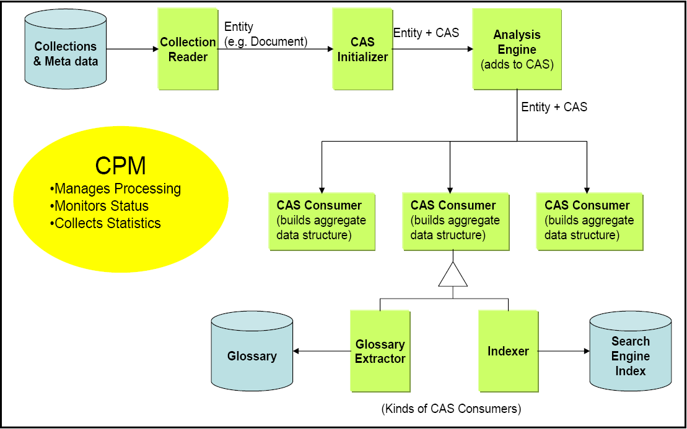
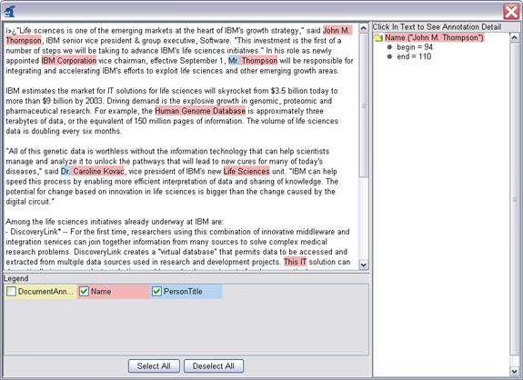

// Licensed to the Apache Software Foundation (ASF) under one
// or more contributor license agreements. See the NOTICE file
// distributed with this work for additional information
// regarding copyright ownership. The ASF licenses this file
// to you under the Apache License, Version 2.0 (the
// "License"); you may not use this file except in compliance
// with the License. You may obtain a copy of the License at
//
// http://www.apache.org/licenses/LICENSE-2.0
//
// Unless required by applicable law or agreed to in writing,
// software distributed under the License is distributed on an
// "AS IS" BASIS, WITHOUT WARRANTIES OR CONDITIONS OF ANY
// KIND, either express or implied. See the License for the
// specific language governing permissions and limitations
// under the License.

[[ugr.tug.cpe]]
= Collection Processing Engine Developer's Guide
// <titleabbrev>CPE Developer's Guide</titleabbrev>

[NOTE]
====
The CPE (Collection Processing Engine) was an early approach to supporting some scale-out use cases.
It is an older approach that doesn't support some of the newer features of CASes  such as multiple views and CAS Multipliers.
It has been supplanted by UIMA-AS, which has full support for the new features.
====

The UIMA Analysis Engine interface provides support for developing and integrating algorithms that analyze unstructured data.
Analysis Engines are designed to operate on a per-document basis.
Their interface handles one CAS at a time.
UIMA provides additional support for applying analysis engines to collections of unstructured data with its __Collection Processing Architecture__.
The Collection Processing Architecture defines additional components for reading raw data formats from data collections, preparing the data for processing by Analysis Engines, executing the analysis, extracting analysis results, and deploying the overall flow in a variety of local and distributed configurations.

The functionality defined in the Collection Processing Architecture is implemented by a _Collection Processing Engine_ (CPE). A CPE includes an Analysis Engine and adds a __Collection Reader__, a _CAS Initializer_ (deprecated as of version 2), and __CAS
    Consumers__.
The part of the UIMA Framework that supports the execution of CPEs is called the Collection Processing Manager, or CPM.

A Collection Reader provides the interface to the raw input data and knows how to iterate over the data collection.
Collection Readers are discussed in <<ugr.tug.cpe.collection_reader.developing>>.
The CAS Initializer footnote:[CAS Initializers are deprecated in favor of a more general mechanism,
    multiple subjects of analysis.] prepares an individual data item for analysis and loads it into the CAS.
CAS Initializers are discussed in <<ugr.tug.cpe.cas_initializer.developing>> A CAS Consumer extracts analysis results from the CAS and may also perform __collection level
    processing__, or analysis over a collection of CASes.
CAS Consumers are discussed in <<ugr.tug.cpe.cas_consumer.developing>>.

Analysis Engines and CAS Consumers are both instances of __CAS
    Processors__.
A Collection Processing Engine (CPE) may contain multiple CAS Processors.
An Analysis Engine contained in a CPE may itself be a Primitive or an Aggregate (composed of other Analysis Engines). Aggregates may contain Cas Consumers.
While Collection Readers and CAS Initializers always run in the same JVM as the CPM, a CAS Processor may be deployed in a variety of local and distributed modes, providing a number of options for scalability and robustness.
The different deployment options are covered in detail in <<ugr.tug.cpe.deployment_alternatives>>.

Each of the components in a CPE has an interface specified by the UIMA Collection Processing Architecture and is described by a declarative XML descriptor file.
Similarly, the CPE itself has a well defined component interface and is described by a declarative XML descriptor file.

A user creates a CPE by assembling the components mentioned above.
The UIMA SDK provides a graphical tool, called the CPE Configurator, for assisting in the assembly of CPEs.
Use of this tool is summarized in <<ugr.tug.cpe.cpe_configurator>>, and more details can be found in xref:tools.adoc#ugr.tools.cpe[Collection Processing Engine Configurator User’s Guide].
Alternatively, a CPE can be assembled by writing an XML CPE descriptor.
Details on the CPE descriptor, including its syntax and content, can be found in the xref:ref.adoc#ugr.ref.xml.cpe_descriptor[Collection Processing Engine Descriptor Reference].
The individual components have associated XML descriptors, each of which can be created and / or edited using the xref:tools.adoc#ugr.tools.cde[Component Description Editor].

A CPE is executed by a UIMA infrastructure component called the _Collection Processing Manager_ (CPM). The CPM provides a number of services and deployment options that cover instantiation and execution of CPEs, error recovery, and local and distributed deployment of the CPE components.

[[ugr.tug.cpe.concepts]]
== CPE Concepts

<<ugr.tug.cpe.fig.cpe_components>> illustrates the data flow that occurs between the different types of components that make up a CPE.

[[ugr.tug.cpe.fig.cpe_components]]
.CPE Components

The components of a CPE are:

* _Collection Reader –_ interfaces to a collection of data items (e.g., documents) to be analyzed. Collection Readers return CASes that contain the documents to analyze, possibly along with additional metadata.
* _Analysis Engine –_ takes a CAS, analyzes its contents, and produces an enriched CAS. Analysis Engines can be recursively composed of other Analysis Engines (called an _Aggregate_ Analysis Engine). Aggregates may also contain CAS Consumers.
* _CAS Consumer –_ consume the enriched CAS that was produced by the sequence of Analysis Engines before it, and produce an application-specific data structure, such as a search engine index or database. 

A fourth type of component, the _CAS Initializer,_ may be used by a Collection Reader to populate a CAS from a document.
However, as of UIMA version 2 CAS Initializers are now deprecated in favor of a more general mechsanism, multiple Subjects of Analysis.

The Collection Processing Manager orchestrates the data flow within a CPE, monitors status, optionally manages the life-cycle of internal components and collects statistics.

CASes are not saved in a persistent way by the framework.
If you want to save CASes, then you have to save each CAS as it comes through (for example) using a CAS Consumer you write to do this, in whatever format you like.
The UIMA SDK supplies an example CAS Consumer to save CASes to XML files, either in the standard XMI format or in an older format called XCAS.
It also supplies an example CAS Consumer to extract information from CASes and store the results into a relational Database, using Java's JDBC APIs.

[[ugr.tug.cpe.configurator_and_viewer]]
== CPE Configurator and CAS viewer

[[ugr.tug.cpe.cpe_configurator]]
=== Using the CPE Configurator

A CPE can be assembled by writing an XML CPE descriptor.
Details on the CPE descriptor, including its syntax and content, can be found in xref:ref.adoc#ugr.ref.xml.cpe_descriptor[Collection Processing Engine Descriptor Reference].
Rather than edit raw XML, you may develop a CPE Descriptor using the CPE Configurator tool.
The CPE Configurator tool is described briefly in this section, and in more detail in xref:tools.adoc#ugr.tools.cpe[Collection Processing Engine Configurator User’s Guide].

The CPE Configurator tool can be run from Eclipse (see <<ugr.tug.cpe.running_cpe_configurator_from_eclipse>>, or using the `cpeGui` shell script (``cpeGui.bat`` on Windows, `cpeGui.sh` on Unix), which is located in the `bin` directory of the UIMA SDK installation.
Executing this batch file will display the window shown here: 

image::images/tutorials_and_users_guides/tug.cpe/image004.jpg[Screenshot of CPE GUI]

The window is divided into three sections, one each for the Collection Reader,  Analysis Engines, and CAS Consumers.footnote:[There is also a fourth pane,
        for the CAS Initializer, but it is hidden by default.  To enable it click the
        View  CAS Initializer Panel menu item.]  In each section, you select the component(s) you want to include in the CPE by  browsing to their XML descriptors.
The configuration parameters present in the XML  descriptors will then be displayed in the GUI; these can be modified to override the values present in the descriptor.
For example, the screen shot below shows the  CPE Configurator after the following components have been chosen: 
[source]
----
Collection Reader: 
   %UIMA_HOME%/examples/descriptors/collection_reader/
          FileSystemCollectionReader.xml

Analysis Engine: 
   %UIMA_HOME%/examples/descriptors/analysis_engine/
          NamesAndPersonTitles_TAE.xml

CAS Consumer: 
    %UIMA_HOME%/examples/descriptors/cas_consumer/
          XmiWriterCasConsumer.xml
----

image::images/tutorials_and_users_guides/tug.cpe/image006.jpg[Screenshot of CPE GUI after fields filled in]

For the File System Collection Reader, ensure that the Input Directory is set to `%UIMA_HOME%\examples\data`footnote:[Replace
        %UIMA_HOME% with the path to where you installed UIMA.].
The other parameters may be left blank.
For the External CAS Writer CAS Consumer, ensure that the Output Directory is set to ``%UIMA_HOME%\examples\data\processed``.

After selecting each of the components and providing configuration settings, click the play (forward arrow) button at the bottom of the screen to begin processing.
A progress bar should be displayed in the lower left corner.
(Note that the progress bar will not begin to move until all components have completed their initialization, which may take several seconds.) Once processing has begun, the pause and stop buttons become enabled.

If an error occurs, you will be informed by an error dialog.
If processing completes successfully, you will be presented with a performance report.

Using the File menu, you can select ``Save CPE Descriptor ``to create an .xml descriptor file that defines the CPE you have constructed.
Later, you can use `Open CPE Descriptor` to restore the CPE Configurator to the saved state.
Also, CPE descriptors can be used to run a CPE from a Java program – see section <<ugr.tug.cpe.running_cpe_from_application>>.
CPE Descriptors allow specifying operational parameters, such as error handling options, that are not currently available for configuration through the CPE Configurator.
For more information on manually creating a CPE Descriptor, see the xref:ref.adoc#ugr.ref.xml.cpe_descriptor[Collection Processing Engine Descriptor Reference].

The CPE configured above runs a simple name and title annotator on the sample data provided with the UIMA SDK and stores the results using the XMI Writer CAS Consumer.
To view the results, start the External CAS Annotation Viewer by running the `annotationViewer` batch file (``annotationViewer.bat`` on Windows, `annotationViewer.sh` on Unix), which is located in the `bin` directory of the UIMA SDK installation.
Executing this batch file will display the window shown here: 

image::images/tutorials_and_users_guides/tug.cpe/image008.jpg[Screenshot of Annotation Viewer results]

Ensure that the Input Directory is the same as the Output Directory specified for the XMI Writer CAS Consumer in the CPE configured above (e.g., ``%UIMA_HOME%\examples\data\processed``) and that the TAE Descriptor File is set to the Analysis Engine used in the CPE configured above (e.g., `examples\descriptors\analysis_engine\NamesAndPersonTitles_TAE.xml` ).

Click the View button to display the Analyzed Documents window: 

image::images/tutorials_and_users_guides/tug.cpe/image010.jpg[Screenshot of CPE Configurator Analyzed Documents]

Double click on any document in the list to view the analyzed document.
Double clicking the first document, IBM_LifeSciences.txt, will bring up the following window: 

This window shows the analysis results for the document.
Clicking on any highlighted annotation causes the details for that annotation to be displayed in the right-hand pane.
Here the annotation spanning "`John M. Thompson`" has been clicked.

Congratulations! You have successfully configured a CPE, saved its descriptor, run the CPE, and viewed the analysis results.

[[ugr.tug.cpe.running_cpe_configurator_from_eclipse]]
=== Running the CPE Configurator from Eclipse

If you have followed the instructions in the xref:oas.adoc#ugr.ovv.eclipse_setup[Setup Guide] and imported the example Eclipse project, then you should already have a Run configuration for the CPE Configurator tool (called __UIMA CPE GUI__) configured to run in the example project.
Simply run that configuration to start the CPE Configurator.

If you have not followed the Eclipse setup instructions and wish to run the CPE Configurator tool from Eclipse, you will need to do the following.
As installed, this Eclipse launch configuration is associated with the `uimaj-examples` project.
If you've not already done so, you may wish to import that project into your Eclipse workspace.
It's located in `%UIMA_HOME%/docs/examples`.
Doing this will supply the Eclipse launcher with all the class files it needs to run the CPE configurator.
If you don't do this, please manually add the JAR files for UIMA to the launch configuration.

Also, you need to add any projects or JAR files for any UIMA components you will be running to the launch class path.

[NOTE]
====
A simpler alternative may be to change the CPE launch configuration to be based on your project.
If you do that, it will pick up all the files in your project's class path, which you should set up to include all the UIMA framework files.
An easy way to do this is to specify in your project's properties' build-path that the uimaj-examples project is on the build path, because the uimaj-examples project is set up to include all the UIMA framework classes in its classpath already. 
====

Next, in the Eclipse menu select __Run → Run...__, which brings up the Run configuration screen.

In the Main tab, set the main class to `org.apache.uima.tools.cpm.CpmFrame`

In the arguments tab, add the following to the VM arguments: 

[source]
----
-Xms128M -Xmx256M 
-Duima.home="C:\Program Files\Apache\uima"
----
(or wherever you installed the UIMA SDK)

Click the Run button to launch the CPE Configurator, and use it as previously described in this section.

[[ugr.tug.cpe.running_cpe_from_application]]
== Running a CPE from Your Own Java Application

The simplest way to run a CPE from a Java application is to first create a CPE descriptor as described in the previous section.
Then the CPE can be instantiated and run using the following code: 
[source]
----
      //parse CPE descriptor in file specified on command line
CpeDescription cpeDesc = UIMAFramework.getXMLParser().
        parseCpeDescription(new XMLInputSource(args[0]));
      
      //instantiate CPE
mCPE = UIMAFramework.produceCollectionProcessingEngine(cpeDesc);

      //Create and register a Status Callback Listener
mCPE.addStatusCallbackListener(new StatusCallbackListenerImpl());

      //Start Processing
mCPE.process();
----

This will start the CPE running in a separate thread.

[NOTE]
====
The `process()` method for a CPE can only be called once.
If you  need to call it again, you have to instantiate a new CPE, and call that new CPE's process method.
====

[[ugr.tug.cpe.using_listeners]]
=== Using Listeners

Updates of the CPM's progress, including any errors that occur, are sent to the callback handler that is registered by the call to ``addStatusCallbackListener``, above.
The callback handler is a class that implements the CPM's `StatusCallbackListener` interface.
It responds to events by printing messages to the console.
The source code is fairly straightforward and is not included in this chapter -- see the `org.apache.uima.examples.cpe.SimpleRunCPE.java` in the `%UIMA_HOME%\examples\src` directory for the complete code.

If you need more control over the information in the CPE descriptor, you can manually configure it via its API.
See the Javadocs for package `org.apache.uima.collection` for more details.

[[ugr.tug.cpe.developing_collection_processing_components]]
== Developing Collection Processing Components

This section is an introduction to the process of developing Collection Readers, CAS Initializers, and CAS Consumers.
The code snippets refer to the classes that can be found in ``%UIMA_HOME%\examples\src ``example project.

In the following sections, classes you write to represent components need to be public and have public, no-args constructors, so that they can be instantiated by the framework.
(Although Java classes in which you do not define any constructor will, by default, have a no-args constructor that doesn't do anything, a class in which you have defined at least one constructor does not get a default no-args constructor.)

[[ugr.tug.cpe.collection_reader.developing]]
=== Developing Collection Readers

A Collection Reader is responsible for obtaining documents from the collection and returning each document as a CAS.
Like all UIMA components, a Collection Reader consists of two parts —the code and an XML descriptor.

A simple example of a Collection Reader is the "`File System Collection
        Reader,`" which simply reads documents from files in a specified directory.
The Java code is in the class `org.apache.uima.examples.cpe.FileSystemCollectionReader` and the XML descriptor is ``%UIMA_HOME%/examples/src/main/descriptors/collection_reader/
          FileSystemCollectionReader.xml``.

[[ugr.tug.cpe.collection_reader.java_class]]
==== Java Class for the Collection Reader

The Java class for a Collection Reader must implement the `org.apache.uima.collection.CollectionReader` interface.
You may build your Collection Reader from scratch and implement this interface, or you may extend the convenience base class `org.apache.uima.collection.CollectionReader_ImplBase` .

The convenience base class provides default implementations for many of the methods defined in the `CollectionReader` interface, and provides abstract definitions for those methods that you are required to implement in your new Collection Reader.
Note that if you extend this base class, you do not need to declare that your new Collection Reader implements the `CollectionReader` interface.

[TIP]
====
Eclipse tip –if you are using Eclipse, you can quickly create the boiler plate code and stubs for all of the required methods by clicking `File`→``New``→``Class`` to bring up the "`New Java Class`" dialogue, specifying `org.apache.uima.collection.CollectionReader_ImplBase` as the Superclass, and checking "`Inherited abstract methods`" in the section "`Which method stubs would you like to create?`", as in the  screenshot below:
====

image::images/tutorials_and_users_guides/tug.cpe/image014.jpg[Screenshot showing Eclipse new class wizard]

For the rest of this section we will assume that your new Collection Reader extends the `CollectionReader_ImplBase` class, and we will show examples from the `org.apache.uima.examples.cpe.FileSystemCollectionReader` . If you must inherit from a different superclass, you must ensure that your Collection Reader implements the `CollectionReader` interface – see the Javadocs for `CollectionReader` for more details.

[[ugr.tug.cpe.collection_reader.required_methods]]
==== Required Methods in the Collection Reader class

The following abstract methods must be implemented:

[[ugr.tug.cpe.collection_reader.required_methods.initialize]]
===== initialize()

The `initialize()` method is called by the framework when the Collection Reader is first created. `CollectionReader_ImplBase` actually provides a default implementation of this method (i.e., it is not abstract), so you are not strictly required to implement this method.
However, a typical Collection Reader will implement this method to obtain parameter values and perform various initialization steps.

In this method, the Collection Reader class can access the values of its configuration parameters and perform other initialization logic.
The example File System Collection Reader reads its configuration parameters and then builds a list of files in the specified input directory, as follows:

[source]
----
public void initialize() throws ResourceInitializationException {
  File directory = new File(
            (String)getConfigParameterValue(PARAM_INPUTDIR));
  mEncoding = (String)getConfigParameterValue(PARAM_ENCODING);
  mDocumentTextXmlTagName = (String)getConfigParameterValue(PARAM_XMLTAG);
  mLanguage = (String)getConfigParameterValue(PARAM_LANGUAGE);
  mCurrentIndex = 0; 
  
  //get list of files (not subdirectories) in the specified directory
  mFiles = new ArrayList();
  File[] files = directory.listFiles();
  for (int i = 0; i < files.length; i++) {
    if (!files[i].isDirectory()) {
      mFiles.add(files[i]);  
    }
  }
}
----

[NOTE]
====
This is the zero-argument version of the initialize method.
There is also a method on the Collection Reader interface called `initialize(ResourceSpecifier, Map)` but it is not recommended that you override this method in your code.
That method performs internal initialization steps and then calls the zero-argument ``initialize()``. 
====

[[ugr.tug.cpe.collection_reader.hasnext]]
===== hasNext()

The `hasNext()` method returns whether or not there are any documents remaining to be read from the collection.
The File System Collection Reader's `hasNext()` method is very simple.
It just checks if there are any more files left to be read: 
[source]
----
public boolean hasNext() {
  return mCurrentIndex < mFiles.size();
}
----

[[ugr.tug.cpe.collection_reader.required_methods.getnext]]
===== getNext(CAS)

The `getNext()` method reads the next document from the collection and populates a CAS.
In the simple case, this amounts to reading the file and calling the CAS's `setDocumentText` method.
The example File System Collection Reader is slightly more complex.
It first checks for a CAS Initializer.
If the CPE includes a CAS Initializer, the CAS Initializer is used to read the document, and `initialize()` the CAS.
If the CPE does not include a CAS Initializer, the File System Collection Reader reads the document and sets the document text in the CAS.

The File System Collection Reader also stores additional metadata about the document in the CAS.
In particular, it sets the document's language in the special built-in feature structure xref:ref.adoc#ugr.ref.cas.document_annotation[`uima.tcas.DocumentAnnotation`] and creates an instance of `org.apache.uima.examples.SourceDocumentInformation`, which stores information about the document's source location.
This information may be useful to downstream components such as CAS Consumers.
Note that the type system descriptor for this type can be found in `org.apache.uima.examples.SourceDocumentInformation.xml`, which is located in the `examples/src` directory.

The getNext() method for the File System Collection Reader looks like this:

[source]
----
  public void getNext(CAS aCAS) throws IOException, CollectionException {
    JCas jcas;
    try {
      jcas = aCAS.getJCas();
    } catch (CASException e) {
      throw new CollectionException(e);
    }

    // open input stream to file
    File file = (File) mFiles.get(mCurrentIndex++);
    BufferedInputStream fis = 
            new BufferedInputStream(new FileInputStream(file));
    try {
      byte[] contents = new byte[(int) file.length()];
      fis.read(contents);
      String text;
      if (mEncoding != null) {
        text = new String(contents, mEncoding);
      } else {
        text = new String(contents);
      }
      // put document in CAS
      jcas.setDocumentText(text);
    } finally {
      if (fis != null)
        fis.close();
    }

    // set language if it was explicitly specified 
    //as a configuration parameter
    if (mLanguage != null) {
      ((DocumentAnnotation) jcas.getDocumentAnnotationFs()).
            setLanguage(mLanguage);
    }

    // Also store location of source document in CAS. 
    // This information is critical if CAS Consumers will 
    // need to know where the original document contents 
    // are located.
    // For example, the Semantic Search CAS Indexer 
    // writes this information into the search index that 
    // it creates, which allows applications that use the 
    // search index to locate the documents that satisfy 
    //their semantic queries.
    SourceDocumentInformation srcDocInfo = 
            new SourceDocumentInformation(jcas);
    srcDocInfo.setUri(
            file.getAbsoluteFile().toURL().toString());
    srcDocInfo.setOffsetInSource(0);
    srcDocInfo.setDocumentSize((int) file.length());
    srcDocInfo.setLastSegment(
            mCurrentIndex == mFiles.size());
    srcDocInfo.addToIndexes();
  }
----

The Collection Reader can create additional annotations in the CAS at this point, in the same way that annotators create annotations.

[[ugr.tug.cpe.collection_reader.required_methods.getprogress]]
===== getProgress()

The Collection Reader is responsible for returning progress information; that is, how much of the collection has been read thus far and how much remains to be read.
The framework defines progress very generally; the Collection Reader simply returns an array of `Progress` objects, where each object contains three fields — the amount already completed, the total amount (if known), and a unit (e.g.
entities (documents), bytes, or files). The method returns an array so that the Collection Reader can report progress in multiple different units, if that information is available.
The File System Collection Reader's `getProgress()` method looks like this: 
[source]
----
public Progress[] getProgress() {
  return new Progress[]{
     new ProgressImpl(mCurrentIndex,mFiles.size(),Progress.ENTITIES)};
}
----

In this particular example, the total number of files in the collection is known, but the total size of the collection is not known.
As such, a `ProgressImpl` object for `Progress.ENTITIES` is returned, but a `ProgressImpl` object for `Progress.BYTES` is not.

[[ugr.tug.cpe.collection_reader.required_methods.close]]
===== close()

The close method is called when the Collection Reader is no longer needed.
The Collection Reader should then release any resources it may be holding.
The FileSystemCollectionReader does not hold resources and so has an empty implementation of this method:

[source]
----
public void close() throws IOException { }
----

[[ugr.tug.cpe.collection_reader.optional_methods]]
===== Optional Methods

The following methods may be implemented:

[[ugr.tug.cpe.collection_reader.optional_methods.reconfigure]]
====== reconfigure()

This method is called if the Collection Reader's configuration parameters change.

[[ugr.tug.cpe.collection_reader.optional_methods.typesysteminit]]
====== typeSystemInit()

If you are only setting the document text in the CAS, or if you are using the JCas (recommended, as in the current example, you do not have to implement this method.
If you are directly using the CAS API, this method is used in the xref:tug.adoc#ugr.tug.aae.contract_for_annotator_methods[same way as it is used for an annotator].

[[ugr.tug.cpe.collection_reader.threading]]
===== Threading considerations

Collection readers do not have to be thread safe; they are run with a single thread per instance, and only one instance per instance of the Collection Processing Manager (CPM) is made.

[[ugr.tug.cpe.collection_reader.descriptor]]
===== XML Descriptor for a Collection Reader

You can use the Component Description Editor to create and / or edit the File System Collection Reader's descriptor.
Here is its descriptor (abbreviated somewhat), which is very similar to an Analysis Engine descriptor:

[source]
----
<collectionReaderDescription 
          xmlns="http://uima.apache.org/resourceSpecifier">
  <frameworkImplementation>org.apache.uima.java</frameworkImplementation>
  <implementationName>
    org.apache.uima.examples.cpe.FileSystemCollectionReader
  </implementationName>
  <processingResourceMetaData>
    <name>File System Collection Reader</name>
    <description>Reads files from the filesystem.</description>
    <version>1.0</version>
    <vendor>The Apache Software Foundation</vendor>
    <configurationParameters>
      <configurationParameter>
        <name>InputDirectory</name>
        <description>Directory containing input files</description>
        <type>String</type>
        <multiValued>false</multiValued>
        <mandatory>true</mandatory>
      </configurationParameter>
      <configurationParameter>
        <name>Encoding</name>
        <description>Character encoding for the documents.</description>
        <type>String</type>
        <multiValued>false</multiValued>
        <mandatory>false</mandatory>
      </configurationParameter>
      <configurationParameter>
        <name>Language</name>
        <description>ISO language code for the documents</description>
        <type>String</type>
        <multiValued>false</multiValued>
        <mandatory>false</mandatory>
      </configurationParameter>
    </configurationParameters>
    <configurationParameterSettings>
      <nameValuePair>
        <name>InputDirectory</name>
        <value>
          <string>C:/Program Files/apache/uima/examples/data</string>
        </value>
      </nameValuePair>
    </configurationParameterSettings>
    
    <!-- Type System of CASes returned by this Collection Reader -->
    
    <typeSystemDescription>
      <imports>
        <import name="org.apache.uima.examples.SourceDocumentInformation"/>
      </imports>
    </typeSystemDescription>
    
    <capabilities>
      <capability>
        <inputs/>
        <outputs>
          <type allAnnotatorFeatures="true">
            org.apache.uima.examples.SourceDocumentInformation
          </type>
        </outputs>
      </capability>
    </capabilities>
    <operationalProperties>
      <modifiesCas>true</modifiesCas>
      <multipleDeploymentAllowed>false</multipleDeploymentAllowed>
      <outputsNewCASes>true</outputsNewCASes>
    </operationalProperties>
  </processingResourceMetaData>
</collectionReaderDescription>
----

[[ugr.tug.cpe.cas_initializer.developing]]
=== Developing CASInitializers

[NOTE]
====
CAS Initializers are now deprecated (as of version 2.1). For complex initialization, please use instead the capabilities of creating see xref:tug.adoc#ugr.tug.mvs[additional Subjects of Analysis]. 
====

In UIMA 1.x, the CAS Initializer component was intended to be used as a plug-in to the Collection Reader for when the task of populating the CAS from a raw document is complex and might be reusable with other data collections.

A CAS Initializer Java class must implement the interface ``org.apache.uima.collection.CasInitializer``, and will also generally extend from the convenience base class ``org.apache.uima.collection.CasInitializer_ImplBase``.
A CAS Initializer also must have an XML descriptor, which has the exact same form as a Collection Reader Descriptor except that the outer tag is ``<casInitializerDescription>``.

CAS Initializers have optional ``initialize()``, ``reconfigure()``, and `typeSystemInit()` methods, which perform the same functions as they do for Collection Readers.
The only required method for a CAS Initializer is ``initializeCas(Object,
        CAS)``.
This method takes the raw document (for example, an `InputStream` object from which the document can be read) and a CAS, and populates the CAS from the document.

[[ugr.tug.cpe.cas_consumer.developing]]
=== Developing CASConsumers

[NOTE]
====
In version 2, there is no difference in capability between CAS Consumers and ordinary Analysis Engines, except for the default setting of the XML parameters for `multipleDeploymentAllowed` and ``modifiesCas``.
We recommend for future work that users implement and use Analysis Engine components instead of CAS Consumers.

The rest of this section is written using the version 1 style of CAS Consumer; the methods described are also available for Analysis Engines.
Note that the  CAS Consumer `processCAS` method is equivalent to the Analysis Engine `process` method.
====

A CAS Consumer receives each CAS after it has been analyzed by the Analysis Engine.
CAS Consumers typically do not update the CAS; they typically extract data from the CAS and persist selected information to aggregate data structures such as search engine indexes or databases.

A CAS Consumer Java class must implement the interface ``org.apache.uima.collection.CasConsumer``, and will also generally extend from the convenience base class ``org.apache.uima.collection.CasConsumer_ImplBase``.
A CAS Consumer also must have an XML descriptor, which has the exact same form as a Collection Reader Descriptor except that the outer tag is ``<casConsumerDescription>``.

CAS Consumers have optional ``initialize()``, ``reconfigure()``, and `typeSystemInit()` methods, which perform the same functions as they do for Collection Readers and CAS Initializers.
The only required method for a CAS Consumer is ``processCas(CAS)``, which is where the CAS Consumer does the bulk of its work (i.e., consume the CAS).

The `CasConsumer` interface (as well as the version 2 Analysis Engine interface) additionally defines batch and collection level processing methods.
The CAS Consumer or Analysis Engine can implement the `batchProcessComplete()` method to perform processing that should occur at the end of each batch of CASes.
Similarly, the CAS Consumer  or Analysis Engine can implement the `collectionProcessComplete()` method to perform any collection level processing at the end of the collection.

A very simple example of a CAS Consumer, which writes an XML representation of the CAS to a file, is the XMI Writer CAS Consumer.
The Java code is in the class `org.apache.uima.examples.cpe.XmiWriterCasConsumer` and the descriptor is in `%UIMA_HOME%/examples/descriptors/cas_consumer/XmiWriterCasConsumer.xml` .

[[ugr.tug.cpe.cas_consumer.required_methods]]
==== Required Methods for a CAS Consumer

When extending the convenience class ``org.apache.uima.collection.CasConsumer_ImplBase``, the following abstract methods must be implemented:

[[ugr.tug.cpe.cas_consumer.required_methods.initialize]]
===== initialize()

The `initialize()` method is called by the framework when the CAS Consumer is first created. `CasConsumer_ImplBase` actually provides a default implementation of this method (i.e., it is not abstract), so you are not strictly required to implement this method.
However, a typical CAS Consumer will implement this method to obtain parameter values and perform various initialization steps.

In this method, the CAS Consumer can access the values of its configuration parameters and perform other initialization logic.
The example XMI Writer CAS Consumer reads its configuration parameters and sets up the output directory: 
[source]
----
public void initialize() throws ResourceInitializationException {
  mDocNum = 0;
  mOutputDir = new File((String) getConfigParameterValue(PARAM_OUTPUTDIR));
  if (!mOutputDir.exists()) {
    mOutputDir.mkdirs();
  }
}
----

[[ugr.tug.cpe.cas_consumer.required_methods.processcas]]
===== processCas()

The `processCas()` method is where the CAS Consumer does most of its work.
In our example, the XMI Writer CAS Consumer obtains an iterator over the document metadata in the CAS (in the SourceDocumentInformation feature structure, which is created by the File System Collection Reader) and extracts the URI for the current document.
From this the output filename is constructed in the output directory and a subroutine (``writeXmi``) is called to generate the output file.
The `writeXmi` subroutine uses the `XmiCasSerializer` class provided with the UIMA SDK to serialize the CAS to the output file (see the example source code for details).

[source]
----
public void processCas(CAS aCAS) throws ResourceProcessException {
  String modelFileName = null;

  JCas jcas;
  try {
    jcas = aCAS.getJCas();
  } catch (CASException e) {
    throw new ResourceProcessException(e);
  }
 
    // retreive the filename of the input file from the CAS
  FSIterator it = jcas
            .getAnnotationIndex(SourceDocumentInformation.type)
                  .iterator();
  File outFile = null;
  if (it.hasNext()) {
    SourceDocumentInformation fileLoc = 
            (SourceDocumentInformation) it.next();
    File inFile;
    try {
      inFile = new File(new URL(fileLoc.getUri()).getPath());
      String outFileName = inFile.getName();
      if (fileLoc.getOffsetInSource() > 0) {
        outFileName += ("_" + fileLoc.getOffsetInSource());
      }
      outFileName += ".xmi";
      outFile = new File(mOutputDir, outFileName);
      modelFileName = mOutputDir.getAbsolutePath() + 
            "/" + inFile.getName() + ".ecore";
    } catch (MalformedURLException e1) {
      // invalid URL, use default processing below
    }
  }
  if (outFile == null) {
    outFile = new File(mOutputDir, "doc" + mDocNum++);
  }
  // serialize XCAS and write to output file
  try {
    writeXmi(jcas.getCas(), outFile, modelFileName);
  } catch (IOException e) {
    throw new ResourceProcessException(e);
  } catch (SAXException e) {
    throw new ResourceProcessException(e);
  }
}
----

[[ugr.tug.cpe.cas_consumer.optional_methods]]
===== Optional Methods

The following methods are optional in a CAS Consumer, though they are often used.

[[ugr.tug.cpe.cas_consumer.optional_methods.batchprocesscomplete]]
====== batchProcessComplete()

The framework calls the batchProcessComplete() method at the end of each batch of CASes.
This gives the CAS Consumer or Analysis Engine  an opportunity to perform any batch level processing.
Our simple XMI Writer CAS Consumer does not perform any batch level processing, so this method is empty.
Batch size is set in the Collection Processing Engine descriptor.

[[ugr.tug.cpe.cas_consumer.optional_methods.collectionprocesscomplete]]
====== collectionProcessComplete()

The framework calls the collectionProcessComplete() method at the end of the collection (i.e., when all objects in the collection have been processed). At this point in time, no CAS is passed in as a parameter.
This gives the CAS Consumer or Analysis Engine an opportunity to perform collection processing over the entire set of objects in the collection.
Our simple XMI Writer CAS Consumer does not perform any collection level processing, so this method is empty.

[[ugr.tug.cpe.deploying_a_cpe]]
== Deploying a CPE

The CPM provides a number of service and deployment options that cover instantiation and execution of CPEs, error recovery, and local and distributed deployment of the CPE components.
The behavior of the CPM (and correspondingly, the CPE) is controlled by various options and parameters set in the CPE descriptor.
The current version of the CPE Configurator tool, however, supports only default error handling and deployment options.
To change these options, you must manually edit the CPE descriptor.

Eventually the CPE Configurator tool will support configuring these options and a detailed tutorial for these settings will be provided.
In the meantime, we provide only a high-level, conceptual overview of these advanced features in the rest of this chapter, and refer the advanced user to the xref:ref.adoc#ugr.ref.xml.cpe_descriptor[CPE Descriptor Reference] for details on setting these options in the CPE Descriptor.

<<ugr.tug.cpe.fig.cpe_instantiation>> shows a logical view of how an application uses the UIMA framework to instantiate a CPE from a CPE descriptor.
The CPE descriptor identifies the CPE components (referencing their corresponding descriptors) and specifies the various options for configuring the CPM and deploying the CPE components.

[[ugr.tug.cpe.fig.cpe_instantiation]]
.CPE Instantiation
image::images/tutorials_and_users_guides/tug.cpe/image018.png[Picture of deployment of a CPE]

[[ugr.tug.cpe.deployment_alternatives]]
=== CPE Deployment alternatives
There are three deployment modes for CAS Processors (Analysis Engines and CAS Consumers) in a CPE:

. *Integrated* (runs in the same Java instance as the CPM)
. *Managed* (runs in a separate process on the same machine), and
. *Non-managed* (runs in a separate process, perhaps on a different machine). 

An integrated CAS Processor runs in the same JVM as the CPE.
A managed CAS Processor runs in a separate process from the CPE, but still on the same computer.
The CPE controls startup, shutdown, and recovery of a managed CAS Processor.
A non-managed CAS Processor runs as a service and may be on the same computer as the CPE or on a remote computer.
A non-managed CAS Processor _service_ is started and managed independently from the CPE.

For both managed and non-managed CAS Processors, the CAS must be transmitted between separate processes and possibly between separate computers.
This is accomplished using __Vinci__, a communication protocol used by the CPM and which is provided as a part of Apache UIMA.
xref:tug.adoc#ugr.tug.application.how_to_deploy_a_vinci_service[Vinci] handles service naming and location and data transport.
Service naming and location are provided by a __Vinci Naming Service__, or __VNS__.
For managed CAS Processors, the CPE uses its own internal VNS.
For non-managed CAS Processors, a separate VNS must be running.

The CPE Configurator tool currently only supports constructing CPEs that deploy CAS Processors in integrated mode.
To deploy CAS Processors in any other mode, the CPE descriptor must be edited by hand (better tooling may be provided later). Details on the CPE descriptor and the required settings for various CAS Processor deployment modes can be found in xref:ref.adoc#ugr.ref.xml.cpe_descriptor[Collection Processing Engine Descriptor Reference].
In the following sections we merely summarize the various CAS Processor deployment options.

[[ugr.tug.cpe.managed_deployment]]
=== Deploying Managed CAS Processors

Managed CAS Processor deployment is shown in <<ugr.tug.cpe.fig.managed_deployment>>.
A managed CAS Processor is deployed by the CPE as a Vinci service.
The CPE manages the lifecycle of the CAS Processor including service launch, restart on failures, and service shutdown.
A managed CAS Processor runs on the same machine as the CPE, but in a separate process.
This provides the necessary fault isolation for the CPE to protect it from non-robust CAS Processors.
A fatal failure of a managed CAS Processor does not threaten the stability of the CPE.

[[ugr.tug.cpe.fig.managed_deployment]]
.CPE with Managed CAS Processors
image::images/tutorials_and_users_guides/tug.cpe/image020.png[Managed deployment showing separate JVMs and CASes
            flowing between them]

The CPE communicates with managed CAS Processors using the Vinci communication protocol.
A CAS Processor is launched as a Vinci service and its `process()` method is invoked remotely via a Vinci command.
The CPE uses its own internal VNS to support managed CAS processors.
The VNS, by default, listens on port 9005.
If this port is not available, the VNS will increment its listen port until it finds one that is available.
All managed CAS Processors are internally configured to "`talk`" to the CPE managed VNS.
This internal VNS is transparent to the end user launching the CPE.

To deploy a managed CAS Processor, the CPE deployer must change the CPE descriptor.
The following is a section from the CPE descriptor that shows an example configuration specifying a managed CAS Processor.

[source]
----
<casProcessor deployment="local" name="Meeting Detector TAE">
  <descriptor>
    <include href="deploy/vinci/Deploy_MeetingDetectorTAE.xml"/>
  </descriptor>
  <runInSeparateProcess>
    <exec dir="." executable="java">
      <env key="CLASSPATH" 
         value="src;
                C:/Program Files/apache/uima/lib/uima-core.jar;
                C:/Program Files/apache/uima/lib/uima-cpe.jar;
                C:/Program Files/apache/uima/lib/uima-examples.jar;
                C:/Program Files/apache/uima/lib/uima-adapter-vinci.jar;
                C:/Program Files/apache/uima/lib/jVinci.jar"/>
      <arg>-DLOG=C:/Temp/service.log</arg>
      <arg>org.apache.uima.reference_impl.collection.
         service.vinci.VinciAnalysisEnginerService_impl</arg>
      <arg>${descriptor}</arg>
    </exec>
  </runInSeparateProcess>
  <deploymentParameters/>
  <filter/>
  <errorHandling>
    <errorRateThreshold action="terminate" value="1/100"/>
    <maxConsecutiveRestarts action="terminate" value="3"/>
    <timeout max="100000"/>
  </errorHandling>
  <checkpoint batch="10000"/>
</casProcessor>
----

Refer to the xref:ref.adoc#ugr.ref.xml.cpe_descriptor[CPE Descriptor Reference] for details and required settings.

[[ugr.tug.cpe.deploying_nonmanaged_cas_processors]]
=== Deploying Non-managed CAS Processors

Non-managed CAS Processor deployment is shown in <<ugr.tug.cpe.fig.nonmanaged_cpe>>.
In non-managed mode, the CPE supports connectivity to CAS Processors running on local or remote computers using Vinci.
Non-managed processors are different from managed processors in two aspects: 

. Non-managed processors are neither started nor stopped by the CPE.
. Non-managed processors use an independent VNS, also neither started nor stopped by the CPE. 

[[ugr.tug.cpe.fig.nonmanaged_cpe]]
.CPE with non-managed CAS Processors
image::images/tutorials_and_users_guides/tug.cpe/image023.png[Non-managed CPE deployment]

While non-managed CAS Processors provide the same level of fault isolation and robustness as managed CAS Processors, error recovery support for non-managed CAS Processors is much more limited.
In particular, the CPE cannot restart a non-managed CAS Processor after an error.

Non-managed CAS Processors also require a separate Vinci Naming Service running on the network.
This VNS must be xref:tug.adoc#ugr.tug.application.vns.starting[manually started] and monitored by the end user or application.

To deploy a non-managed CAS Processor, the CPE deployer must change the CPE descriptor.
The following is a section from the CPE descriptor that shows an example configuration for the non-managed CAS Processor.

[source]
----
<casProcessor deployment="remote" name="Meeting Detector TAE">
  <descriptor>
    <include href=
        "descriptors/vinciService/MeetingDetectorVinciService.xml"/>
  </descriptor>
  <deploymentParameters/>
  <filter/>
  <errorHandling>
    <errorRateThreshold action="terminate" value="1/100"/>
    <maxConsecutiveRestarts action="terminate" value="3"/>
    <timeout max="100000"/>
  </errorHandling>
  <checkpoint batch="10000"/>
</casProcessor>
----

Refer to the xref:ref.adoc#ugr.ref.xml.cpe_descriptor[CPE Descriptor Reference] for details and required settings.

[[ugr.tug.cpe.integrated_deployment]]
=== Deploying Integrated CAS Processors

Integrated CAS Processors are shown in <<ugr.tug.cpe.fig.integrated_deployment>>.
Here the CAS Processors run in the same JVM as the CPE, just like the Collection Reader and CAS Initializer.
This deployment method results in minimal CAS communication and transport overhead as the CAS is shared in the same process space of the JVM.
However, a CPE running with all integrated CAS Processors is limited in scalability by the capability of the single computer on which the CPE is running.
There is also a stability risk associated with integrated processors because a poorly written CAS Processor can cause the JVM, and hence the entire CPE, to abort.

[[ugr.tug.cpe.fig.integrated_deployment]]
.CPE with integrated CAS Processor
image::images/tutorials_and_users_guides/tug.cpe/image026.png[CPE with integrated CAS Processor]

The following is a section from a CPE descriptor that shows an example configuration for the integrated CAS Processor.

[source]
----
<casProcessor deployment=integrated name=Meeting Detector TAE>
  <descriptor>
    <include href="descriptors/tutorial/ex4/MeetingDetectorTAE.xml"/>
  </descriptor>
  <deploymentParameters/>
  <filter/>
  <errorHandling>
    <errorRateThreshold action="terminate" value="100/1000"/>
    <maxConsecutiveRestarts action="terminate" value="30"/>
    <timeout max="100000"/>
  </errorHandling>
  <checkpoint batch="10000"/>
</casProcessor>
----

Refer to the xref:ref.adoc#ugr.ref.xml.cpe_descriptor[CPE Descriptor Reference] for details and required settings.

[[ugr.tug.cpe.collection_processing_examples]]
== Collection Processing Examples

The UIMA SDK includes a set of examples illustrating the three modes of deployment, integrated, managed, and non-managed.
These are in the `/examples/descriptors/collection_processing_engine` directory.
There are three CPE descriptors that run an example annotator (the Meeting Finder) in these modes.

To run either the integrated or managed examples, use the `runCPE` script in the /bin directory of the UIMA installation, passing the appropriate CPE descriptor as an argument, or if you're using Eclipse and have the `uimaj-examples` project in your workspace, you can use the Eclipse Menu → Run → Run... → and then pick the  launch configuration "`UIMA Run CPE`".

[NOTE]
====
The `runCPE` script _ must_  be run from the `%UIMA_HOME%\examples` directory, because the example CPE descriptors use relative path names that are resolved relative to this working directory.
For instance, 

  runCPE
  descriptors\collection_processing_engine\MeetingFinderCPE_Integrated.xml
====

To run the non-managed example, there are some additional steps. 

. Start a VNS service by running the `startVNS` script in the `/bin` directory, or using the Eclipse launcher "`UIMA Start VNS`".
. Deploy the Meeting Detector Analysis Engine as a Vinci service, by running the `startVinciService` script in the `/bin` directory or using the Eclipse launcher for this, and passing it the location of the descriptor to deploy, in this case ``%UIMA_HOME%/examples/deploy/vinci/Deploy_MeetingDetectorTAE.xml``, or if you're using Eclipse and have the `uimaj-examples` project in your workspace, you can use the Eclipse Menu → Run → Run... → and then pick the  launch configuration "`UIMA Start Vinci Service`". 
. Now, run the runCPE script (or if in Eclipse, run the  launch configuration "`UIMA Run CPE`"), passing it the CPE for the non-managed version `(%UIMA_HOME%/examples/descriptors/collection_processing_engine/ MeetingFinderCPE_NonManaged.xml` ). 

This assumes that the Vinci Naming Service, the runCPE application, and the `MeetingDetectorTAE` service are all running on the same machine.
Most of the scripts that need information about VNS will look for values to use in environment variables VNS_HOST and VNS_PORT; these default to "`localhost`" and "`9000`".
You may set these to appropriate values before running the scripts, as needed; you can also pass the name of the VNS host as the second argument to the startVinciService script.

Alternatively, you can edit the scripts and/or the XML files to specify alternatives for the VNS_HOST and VNS_PORT.
For instance, if the `runCPE` application is running on a different machine from the Vinci Naming Service, you can edit the `MeetingFinderCPE_NonManaged.xml` and change the vnsHost parameter: `<parameter name="vnsHost"  value="localhost" type="string"/>` to specify the VNS host instead of "`localhost`".